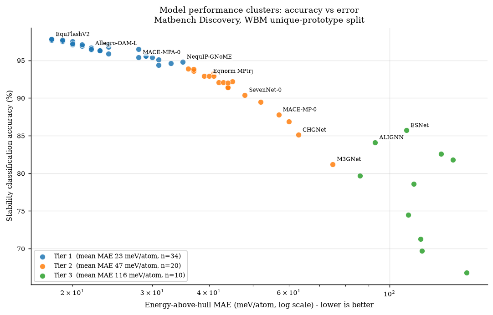
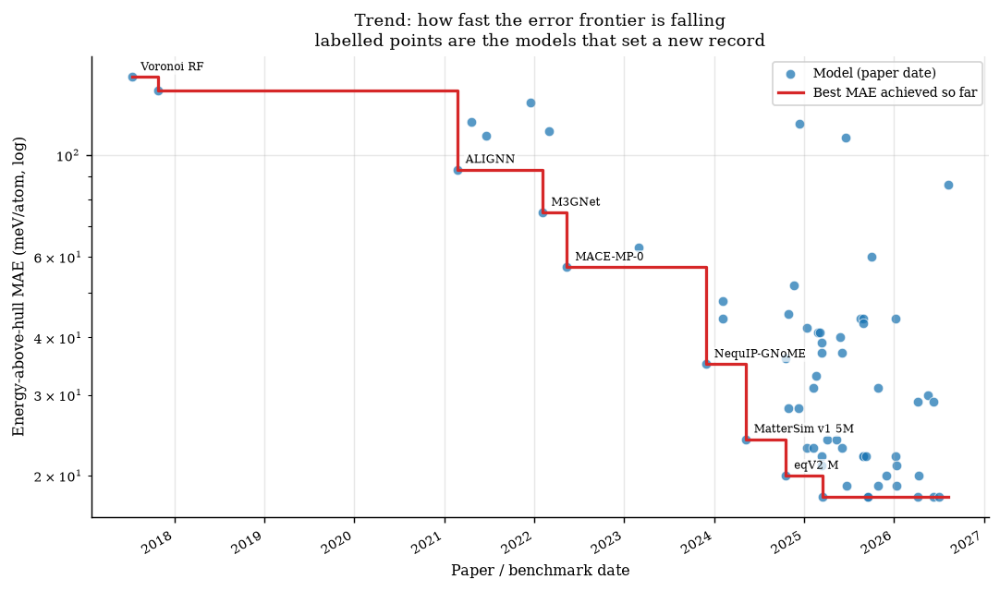
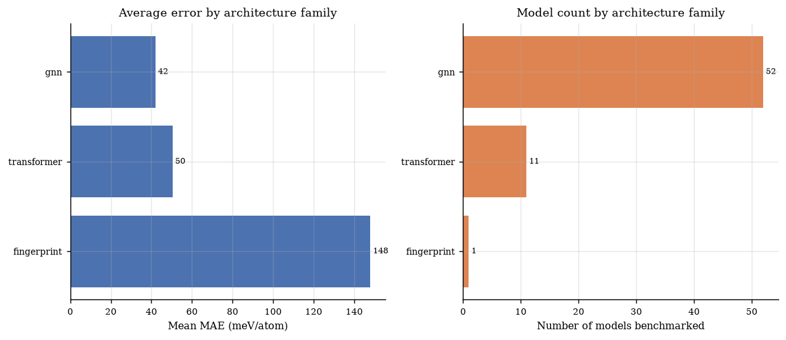
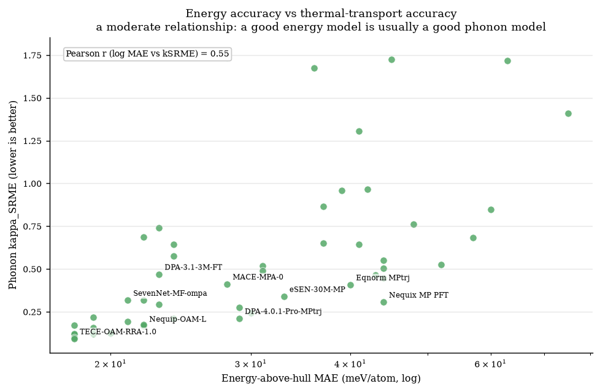
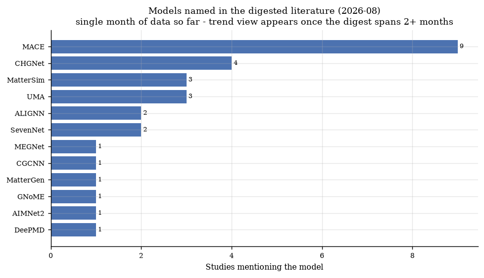

# AI Models for Materials Discovery - Performance Summary

Generated 2026-08-29 by `build_summary.py`. Rows are ordered by reported accuracy (descending), then by error (ascending) - not chronologically. Blank cells mean the value was not published in a machine-readable form; every blank is itemised in [NEEDS_DATA.md](NEEDS_DATA.md).

## How to read this document

Two tables, two very different evidentiary standards:

1. **Table 1** comes from the Matbench Discovery leaderboard, where every model is evaluated on the *same* held-out test set with the *same* DFT reference. These numbers are directly comparable.
2. **Table 2** comes from the daily digest, i.e. whatever the literature published this week. Each study uses its own test set and its own definition of error, so those numbers are **not** comparable to each other. Treat Table 2 as a lead list, not a ranking.

## Headline numbers

- **65** models tracked, **64** with comparable accuracy figures.
- Highest stability-classification accuracy: **EquFlashV2** at **97.8%** (F1 0.929).
- Lowest energy error: **EquFlashV2** at **18 meV/atom**.
- **93** studies parsed from the digest; **3** reported a numeric performance figure in the abstract.

## Figures

**Performance clusters: accuracy vs error**

**Trend: error frontier over time**

**Architecture families and their mean error**

**Energy accuracy vs thermal transport accuracy**

**Model mentions in the incoming literature**

## Table 1 - Benchmarked models, ranked by accuracy

Source: [Matbench Discovery](https://github.com/janosh/matbench-discovery) (CC-BY-4.0). Test set: WBM unique prototypes, ~215k inorganic crystals, scored against the Materials Project PBE convex hull. `kSRME` is the phonon thermal-conductivity error (lower is better); it is blank for models that were never evaluated on it.

| # | Model | Acc. (%) | MAE (meV/atom) | RMSE (meV/atom) | F1 | R2 | kSRME | Tier | Architecture | Params | Calculation method / reference | Materials tested | Training set | Date | DOI |
|---|---|---|---|---|---|---|---|---|---|---|---|---|---|---|---|
| 1 | **EquFlashV2** | 97.8 | 18 | 66 | 0.929 | 0.873 | 0.094 | 1 | gnn | 44.9M | DFT PBE(+U), Materials Project settings; DFT single-point + relaxation: energy, forces, stress | WBM (unique prototypes), inorganic crystals vs MP convex hull | MPtrj, OMat24, sAlex | 2026-06-11 | [link](https://proceedings.mlr.press/v267/lee25l.html) |
| 2 | **EquiformerV3+DeNS-OAM** | 97.8 | 18 | 67 | 0.931 | 0.868 | 0.118 | 1 | transformer | 30.3M | DFT PBE(+U), Materials Project settings; DFT single-point + relaxation: energy, forces, stress | WBM (unique prototypes), inorganic crystals vs MP convex hull | MPtrj, OMat24, sAlex | 2026-04-07 | [10.48550/arXiv.2604.09130](https://doi.org/10.48550/arXiv.2604.09130) |
| 3 | **TACE-OAM-RRA-Preview** | 97.8 | 18 | 68 | 0.928 | 0.866 | 0.101 | 1 | gnn | 213.7M | DFT PBE(+U), Materials Project settings; DFT single-point + relaxation: energy, forces, stress | WBM (unique prototypes), inorganic crystals vs MP convex hull | MPtrj, OMat24, sAlex | 2025-09-18 | [10.57967/hf/7458](https://doi.org/10.57967/hf/7458) |
| 4 | **TECE-OAM-RRA-1.0** | 97.8 | 18 | 66 | 0.929 | 0.871 | 0.093 | 1 | gnn | 221.9M | DFT PBE(+U), Materials Project settings; DFT single-point + relaxation: energy, forces, stress | WBM (unique prototypes), inorganic crystals vs MP convex hull | MPtrj, OMat24, sAlex | 2025-09-18 | [10.57967/hf/7458](https://doi.org/10.57967/hf/7458) |
| 5 | **eSEN-30M-OAM** | 97.7 | 18 | 67 | 0.925 | 0.866 | 0.17 | 1 | gnn | 30.2M | DFT PBE(+U), Materials Project settings; DFT single-point + relaxation: energy, forces, stress | WBM (unique prototypes), inorganic crystals vs MP convex hull | MPtrj, OMat24, sAlex | 2025-03-17 | [10.48550/arXiv.2502.12147](https://doi.org/10.48550/arXiv.2502.12147) |
| 6 | **GRACE-3L-OAM-L** | 97.7 | 18 | 65 | 0.925 | 0.875 | 0.121 | 1 | gnn | 42.1M | DFT PBE(+U), Materials Project settings; S2EF | WBM (unique prototypes), inorganic crystals vs MP convex hull | MPtrj, OMat24, sAlex | 2026-07-02 | [10.1038/s41524-026-01979-1](https://doi.org/10.1038/s41524-026-01979-1) |
| 7 | **PET-OAM-XL** | 97.7 | 19 | 68 | 0.924 | 0.864 | 0.119 | 1 | transformer | 730.0M | DFT PBE(+U), Materials Project settings; DFT single-point + relaxation: energy, forces, stress | WBM (unique prototypes), inorganic crystals vs MP convex hull | MPtrj, OMat24, sAlex | 2026-01-10 | [10.1038/s41467-025-65662-7](https://doi.org/10.1038/s41467-025-65662-7) |
| 8 | **MatRIS-10M-OAM** | 97.6 | 19 | 66 | 0.921 | 0.871 | 0.218 | 1 | gnn | 10.4M | DFT PBE(+U), Materials Project settings; DFT energy, forces, stress, magmoms | WBM (unique prototypes), inorganic crystals vs MP convex hull | MPtrj, OMat24, sAlex | 2025-10-29 | [10.48550/arXiv.2603.02002](https://doi.org/10.48550/arXiv.2603.02002) |
| 9 | **EquFlash** | 97.5 | 19 | 66 | 0.919 | 0.871 | 0.158 | 1 | gnn | 28.7M | DFT PBE(+U), Materials Project settings; DFT single-point + relaxation: energy, forces, stress | WBM (unique prototypes), inorganic crystals vs MP convex hull | MPtrj, OMat24, sAlex | 2025-06-23 | [link](https://proceedings.mlr.press/v267/lee25l.html) |
| 10 | **eqV2 M** | 97.5 | 20 | 72 | 0.917 | 0.848 | 1.771 | 1 | transformer | 86.6M | DFT PBE(+U), Materials Project settings; DFT single-point + relaxation: energy, forces, stress | WBM (unique prototypes), inorganic crystals vs MP convex hull | MPtrj, OMat24 | 2024-10-18 | [10.48550/arXiv.2410.12771](https://doi.org/10.48550/arXiv.2410.12771) |
| 11 | **TACE-OAM-L** | 97.2 | 20 | 67 | 0.91 | 0.868 | 0.126 | 1 | gnn | 82.9M | DFT PBE(+U), Materials Project settings; DFT single-point + relaxation: energy, forces, stress | WBM (unique prototypes), inorganic crystals vs MP convex hull | MPtrj, OMat24, sAlex | 2026-04-09 | [10.57967/hf/7458](https://doi.org/10.57967/hf/7458) |
| 12 | **Nequip-OAM-XL** | 97.1 | 20 | 66 | 0.906 | 0.872 | 0.125 | 1 | gnn | 32.1M | DFT PBE(+U), Materials Project settings; DFT single-point + relaxation: energy, forces, stress | WBM (unique prototypes), inorganic crystals vs MP convex hull | MPtrj, OMat24, sAlex | 2025-11-30 | [10.5281/zenodo.16980200](https://doi.org/10.5281/zenodo.16980200) |
| 13 | **SevenNet-Omni-i12** | 97.1 | 21 | 67 | 0.906 | 0.868 | 0.192 | 1 | gnn | 54.9M | DFT (see training set); DFT single-point + relaxation: energy, forces, stress | WBM (unique prototypes), inorganic crystals vs MP convex hull | COSMOSDataset | 2026-01-12 | [10.48550/arXiv.2510.11241](https://doi.org/10.48550/arXiv.2510.11241) |
| 14 | **ORB v3** | 97.1 | 24 | 78 | 0.905 | 0.821 | 0.21 | 1 | transformer | 25.5M | DFT PBE(+U), Materials Project settings; DFT single-point + relaxation: energy, forces, stress | WBM (unique prototypes), inorganic crystals vs MP convex hull | MPtrj, Alex, OMat24 | 2025-04-05 | [10.48550/arXiv.2504.06231](https://doi.org/10.48550/arXiv.2504.06231) |
| 15 | **SevenNet-MF-ompa** | 96.9 | 21 | 67 | 0.901 | 0.867 | 0.317 | 1 | gnn | 25.7M | DFT PBE(+U), Materials Project settings; DFT single-point + relaxation: energy, forces, stress | WBM (unique prototypes), inorganic crystals vs MP convex hull | MPtrj, OMat24, sAlex | 2025-03-13 | [10.1021/jacs.4c14455](https://doi.org/10.1021/jacs.4c14455) |
| 16 | **AlphaNet-v1-OAM** | 96.8 | 24 | 76 | 0.901 | 0.831 | 0.643 | 1 | gnn | 4.7M | DFT PBE(+U), Materials Project settings; DFT single-point + relaxation: energy, forces, stress | WBM (unique prototypes), inorganic crystals vs MP convex hull | MPtrj, OMat24, sAlex | 2025-05-12 | [10.48550/arXiv.2501.07155](https://doi.org/10.48550/arXiv.2501.07155) |
| 17 | **Nequip-OAM-L** | 96.7 | 22 | 68 | 0.893 | 0.865 | 0.166 | 1 | gnn | 9.6M | DFT PBE(+U), Materials Project settings; DFT single-point + relaxation: energy, forces, stress | WBM (unique prototypes), inorganic crystals vs MP convex hull | MPtrj, OMat24, sAlex | 2025-08-28 | [10.5281/zenodo.16980200](https://doi.org/10.5281/zenodo.16980200) |
| 18 | **Allegro-OAM-L** | 96.6 | 22 | 67 | 0.895 | 0.868 | 0.319 | 1 | gnn | 9.7M | DFT PBE(+U), Materials Project settings; DFT single-point + relaxation: energy, forces, stress | WBM (unique prototypes), inorganic crystals vs MP convex hull | MPtrj, OMat24, sAlex | 2025-08-28 | [10.5281/zenodo.16980200](https://doi.org/10.5281/zenodo.16980200) |
| 19 | **DPA3-v2-OpenLAM** | 96.6 | 22 | 67 | 0.89 | 0.869 | 0.688 | 1 | gnn | 7.0M | DFT (see training set); DFT single-point + relaxation: energy, forces, stress | WBM (unique prototypes), inorganic crystals vs MP convex hull | OpenLAM | 2025-03-14 | [10.1038/s41524-026-02146-2](https://doi.org/10.1038/s41524-026-02146-2) |
| 20 | **TACE-v1-OAM-M** | 96.5 | 22 | 68 | 0.889 | 0.865 | 0.173 | 1 | gnn | 18.8M | DFT PBE(+U), Materials Project settings; DFT single-point + relaxation: energy, forces, stress | WBM (unique prototypes), inorganic crystals vs MP convex hull | MPtrj, OMat24, sAlex | 2026-01-06 | [10.57967/hf/7458](https://doi.org/10.57967/hf/7458) |
| 21 | **ORB v2 MPA** | 96.5 | 28 | 77 | 0.88 | 0.824 | 1.734 | 1 | transformer | 25.2M | DFT PBE(+U), Materials Project settings; DFT single-point + relaxation: energy, forces, stress | WBM (unique prototypes), inorganic crystals vs MP convex hull | MPtrj, Alex | 2024-10-29 | [10.48550/arXiv.2410.22570](https://doi.org/10.48550/arXiv.2410.22570) |
| 22 | **GRACE-2L-OAM-L** | 96.4 | 22 | 68 | 0.883 | 0.862 | 0.169 | 1 | gnn | 26.4M | DFT PBE(+U), Materials Project settings; S2EF | WBM (unique prototypes), inorganic crystals vs MP convex hull | MPtrj, OMat24, sAlex | 2025-09-09 | [10.48550/arXiv.2508.17936](https://doi.org/10.48550/arXiv.2508.17936) |
| 23 | **DPA-3.1-3M-FT** | 96.3 | 23 | 67 | 0.884 | 0.869 | 0.469 | 1 | gnn | 3.3M | DFT (see training set); DFT single-point + relaxation: energy, forces, stress | WBM (unique prototypes), inorganic crystals vs MP convex hull | OpenLAM | 2025-06-05 | [10.1038/s41524-026-02146-2](https://doi.org/10.1038/s41524-026-02146-2) |
| 24 | **DPA3-v1-OpenLAM** | 96.3 | 23 | 67 | 0.883 | 0.869 | 0.741 | 1 | gnn | 8.2M | DFT (see training set); DFT single-point + relaxation: energy, forces, stress | WBM (unique prototypes), inorganic crystals vs MP convex hull | OpenLAM | 2025-01-10 | [10.1038/s41524-026-02146-2](https://doi.org/10.1038/s41524-026-02146-2) |
| 25 | **GRACE-2L-OAM** | 96.3 | 23 | 68 | 0.88 | 0.862 | 0.294 | 1 | gnn | 12.6M | DFT PBE(+U), Materials Project settings; S2EF | WBM (unique prototypes), inorganic crystals vs MP convex hull | MPtrj, OMat24, sAlex | 2025-02-06 | [10.1103/PhysRevX.14.021036](https://doi.org/10.1103/PhysRevX.14.021036) |
| 26 | **MatterSim v1 5M** | 95.9 | 24 | 68 | 0.862 | 0.863 | 0.575 | 1 | gnn | 4.5M | DFT (see training set); DFT single-point + relaxation: energy, forces, stress | WBM (unique prototypes), inorganic crystals vs MP convex hull | MatterSim | 2024-05-08 | [10.48550/arXiv.2405.04967](https://doi.org/10.48550/arXiv.2405.04967) |
| 27 | **DPA-4.0.1-Pro-MPtrj** | 95.6 | 29 | 74 | 0.857 | 0.836 | 0.211 | 1 | gnn | 22.8M | DFT PBE(+U), Materials Project settings; DFT single-point + relaxation: energy, forces, stress | WBM (unique prototypes), inorganic crystals vs MP convex hull | MPtrj | 2026-06-11 | [10.48550/arXiv.2606.02419](https://doi.org/10.48550/arXiv.2606.02419) |
| 28 | **EquiformerV3+DeNS-MP** | 95.6 | 29 | 74 | 0.863 | 0.84 | 0.275 | 1 | transformer | 30.3M | DFT PBE(+U), Materials Project settings; DFT single-point + relaxation: energy, forces, stress | WBM (unique prototypes), inorganic crystals vs MP convex hull | MPtrj | 2026-04-07 | [10.48550/arXiv.2604.09130](https://doi.org/10.48550/arXiv.2604.09130) |
| 29 | **MACE-MPA-0** | 95.4 | 28 | 73 | 0.852 | 0.842 | 0.412 | 1 | gnn | 9.1M | DFT PBE(+U), Materials Project settings; DFT single-point + relaxation: energy, forces, stress | WBM (unique prototypes), inorganic crystals vs MP convex hull | MPtrj, sAlex | 2024-12-09 | [10.48550/arXiv.2401.00096](https://doi.org/10.48550/arXiv.2401.00096) |
| 30 | **DPA-4.0-Pro-MPtrj** | 95.4 | 30 | 78 | 0.85 | 0.823 | 0.241 | 1 | gnn | 32.7M | DFT PBE(+U), Materials Project settings; DFT single-point + relaxation: energy, forces, stress | WBM (unique prototypes), inorganic crystals vs MP convex hull | MPtrj | 2026-05-20 | [10.48550/arXiv.2606.02419](https://doi.org/10.48550/arXiv.2606.02419) |
| 31 | **MatRIS-10M-MP** | 95.1 | 31 | 77 | 0.847 | 0.824 | 0.489 | 1 | gnn | 10.4M | DFT PBE(+U), Materials Project settings; DFT energy, forces, stress, magmoms | WBM (unique prototypes), inorganic crystals vs MP convex hull | MPtrj | 2025-10-29 | [10.48550/arXiv.2603.02002](https://doi.org/10.48550/arXiv.2603.02002) |
| 32 | **NequIP-GNoME** | 94.8 | 35 | 85 | 0.829 | 0.785 |  | 1 | gnn | 16.2M | DFT (see training set); DFT single-point + relaxation: energy, forces, stress | WBM (unique prototypes), inorganic crystals vs MP convex hull | GNoME | 2023-11-29 | [10.1038/s41586-023-06735-9](https://doi.org/10.1038/s41586-023-06735-9) |
| 33 | **eSEN-30M-MP** | 94.6 | 33 | 78 | 0.831 | 0.822 | 0.34 | 1 | gnn | 30.1M | DFT PBE(+U), Materials Project settings; DFT single-point + relaxation: energy, forces, stress | WBM (unique prototypes), inorganic crystals vs MP convex hull | MPtrj | 2025-02-17 | [10.48550/arXiv.2502.12147](https://doi.org/10.48550/arXiv.2502.12147) |
| 34 | **GRACE-1L-OAM** | 94.4 | 31 | 73 | 0.824 | 0.842 | 0.517 | 1 | gnn | 3.4M | DFT PBE(+U), Materials Project settings; S2EF | WBM (unique prototypes), inorganic crystals vs MP convex hull | MPtrj, OMat24, sAlex | 2025-02-06 | [10.1103/PhysRevX.14.021036](https://doi.org/10.1103/PhysRevX.14.021036) |
| 35 | **eqV2 S DeNS** | 93.9 | 36 | 85 | 0.815 | 0.788 | 1.676 | 2 | transformer | 31.2M | DFT PBE(+U), Materials Project settings; DFT single-point + relaxation: energy, forces, stress | WBM (unique prototypes), inorganic crystals vs MP convex hull | MPtrj | 2024-10-18 | [10.48550/arXiv.2410.12771](https://doi.org/10.48550/arXiv.2410.12771) |
| 36 | **MatRIS v0.5.0 MPtrj** | 93.8 | 37 | 82 | 0.809 | 0.803 | 0.865 | 2 | gnn | 5.8M | DFT PBE(+U), Materials Project settings; DFT energy, forces, stress, magmoms | WBM (unique prototypes), inorganic crystals vs MP convex hull | MPtrj | 2025-03-13 | [10.48550/arXiv.2603.02002](https://doi.org/10.48550/arXiv.2603.02002) |
| 37 | **DPA-3.1-MPtrj** | 93.6 | 37 | 80 | 0.803 | 0.812 | 0.65 | 2 | gnn | 4.8M | DFT PBE(+U), Materials Project settings; DFT single-point + relaxation: energy, forces, stress | WBM (unique prototypes), inorganic crystals vs MP convex hull | MPtrj | 2025-06-05 | [10.1038/s41524-026-02146-2](https://doi.org/10.1038/s41524-026-02146-2) |
| 38 | **AlphaNet-v1-MPtrj** | 93.3 | 41 | 93 | 0.799 | 0.745 | 1.305 | 2 | gnn | 16.2M | DFT PBE(+U), Materials Project settings; DFT single-point + relaxation: energy, forces, stress | WBM (unique prototypes), inorganic crystals vs MP convex hull | MPtrj | 2025-03-05 | [10.48550/arXiv.2501.07155](https://doi.org/10.48550/arXiv.2501.07155) |
| 39 | **DPA3-v2-MPtrj** | 92.9 | 39 | 81 | 0.786 | 0.804 | 0.96 | 2 | gnn | 4.9M | DFT PBE(+U), Materials Project settings; DFT single-point + relaxation: energy, forces, stress | WBM (unique prototypes), inorganic crystals vs MP convex hull | MPtrj | 2025-03-14 | [10.1038/s41524-026-02146-2](https://doi.org/10.1038/s41524-026-02146-2) |
| 40 | **Eqnorm MPtrj** | 92.9 | 40 | 83 | 0.786 | 0.799 | 0.408 | 2 | gnn | 1.3M | DFT PBE(+U), Materials Project settings; DFT single-point + relaxation: energy, forces, stress | WBM (unique prototypes), inorganic crystals vs MP convex hull | MPtrj | 2025-05-26 | [link](https://github.com/yzchen08/eqnorm) |
| 41 | **HIENet** | 92.9 | 41 | 84 | 0.777 | 0.793 | 0.642 | 2 | gnn | 7.5M | DFT PBE(+U), Materials Project settings; DFT single-point + relaxation: energy, forces, stress | WBM (unique prototypes), inorganic crystals vs MP convex hull | MPtrj | 2025-02-25 | [10.48550/arXiv.2503.05771](https://doi.org/10.48550/arXiv.2503.05771) |
| 42 | **ORB v2 MPtrj** | 92.2 | 45 | 91 | 0.765 | 0.756 | 1.726 | 2 | transformer | 25.2M | DFT PBE(+U), Materials Project settings; DFT single-point + relaxation: energy, forces, stress | WBM (unique prototypes), inorganic crystals vs MP convex hull | MPtrj | 2024-10-29 | [10.48550/arXiv.2410.22570](https://doi.org/10.48550/arXiv.2410.22570) |
| 43 | **DPA3-v1-MPtrj** | 92.1 | 42 | 83 | 0.765 | 0.798 | 0.965 | 2 | gnn | 3.4M | DFT PBE(+U), Materials Project settings; DFT single-point + relaxation: energy, forces, stress | WBM (unique prototypes), inorganic crystals vs MP convex hull | MPtrj | 2025-01-10 | [10.1038/s41524-026-02146-2](https://doi.org/10.1038/s41524-026-02146-2) |
| 44 | **Nequip-MP-L** | 92.1 | 43 | 84 | 0.761 | 0.791 | 0.466 | 2 | gnn | 9.6M | DFT PBE(+U), Materials Project settings; DFT single-point + relaxation: energy, forces, stress | WBM (unique prototypes), inorganic crystals vs MP convex hull | MPtrj | 2025-08-28 | [10.5281/zenodo.16980200](https://doi.org/10.5281/zenodo.16980200) |
| 45 | **SevenNet-l3i5** | 92 | 44 | 87 | 0.76 | 0.776 | 0.55 | 2 | gnn | 1.2M | DFT PBE(+U), Materials Project settings; DFT single-point + relaxation: energy, forces, stress | WBM (unique prototypes), inorganic crystals vs MP convex hull | MPtrj | 2024-02-06 | [10.1021/acs.jctc.4c00190](https://doi.org/10.1021/acs.jctc.4c00190) |
| 46 | **Allegro-MP-L** | 91.5 | 44 | 87 | 0.751 | 0.778 | 0.504 | 2 | gnn | 18.7M | DFT PBE(+U), Materials Project settings; DFT single-point + relaxation: energy, forces, stress | WBM (unique prototypes), inorganic crystals vs MP convex hull | MPtrj | 2025-08-28 | [10.5281/zenodo.16980200](https://doi.org/10.5281/zenodo.16980200) |
| 47 | **Nequix MP PFT** | 91.4 | 44 | 85 | 0.748 | 0.784 | 0.307 | 2 | gnn | 708k | DFT PBE(+U), Materials Project settings; DFT single-point + relaxation: energy, forces, stress | WBM (unique prototypes), inorganic crystals vs MP convex hull | MPtrj, MDR-MP PBE ω_q | 2026-01-08 | [10.48550/arXiv.2601.07742](https://doi.org/10.48550/arXiv.2601.07742) |
| 48 | **Nequix MP** | 91.4 | 44 | 86 | 0.751 | 0.782 | 0.446 | 2 | gnn | 708k | DFT PBE(+U), Materials Project settings; DFT single-point + relaxation: energy, forces, stress | WBM (unique prototypes), inorganic crystals vs MP convex hull | MPtrj | 2025-08-17 | [10.48550/arXiv.2508.16067](https://doi.org/10.48550/arXiv.2508.16067) |
| 49 | **SevenNet-0** | 90.4 | 48 | 92 | 0.724 | 0.75 | 0.762 | 2 | gnn | 842k | DFT PBE(+U), Materials Project settings; DFT single-point + relaxation: energy, forces, stress | WBM (unique prototypes), inorganic crystals vs MP convex hull | MPtrj | 2024-02-06 | [10.1021/acs.jctc.4c00190](https://doi.org/10.1021/acs.jctc.4c00190) |
| 50 | **GRACE-2L-MPtrj** | 89.5 | 52 | 94 | 0.691 | 0.741 | 0.525 | 2 | gnn | 15.3M | DFT PBE(+U), Materials Project settings; S2EF | WBM (unique prototypes), inorganic crystals vs MP convex hull | MPtrj | 2024-11-21 | [10.1103/PhysRevX.14.021036](https://doi.org/10.1103/PhysRevX.14.021036) |
| 51 | **MACE-MP-0** | 87.8 | 57 | 101 | 0.669 | 0.697 | 0.682 | 2 | gnn | 4.7M | DFT PBE(+U), Materials Project settings; DFT single-point + relaxation: energy, forces, stress | WBM (unique prototypes), inorganic crystals vs MP convex hull | MPtrj | 2022-05-13 | [10.48550/arXiv.2401.00096](https://doi.org/10.48550/arXiv.2401.00096) |
| 52 | **BAM-MP-core** | 86.9 | 60 | 99 | 0.623 | 0.712 | 0.848 | 2 | gnn | 17.0M | DFT PBE(+U), Materials Project settings; DFT single-point + relaxation: energy, forces, stress | WBM (unique prototypes), inorganic crystals vs MP convex hull | MPtrj | 2025-10-03 | [10.48550/arXiv.2510.03046](https://doi.org/10.48550/arXiv.2510.03046) |
| 53 | **ESNet** | 85.7 | 109 | 194 | 0.572 | -0.114 |  | 3 | transformer | 5.4M | DFT (see training set); relaxed structure to relaxed energy | WBM (unique prototypes), inorganic crystals vs MP convex hull | MP 2022 | 2025-06-20 | [10.21203/rs.3.rs-5979703/v1](https://doi.org/10.21203/rs.3.rs-5979703/v1) |
| 54 | **CHGNet** | 85.1 | 63 | 103 | 0.613 | 0.689 | 1.717 | 2 | gnn | 413k | DFT PBE(+U), Materials Project settings; DFT energy, forces, stress, magmoms | WBM (unique prototypes), inorganic crystals vs MP convex hull | MPtrj | 2023-03-01 | [10.48550/arXiv.2302.14231](https://doi.org/10.48550/arXiv.2302.14231) |
| 55 | **ALIGNN** | 84.1 | 93 | 154 | 0.567 | 0.297 |  | 3 | gnn | 4.0M | DFT (see training set); relaxed structure to relaxed energy | WBM (unique prototypes), inorganic crystals vs MP convex hull | MP 2022 | 2021-02-22 | [10.1038/s41524-021-00650-1](https://doi.org/10.1038/s41524-021-00650-1) |
| 56 | **MEGNet** | 82.6 | 130 | 206 | 0.51 | -0.248 |  | 3 | gnn | 168k | DFT (see training set); relaxed structure to relaxed energy | WBM (unique prototypes), inorganic crystals vs MP convex hull | MP Graphs | 2021-12-18 | [10.1021/acs.chemmater.9b01294](https://doi.org/10.1021/acs.chemmater.9b01294) |
| 57 | **CGCNN** | 81.8 | 138 | 233 | 0.507 | -0.603 |  | 3 | gnn | 128k | DFT (see training set); relaxed structure to relaxed energy | WBM (unique prototypes), inorganic crystals vs MP convex hull | MP 2022 | 2017-10-27 | [10.1103/PhysRevLett.120.145301](https://doi.org/10.1103/PhysRevLett.120.145301) |
| 58 | **M3GNet** | 81.2 | 75 | 118 | 0.569 | 0.585 | 1.409 | 2 | gnn | 228k | DFT PBE(+U), MPF2021; DFT single-point + relaxation: energy, forces, stress | WBM (unique prototypes), inorganic crystals vs MP convex hull | MPF | 2022-02-05 | [10.1038/s43588-022-00349-3](https://doi.org/10.1038/s43588-022-00349-3) |
| 59 | **EMA-GNN** | 79.7 | 86 | 141 | 0.558 | 0.412 |  | 3 | gnn | 2.2M | DFT (see training set); relaxed structure to relaxed energy | WBM (unique prototypes), inorganic crystals vs MP convex hull | MP 2022 | 2026-08-08 | [10.6084/m9.figshare.33111509](https://doi.org/10.6084/m9.figshare.33111509) |
| 60 | **CGCNN+P** | 78.6 | 113 | 182 | 0.5 | 0.019 |  | 3 | gnn | 128k | DFT (see training set); structure to relaxed energy | WBM (unique prototypes), inorganic crystals vs MP convex hull | MP 2022 | 2022-02-28 | [10.1038/s41524-022-00891-8](https://doi.org/10.1038/s41524-022-00891-8) |
| 61 | **Wrenformer** | 74.5 | 110 | 186 | 0.466 | -0.018 |  | 3 | transformer | 5.2M | DFT (see training set); relaxed prototype to relaxed energy | WBM (unique prototypes), inorganic crystals vs MP convex hull | MP 2022 | 2021-06-21 | [10.1126/sciadv.abn4117](https://doi.org/10.1126/sciadv.abn4117) |
| 62 | **AlchemBERT** | 71.3 | 117 | 175 | 0.421 | 0.096 |  | 3 | transformer | 110.0M | DFT (see training set); relaxed structure to relaxed energy | WBM (unique prototypes), inorganic crystals vs MP convex hull | MP 2022 | 2024-12-11 | [10.26434/chemrxiv-2024-r4dnl](https://doi.org/10.26434/chemrxiv-2024-r4dnl) |
| 63 | **BOWSR** | 69.7 | 118 | 167 | 0.423 | 0.151 |  | 3 | gnn, bayesian_optimization | 168k | DFT (see training set); relaxed structure to relaxed energy | WBM (unique prototypes), inorganic crystals vs MP convex hull | MP Graphs | 2021-04-20 | [10.1016/j.mattod.2021.08.012](https://doi.org/10.1016/j.mattod.2021.08.012) |
| 64 | **Voronoi RF** | 66.8 | 148 | 212 | 0.333 | -0.329 |  | 3 | fingerprint, random_forest | 26.2M | DFT (see training set); relaxed structure to relaxed energy | WBM (unique prototypes), inorganic crystals vs MP convex hull | MP 2022 | 2017-07-14 | [10.1103/PhysRevB.96.024104](https://doi.org/10.1103/PhysRevB.96.024104) |
| 65 | **ALIGNN FF** |  |  |  |  |  |  |  | gnn |  | DFT PBE(+U), Materials Project settings; DFT single-point + relaxation: energy, forces, stress |  | MPtrj | 2022-09-16 | [10.1039/D2DD00096B](https://doi.org/10.1039/D2DD00096B) |

## Table 2 - Studies from the daily digest

Extracted automatically from titles and abstracts. Ordered by the numeric figure found (accuracy %, or 100 - error %, or R2/F1 x 100), then blanks. **Caveat:** abstracts state a numeric performance figure only about 10% of the time, so most metric cells are blank by necessity, not by oversight.

| # | Sort value | Study | Models named | Materials / systems | Calculation method | Metrics found | Date | DOI |
|---|---|---|---|---|---|---|---|---|
| 1 | 98.4 | [Integrating Multi-Task Surrogate Modelling with Reinforcement Learning for Autonomous CO2 Reduction Catalyst Discovery: A Proof-of-Concept Framework](https://doi.org/10.26434/chemrxiv.15007484/v1) |  | catalyst, alloy, CO2 | DFT | R2 0.984; R2 0.974; R2 0.559 | 2026-08-17 | [10.26434/chemrxiv.15007484/v1](https://doi.org/10.26434/chemrxiv.15007484/v1) |
| 2 | 92 | [Interatomic Potential Prediction Based on Charge Equilibration and Equivariant Transformer](https://doi.org/10.70267/cai.26v3n4.3545) |  |  | MLIP | MAE 8 % | 2026-08-24 | [10.70267/cai.26v3n4.3545](https://doi.org/10.70267/cai.26v3n4.3545) |
| 3 | 38.6 | [Universal Machine-learning Molecular Dynamics at the Speed of Empirical Potentials](http://arxiv.org/abs/2608.19041v2) | MACE |  | DFT, MD, MLIP | error 61.4 % | 2026-08-19 | [link](http://arxiv.org/abs/2608.19041v2) |
| 4 |  | [From Empirical Design To Autonomous Ecosystems: AI-Driven Advances, Challenges, And Future Directions In Precision Nanomedicine](https://doi.org/10.5281/zenodo.21931873) |  |  |  |  | 2026-08-14 | [10.5281/zenodo.21931873](https://doi.org/10.5281/zenodo.21931873) |
| 5 |  | [Materials Discovery and Design](https://doi.org/10.1002/9783527852048.ch9) |  | polymer |  |  | 2026-08-14 | [10.1002/9783527852048.ch9](https://doi.org/10.1002/9783527852048.ch9) |
| 6 |  | [Neural Networks Accelerate Ab Initio Multiple Spawning Simulations: A Case Study of Using Machine Learning Potentials for Excited State Dynamics](https://doi.org/10.26434/chemrxiv.15007443/v1) |  | molecule / organic | DFT, MLIP |  | 2026-08-14 | [10.26434/chemrxiv.15007443/v1](https://doi.org/10.26434/chemrxiv.15007443/v1) |
| 7 |  | [Electrostatic Phenomenology Benchmarks for Machine-Learned Interatomic Potentials in Electrochemistry: Beyond the Energy-Force Metric](http://arxiv.org/abs/2608.14153v1) |  |  | MLIP |  | 2026-08-14 | [link](http://arxiv.org/abs/2608.14153v1) |
| 8 |  | [Universal Thermodynamic Interatomic Potentials for Crystalline Materials](http://arxiv.org/abs/2608.14502v1) | UMA |  | MD, MLIP, free energy |  | 2026-08-14 | [link](http://arxiv.org/abs/2608.14502v1) |
| 9 |  | [Data-Efficient Construction of Material-Specific Machine-Learning Interatomic Potentials from Ab Initio Molecular Dynamics Trajectories](http://arxiv.org/abs/2608.14899v1) | GRACE-1L-OAM, SevenNet-0, MatterSim, MACE-MP-0 |  | DFT, AIMD, MD, MLIP |  | 2026-08-14 | [link](http://arxiv.org/abs/2608.14899v1) |
| 10 |  | [The Past and Future of AI Scientists](http://arxiv.org/abs/2608.14407v1) |  |  | MLIP |  | 2026-08-14 | [link](http://arxiv.org/abs/2608.14407v1) |
| 11 |  | [Discovering Physically Interpretable Mathematical Expression for Predicting CO2 Adsorption in Metal-Organic Frameworks via Machine Learning-Symbolic R](http://arxiv.org/abs/2608.14990v1) |  | MOF, CO2 |  |  | 2026-08-15 | [link](http://arxiv.org/abs/2608.14990v1) |
| 12 |  | [Crystal-structure design by agentic AI in a language of motifs](https://doi.org/10.48550/arxiv.2608.15900) |  | magnetic material | DFT |  | 2026-08-16 | [10.48550/arxiv.2608.15900](https://doi.org/10.48550/arxiv.2608.15900) |
| 13 |  | [Graph neural network prediction of temperature-dependent hydrogen diffusion and thermal conductivity tensors of tungsten containing helium bubbles and](http://arxiv.org/abs/2608.15609v1) |  |  | MD |  | 2026-08-16 | [link](http://arxiv.org/abs/2608.15609v1) |
| 14 |  | [Conservation-Resolved Error Decomposition: A Benchmark Axis for Electronic-Structure Methods and Machine-Learned Interatomic Potentials](https://doi.org/10.26434/chemrxiv.15007478/v1) | MACE | OFF23 | hybrid DFT, MLIP |  | 2026-08-17 | [10.26434/chemrxiv.15007478/v1](https://doi.org/10.26434/chemrxiv.15007478/v1) |
| 15 |  | [G2RINS: A Generative String-and-Graph Polymer Representation to Assist Computational Materials Discovery](https://doi.org/10.26434/chemrxiv.15007504/v1) |  | polymer | MD |  | 2026-08-17 | [10.26434/chemrxiv.15007504/v1](https://doi.org/10.26434/chemrxiv.15007504/v1) |
| 16 |  | [Machine Learning-Accelerated Band-Edge Engineering of Pnictogen Chalcohalide Solid Solutions for Solar Energy Technologies](http://arxiv.org/abs/2608.16611v1) |  |  | DFT |  | 2026-08-17 | [link](http://arxiv.org/abs/2608.16611v1) |
| 17 |  | [Extracting a nitrile-centered, ether-assisted motif hierarchy for lithium-battery electrolyte design from billion-scale molecular space](http://arxiv.org/abs/2608.16364v1) |  |  |  |  | 2026-08-17 | [link](http://arxiv.org/abs/2608.16364v1) |
| 18 |  | [Discovery of novel magnetic Y-Mn-B compounds via advanced machine learning guided framework](http://arxiv.org/abs/2608.17200v1) |  |  | DFT |  | 2026-08-17 | [link](http://arxiv.org/abs/2608.17200v1) |
| 19 |  | [Unlocking Multi-Component Bulk-Materials Molecular Dynamics with a Small-Footprint Machine Learning Interatomic Potential](http://arxiv.org/abs/2608.16329v1) |  |  | MD, MLIP |  | 2026-08-17 | [link](http://arxiv.org/abs/2608.16329v1) |
| 20 |  | [ChemReporter: A Framework for Curating and Exporting Large-Scale Chemical Datasets for MLIP Training](http://arxiv.org/abs/2608.16418v1) |  |  | MLIP |  | 2026-08-17 | [link](http://arxiv.org/abs/2608.16418v1) |
| 21 |  | [Optimization of active learning strategies for infrared spectra prediction in catalysis](https://doi.org/10.26434/chemrxiv.15007549/v1) |  | catalyst, molecule / organic | DFT, AIMD, MD, MLIP |  | 2026-08-18 | [10.26434/chemrxiv.15007549/v1](https://doi.org/10.26434/chemrxiv.15007549/v1) |
| 22 |  | [GRACE-OFF: A machine-learned interatomic potential for organic liquids using the GRACE architecture](https://doi.org/10.26434/chemrxiv.15001529/v2) | GRACE, MACE |  | MLIP |  | 2026-08-18 | [10.26434/chemrxiv.15001529/v2](https://doi.org/10.26434/chemrxiv.15001529/v2) |
| 23 |  | [Atomistic Structure Generation and Neural-Network Screening of Hard Carbons to Identify High-Capacity Sodium Storage](http://arxiv.org/abs/2608.17716v1) |  | Li-ion battery | MLIP |  | 2026-08-18 | [link](http://arxiv.org/abs/2608.17716v1) |
| 24 |  | [Active learning molecular beam epitaxy of complex quantum materials](http://arxiv.org/abs/2608.17742v1) |  |  |  |  | 2026-08-18 | [link](http://arxiv.org/abs/2608.17742v1) |
| 25 |  | [How AI Coding Agents Can Unlock Materials Simulation with NVIDIA ALCHEMI Toolkit](https://developer.nvidia.com/blog/how-ai-coding-agents-can-unlock-materials-simulation-with-nvidia-alchemi-toolkit/) | ALCHEMI |  |  |  | 2026-08-18 | [link](https://developer.nvidia.com/blog/how-ai-coding-agents-can-unlock-materials-simulation-with-nvidia-alchemi-toolkit/) |
| 26 |  | [PyAPX: python toolkit for atomic configuration pattern exploration](https://doi.org/10.1038/s41598-026-66072-5) |  |  | DFT, MLIP |  | 2026-08-19 | [10.1038/s41598-026-66072-5](https://doi.org/10.1038/s41598-026-66072-5) |
| 27 |  | [Local Symmetry Breaking and Correlated Fluctuations in Quantum Materials from Atomistic Foundation Models](https://doi.org/10.26434/chemrxiv.15001387/v2) |  | superconductor | DFT, AIMD, MD, phonons, MLIP |  | 2026-08-19 | [10.26434/chemrxiv.15001387/v2](https://doi.org/10.26434/chemrxiv.15001387/v2) |
| 28 |  | [HIP: Hessian Interatomic Potentials](https://doi.org/10.5281/zenodo.22003592) | EquiformerV2 | molecule / organic | MLIP |  | 2026-08-19 | [10.5281/zenodo.22003592](https://doi.org/10.5281/zenodo.22003592) |
| 29 |  | [Enhancing EBSD throughput of battery electrode materials using super-resolution generative adversarial networks](http://arxiv.org/abs/2608.19117v1) |  | Li-ion battery |  |  | 2026-08-19 | [link](http://arxiv.org/abs/2608.19117v1) |
| 30 |  | [JANUS: A Multi-modal Foundation Neural Sampler for Disordered Materials](http://arxiv.org/abs/2608.19116v1) |  | alloy | Monte Carlo |  | 2026-08-19 | [link](http://arxiv.org/abs/2608.19116v1) |
| 31 |  | [A single design choice determines whether machine learning models of materials make physically impossible predictions](http://arxiv.org/abs/2608.18714v1) |  |  | DFT |  | 2026-08-19 | [link](http://arxiv.org/abs/2608.18714v1) |
| 32 |  | [Dynamic Ensembles of Phosphine-Stabilized Gold Nanoclusters](http://arxiv.org/abs/2608.19404v1) |  |  | MD, MLIP |  | 2026-08-19 | [link](http://arxiv.org/abs/2608.19404v1) |
| 33 |  | [Integration of Machine Learning and Solid-State Chemistry for the Discovery of Electrochemical Materials for Fuel Cells and Electrolyzers](https://doi.org/10.5281/zenodo.22021890) | MEGNet, ALIGNN, CGCNN | Li-ion battery, catalyst, oxide | DFT |  | 2026-08-20 | [10.5281/zenodo.22021890](https://doi.org/10.5281/zenodo.22021890) |
| 34 |  | [Generative AI and Emerging Technologies: Transforming Engineering, Innovation and Entrepreneurship](https://doi.org/10.5281/zenodo.22025110) |  |  |  |  | 2026-08-20 | [10.5281/zenodo.22025110](https://doi.org/10.5281/zenodo.22025110) |
| 35 |  | [Lithium Layers Govern Wave-like Cross-Plane Transport and Thermal Anisotropy in LiCoO2](https://doi.org/10.1021/acsaem.6c01338) |  | Li-ion battery, LiCoO2, CoO2 | DFT, MD, phonons, MLIP |  | 2026-08-20 | [10.1021/acsaem.6c01338](https://doi.org/10.1021/acsaem.6c01338) |
| 36 |  | [Exploring celecoxib polymorph landscape using AIMNet2 machine learning interatomic potential](https://doi.org/10.17615/xd5h-sd62) | AIMNet2 |  | DFT, MLIP |  | 2026-08-20 | [10.17615/xd5h-sd62](https://doi.org/10.17615/xd5h-sd62) |
| 37 |  | [Machine Learning Guided Discovery of Corundum High Entropy Oxides](https://doi.org/10.48550/arxiv.2608.20596) |  | oxide | MLIP |  | 2026-08-20 | [10.48550/arxiv.2608.20596](https://doi.org/10.48550/arxiv.2608.20596) |
| 38 |  | [Stable Models, Unstable Candidates: Target Transferability in MOF Machine Learning for Gas Uptake Prediction](https://doi.org/10.26434/chemrxiv.15007729/v1) |  | MOF, CO2, CH4 |  |  | 2026-08-21 | [10.26434/chemrxiv.15007729/v1](https://doi.org/10.26434/chemrxiv.15007729/v1) |
| 39 |  | [Atomic-Scale Origin of the Cation Field Strength Dependence of Mechanical Properties in Divalent-Cation Aluminosilicate Glasses](https://doi.org/10.1021/acs.jpcb.6c03531) |  | oxide, glass / amorphous | r2SCAN, PBE, DFT, MD, MLIP |  | 2026-08-21 | [10.1021/acs.jpcb.6c03531](https://doi.org/10.1021/acs.jpcb.6c03531) |
| 40 |  | [Benchmarking Machine Learning Methods for Predicting Adiabatic Redox Potentials](https://doi.org/10.26434/chemrxiv.15007720/v1) | MACE |  | DFT |  | 2026-08-21 | [10.26434/chemrxiv.15007720/v1](https://doi.org/10.26434/chemrxiv.15007720/v1) |
| 41 |  | [Machine Learning to Foundation Models: Artificial Intelligence for Nanophotonic Modeling and Scientific Discovery](https://doi.org/10.48550/arxiv.2608.21612) |  |  | MLIP |  | 2026-08-21 | [10.48550/arxiv.2608.21612](https://doi.org/10.48550/arxiv.2608.21612) |
| 42 |  | [Charge-State-Aware Machine-Learned Molecular Dynamics for Reactive Systems with Charge Transfer](https://doi.org/10.26434/chemrxiv.15007718/v1) |  | NH3 | DFT, AIMD, MD, MLIP |  | 2026-08-21 | [10.26434/chemrxiv.15007718/v1](https://doi.org/10.26434/chemrxiv.15007718/v1) |
| 43 |  | [Vibrational, structural, and chemical fingerprints of ion diffusion in crystalline solids](https://doi.org/10.48550/arxiv.2608.21624) |  | solid electrolyte | MD, MLIP, free energy |  | 2026-08-21 | [10.48550/arxiv.2608.21624](https://doi.org/10.48550/arxiv.2608.21624) |
| 44 |  | [Data-Efficient and Fast Machine Learning Molecular Dynamics through Integrated Active Learning and Knowledge Distillation](https://doi.org/10.1021/acs.jctc.6c00917) | DeePMD, MACE |  | DFT, MD, MLIP |  | 2026-08-21 | [10.1021/acs.jctc.6c00917](https://doi.org/10.1021/acs.jctc.6c00917) |
| 45 |  | [Accurate and Efficient NMR Crystallography through Machine-Learning Geometry Optimization and Shielding Prediction](https://doi.org/10.1021/acs.jpclett.6c02446) | UMA |  | PBE, hybrid DFT, DFT |  | 2026-08-21 | [10.1021/acs.jpclett.6c02446](https://doi.org/10.1021/acs.jpclett.6c02446) |
| 46 |  | [First-Principles Atomistic Structure and Dynamics of Polyethylene During High-Pressure Radical Polymerization via Machine Learning Force Fields](https://doi.org/10.48550/arxiv.2608.21741) |  | polymer, high pressure | DFT, MLIP |  | 2026-08-22 | [10.48550/arxiv.2608.21741](https://doi.org/10.48550/arxiv.2608.21741) |
| 47 |  | [FastMD](https://doi.org/10.5281/zenodo.22051980) | CHGNet, ALIGNN |  | MD, MLIP |  | 2026-08-22 | [10.5281/zenodo.22051980](https://doi.org/10.5281/zenodo.22051980) |
| 48 |  | [The CHGNet uMLIP model fine-tuned for 2Hc-WS2](https://doi.org/10.5281/zenodo.22059539) | CHGNet | WS2, MoS2 | DFT, MLIP |  | 2026-08-22 | [10.5281/zenodo.22059539](https://doi.org/10.5281/zenodo.22059539) |
| 49 |  | [Equivariance as a Substitutable Resource: A Unified Scaling Law for Machine-Learned Interatomic Potentials](https://doi.org/10.5281/zenodo.22063807) | MACE | molecule / organic | MLIP |  | 2026-08-23 | [10.5281/zenodo.22063807](https://doi.org/10.5281/zenodo.22063807) |
| 50 |  | [Diagnosing and narrowing the simulation-to-real gap in powder X-ray diffraction with a wet-dry agentic loop](http://arxiv.org/abs/2608.22400v1) |  |  |  |  | 2026-08-23 | [link](http://arxiv.org/abs/2608.22400v1) |
| 51 |  | [Y-Mn-B Magnetic Materials: A DFT and Machine Learning Dataset](https://doi.org/10.5281/zenodo.22084773) |  | magnetic material, Y3MnB7, YMnB4 | DFT, phonons, MLIP |  | 2026-08-24 | [10.5281/zenodo.22084773](https://doi.org/10.5281/zenodo.22084773) |
| 52 |  | [Bayesian Neural Networks versus deep ensembles for uncertainty quantification in machine learning interatomic potentials](https://doi.org/10.1088/2632-2153/ae9de8) |  | molecule / organic | MLIP |  | 2026-08-24 | [10.1088/2632-2153/ae9de8](https://doi.org/10.1088/2632-2153/ae9de8) |
| 53 |  | [Dataset for the publication- A cylindrical sintering method for more realistic grain boundaries in nanocrystalline thin films](https://doi.org/10.5281/zenodo.22111105) |  |  |  |  | 2026-08-24 | [10.5281/zenodo.22111105](https://doi.org/10.5281/zenodo.22111105) |
| 54 |  | [Polymer-Linked Nanoparticle Networks Running on Heat Can Act as Computing Devices](http://arxiv.org/abs/2608.22841v1) |  | polymer | MD, phonons |  | 2026-08-24 | [link](http://arxiv.org/abs/2608.22841v1) |
| 55 |  | [Continuous Scalar Kernels for Quotients of Variable-Cell Periodic Structures: Compactness, Acquisition, and Target Boundaries](https://doi.org/10.26434/chemrxiv.15006891/v3) |  |  | MLIP |  | 2026-08-25 | [10.26434/chemrxiv.15006891/v3](https://doi.org/10.26434/chemrxiv.15006891/v3) |
| 56 |  | [Attention-based composition learning for thermodynamic and electronic property prediction in inorganic materials](https://doi.org/10.1016/j.nxmate.2026.103265) |  |  | DFT |  | 2026-08-25 | [10.1016/j.nxmate.2026.103265](https://doi.org/10.1016/j.nxmate.2026.103265) |
| 57 |  | [Machine learning for biomaterials design](https://doi.org/10.1038/s44222-026-00476-w) |  |  |  |  | 2026-08-25 | [10.1038/s44222-026-00476-w](https://doi.org/10.1038/s44222-026-00476-w) |
| 58 |  | [Machine Learning Prediction of Transport Properties in Amorphous Polymer Electrolytes Using Chemically Informed Structural Descriptors](https://doi.org/10.26434/chemrxiv.15000431/v2) |  | polymer, glass / amorphous |  |  | 2026-08-25 | [10.26434/chemrxiv.15000431/v2](https://doi.org/10.26434/chemrxiv.15000431/v2) |
| 59 |  | [Multiscale Modelling of Ferroelectrics using a Physics-Informed Neural Network Driven by Molecular Dynamics Data: Parameter Identification and Field R](http://arxiv.org/abs/2608.24733v1) |  |  | MD |  | 2026-08-25 | [link](http://arxiv.org/abs/2608.24733v1) |
| 60 |  | [PhononBench:A Large-Scale Phonon-Based Benchmark for Dynamical Stability in Crystal Generation](https://doi.org/10.1088/3050-287x/ae9ee4) | MatterGen, MatterSim |  | phonons |  | 2026-08-26 | [10.1088/3050-287x/ae9ee4](https://doi.org/10.1088/3050-287x/ae9ee4) |
| 61 |  | [DeepField: Condensed-Phase Quantum Learning for All-Atom Protein Dynamics in Explicit Water](https://doi.org/10.26434/chemrxiv.15007896/v1) |  |  | MD, MLIP |  | 2026-08-26 | [10.26434/chemrxiv.15007896/v1](https://doi.org/10.26434/chemrxiv.15007896/v1) |
| 62 |  | [Mechanistic study of mixed lithium halides solid-state electrolytes](https://doi.org/10.1103/czy4-7lfp) |  | solid electrolyte, alloy | HSE06, MLIP |  | 2026-08-26 | [10.1103/czy4-7lfp](https://doi.org/10.1103/czy4-7lfp) |
| 63 |  | [High-throughput Discovery of Magnetic Rare Earth Transition Metal Alloys](https://doi.org/10.48550/arxiv.2608.25270) |  | alloy, magnetic material | DFT, MLIP |  | 2026-08-26 | [10.48550/arxiv.2608.25270](https://doi.org/10.48550/arxiv.2608.25270) |
| 64 |  | [A computed thermoelectric feature database for 50,992 GNoME materials](https://doi.org/10.26434/chemrxiv.15007873/v1) | CHGNet, GNoME | thermoelectric | DFT, MLIP | MAE 0.036 eV/atom | 2026-08-26 | [10.26434/chemrxiv.15007873/v1](https://doi.org/10.26434/chemrxiv.15007873/v1) |
| 65 |  | [Text Embedding-Assisted Prediction of Corrosion Inhibition Efficiency Using Machine Learning under Small-Sample Conditions](https://doi.org/10.26434/chemrxiv.15007865/v1) |  | alloy |  |  | 2026-08-26 | [10.26434/chemrxiv.15007865/v1](https://doi.org/10.26434/chemrxiv.15007865/v1) |
| 66 |  | [Insights into Lithium Diffusion in Crystalline and Amorphous Solid Electrolytes with Machine Learning Interatomic Potentials](https://doi.org/10.26434/chemrxiv.15007863/v1) |  | solid electrolyte, Li-ion battery, glass / amorphous, Li3YCl6, Li7P3S11 | MD, MLIP |  | 2026-08-26 | [10.26434/chemrxiv.15007863/v1](https://doi.org/10.26434/chemrxiv.15007863/v1) |
| 67 |  | [Realistic Simulations of Energy Materials Using Foundation Models and Electrode-Potential Learning](https://doi.org/10.26434/chemrxiv.15007895/v1) | SevenNet |  | DFT, MLIP |  | 2026-08-26 | [10.26434/chemrxiv.15007895/v1](https://doi.org/10.26434/chemrxiv.15007895/v1) |
| 68 |  | [Preprint of the publication- A cylindrical sintering method for more realistic grain boundaries in nanocrystalline thin films](https://doi.org/10.5281/zenodo.22112768) |  |  |  |  | 2026-08-26 | [10.5281/zenodo.22112768](https://doi.org/10.5281/zenodo.22112768) |
| 69 |  | [Atomistic Simulation Frameworks for Lithium-Ion Battery Materials: From First-Principles to Machine Learning Potentials](https://doi.org/10.1007/s42493-026-00160-6) |  | Li-ion battery | DFT |  | 2026-08-26 | [10.1007/s42493-026-00160-6](https://doi.org/10.1007/s42493-026-00160-6) |
| 70 |  | [Enhancing materials discovery with valence-constrained design in generative modeling](https://www.nature.com/articles/s43588-026-01037-2) |  |  |  |  | 2026-08-26 | [10.1038/s43588-026-01037-2](https://doi.org/10.1038/s43588-026-01037-2) |
| 71 |  | [A Hierarchical Synergistic Deep Learning Framework Integrating Composition, Structure, and Ionic Transport for Solid-State Electrolyte Discovery](http://arxiv.org/abs/2608.25592v1) |  | solid electrolyte |  |  | 2026-08-26 | [link](http://arxiv.org/abs/2608.25592v1) |
| 72 |  | [Bayesian Optimization for Self-Driving Materials Laboratories: From Algorithms to Physics-Informed Workflows](http://arxiv.org/abs/2608.26016v1) |  |  |  |  | 2026-08-26 | [link](http://arxiv.org/abs/2608.26016v1) |
| 73 |  | [Cross-Scale Assessment of MACE Foundation Models and from Scratch Trained Potentials for Bi-Pt Systems](https://doi.org/10.26434/chemrxiv.15007985/v1) | MACE | Bi18Pt24 | DFT, phonons, MLIP |  | 2026-08-27 | [10.26434/chemrxiv.15007985/v1](https://doi.org/10.26434/chemrxiv.15007985/v1) |
| 74 |  | [Comparative study of ensemble-based uncertainty quantification methods for neural network interatomic potentials](https://doi.org/10.1088/2632-2153/ae9fb4) |  |  | DFT, phonons, MLIP |  | 2026-08-27 | [10.1088/2632-2153/ae9fb4](https://doi.org/10.1088/2632-2153/ae9fb4) |
| 75 |  | [Designing High-Entropy Alloys: From Physical Metallurgy to Machine Learning Enabled Discovery](https://doi.org/10.20944/preprints202608.1952.v1) |  | alloy | MLIP |  | 2026-08-27 | [10.20944/preprints202608.1952.v1](https://doi.org/10.20944/preprints202608.1952.v1) |
| 76 |  | [A multi-scale mixture of experts model for cross-size structural prediction of Cu nanoparticles](https://doi.org/10.1038/s41524-026-02280-x) |  |  | DFT, MD, MLIP |  | 2026-08-27 | [10.1038/s41524-026-02280-x](https://doi.org/10.1038/s41524-026-02280-x) |
| 77 |  | [Benchmarking of Fast and Interpretable UF Machine Learning Potentials](https://doi.org/10.48550/arxiv.2608.27277) |  |  | DFT, MD, MLIP |  | 2026-08-27 | [10.48550/arxiv.2608.27277](https://doi.org/10.48550/arxiv.2608.27277) |
| 78 |  | [Grain-Boundary Premelting in High-Entropy Transition Metal Carbides](https://doi.org/10.48550/arxiv.2608.27273) | MACE |  | MD, Monte Carlo, MLIP |  | 2026-08-27 | [10.48550/arxiv.2608.27273](https://doi.org/10.48550/arxiv.2608.27273) |
| 79 |  | [Carbon Nanotube-Induced Magnetic Shielding Effects on 129Xe NMR from Equivariant Neural Networks](https://doi.org/10.26434/chemrxiv.15007956/v1) |  |  | MD, MLIP |  | 2026-08-27 | [10.26434/chemrxiv.15007956/v1](https://doi.org/10.26434/chemrxiv.15007956/v1) |
| 80 |  | [Commentary on ten selected 2025 papers in AI for Materials Science](https://doi.org/10.20517/jmi.2026.36) |  |  |  |  | 2026-08-27 | [10.20517/jmi.2026.36](https://doi.org/10.20517/jmi.2026.36) |
| 81 |  | [Packora: Systematic Design for Generative Molecular Crystal Structure Prediction](http://arxiv.org/abs/2608.26962v1) |  |  |  |  | 2026-08-27 | [link](http://arxiv.org/abs/2608.26962v1) |
| 82 |  | [Docking-Score Landscapes Shape Active-Learning Performance across Vina, Glide, and SILCS](https://doi.org/10.26434/chemrxiv-2025-3t356/v2) |  |  |  |  | 2026-08-28 | [10.26434/chemrxiv-2025-3t356/v2](https://doi.org/10.26434/chemrxiv-2025-3t356/v2) |
| 83 |  | [When less is more: simplified models for interpretable materials design](https://doi.org/10.26434/chemrxiv.15008004/v1) |  | polymer |  |  | 2026-08-28 | [10.26434/chemrxiv.15008004/v1](https://doi.org/10.26434/chemrxiv.15008004/v1) |
| 84 |  | [Ferroelastic hysteresis, shear modulus softening, and the tetragonal↔cubic transition in davemaoite](https://doi.org/10.1126/sciadv.aed7601) |  | perovskite | MD, MLIP |  | 2026-08-28 | [10.1126/sciadv.aed7601](https://doi.org/10.1126/sciadv.aed7601) |
| 85 |  | [Machine learning interatomic potential study of grain boundaries thermal conductance and tensile strength in hexagonal boron nitride](https://doi.org/10.17632/c5pynk4jyj) |  | 2D material, nitride | AIMD, MLIP |  | 2026-08-28 | [10.17632/c5pynk4jyj](https://doi.org/10.17632/c5pynk4jyj) |
| 86 |  | [ase-calculator-kit: a unified ASE calculator factory for MLIP and DFT calculators](https://doi.org/10.5281/zenodo.21807793) | MatterSim, SevenNet, NequIP, CHGNet, MACE, UMA |  | DFT, MLIP |  | 2026-08-28 | [10.5281/zenodo.21807793](https://doi.org/10.5281/zenodo.21807793) |
| 87 |  | [Autoregressive Generative Latent Diffusion Models for Magnetohydrodynamics](https://doi.org/10.1109/icops53334.2026.11660190) |  |  |  |  | 2026-08-28 | [10.1109/icops53334.2026.11660190](https://doi.org/10.1109/icops53334.2026.11660190) |
| 88 |  | [Crystal structure prediction with nuclear quantum and finite-temperature effects via deep free energy learning](https://doi.org/10.1103/3qjr-mgv7) |  |  | free energy |  | 2026-08-28 | [10.1103/3qjr-mgv7](https://doi.org/10.1103/3qjr-mgv7) |
| 89 |  | [Neural network finds twisted crystals that steer light at the nanoscale](https://www.nature.com/articles/s41563-026-02744-x) |  |  |  |  | 2026-08-28 | [10.1038/s41563-026-02744-x](https://doi.org/10.1038/s41563-026-02744-x) |
| 90 |  | [Atomistic simulations of high-entropy alloys: from density functional theory to machine-learning interatomic potentials](https://doi.org/10.1007/s10853-026-13520-2) |  | alloy | DFT, MLIP, free energy |  | 2026-08-29 | [10.1007/s10853-026-13520-2](https://doi.org/10.1007/s10853-026-13520-2) |
| 91 |  | [Volumetric reference data of the orbit: a deep learning MRI analysis in the German national cohort](https://doi.org/10.1038/s41598-026-68393-x) |  |  |  |  | 2026-08-29 | [10.1038/s41598-026-68393-x](https://doi.org/10.1038/s41598-026-68393-x) |
| 92 |  | [DFT and machine learning insights into productive versus self-metathesis selectivity in ruthenium-catalyzed ethenolysis](https://doi.org/10.1016/j.jcat.2026.117142) |  |  | DFT |  | 2026-08-29 | [10.1016/j.jcat.2026.117142](https://doi.org/10.1016/j.jcat.2026.117142) |
| 93 |  | [PCFM-based small-sample data augmentation and inverse design of an all-dielectric metasurface supporting triple Fano resonances](https://doi.org/10.1016/j.optcom.2026.133711) |  |  |  |  | 2026-08-29 | [10.1016/j.optcom.2026.133711](https://doi.org/10.1016/j.optcom.2026.133711) |

## Provenance and honest limitations

- **Why two sources.** MAE/RMSE values are published in full-text tables, not abstracts. Testing 12 digest DOIs, only 1 exposed a usable numeric metric in its abstract. A table built solely from abstracts would be almost entirely blank, so the leaderboard supplies the comparable numbers and the digest supplies the leading edge.
- **Accuracy here means stability classification accuracy** (is this structure on or below the convex hull?), not a chemical accuracy claim.
- **Tiers** come from k-means (k=3) on [MAE, accuracy, F1, R2], ordered by mean MAE. Tier 1 is best. They are a descriptive grouping, not a ranking endorsed by the benchmark authors.
- **Table 2 extraction is regex-based.** It will miss models it has never heard of and can mis-attribute a number to the wrong quantity. Verify anything you intend to cite.
- Values you enter in `manual_data.json` override everything above and survive future runs.

