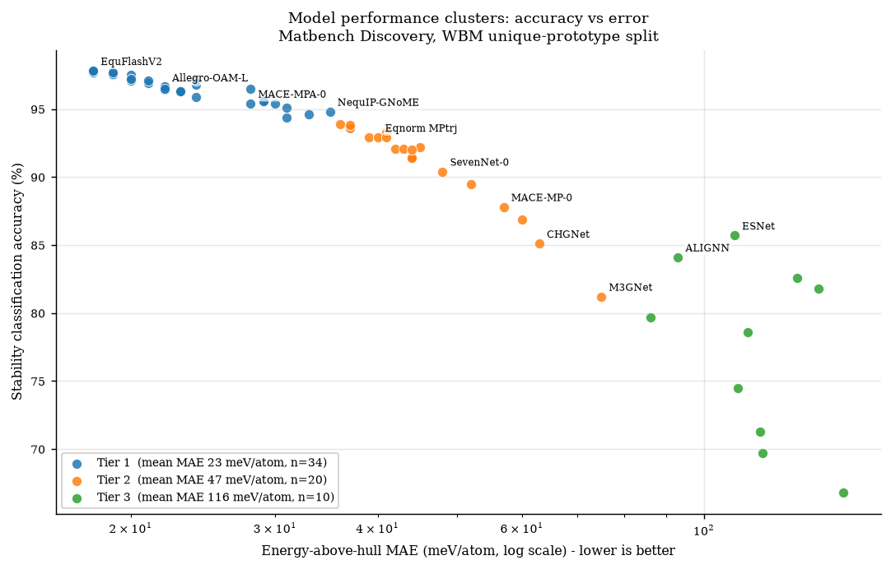
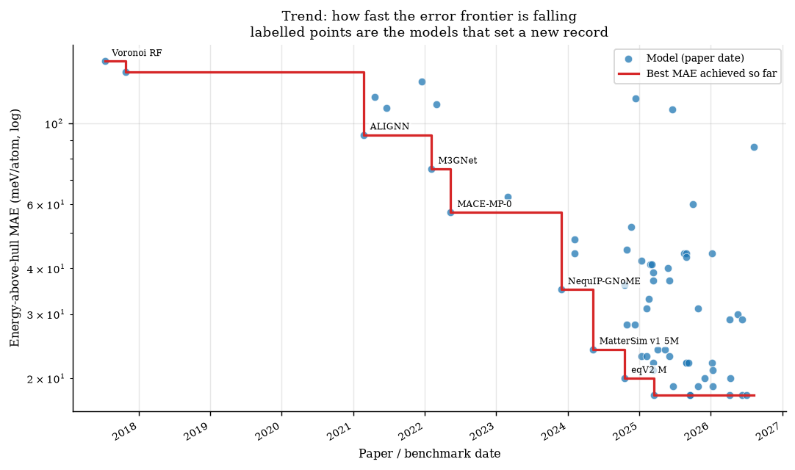
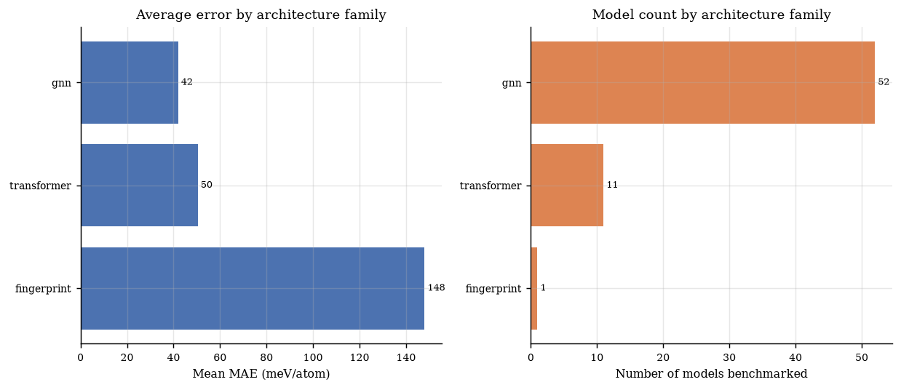
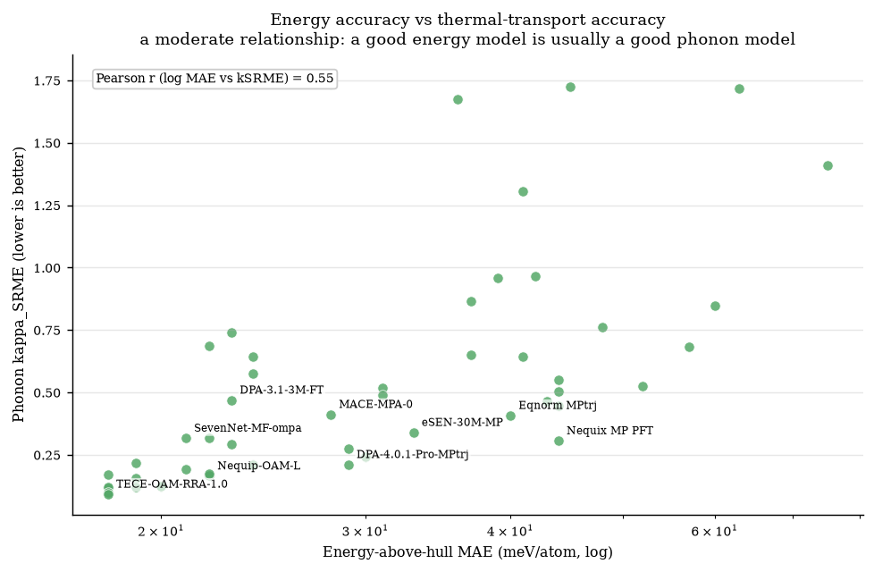
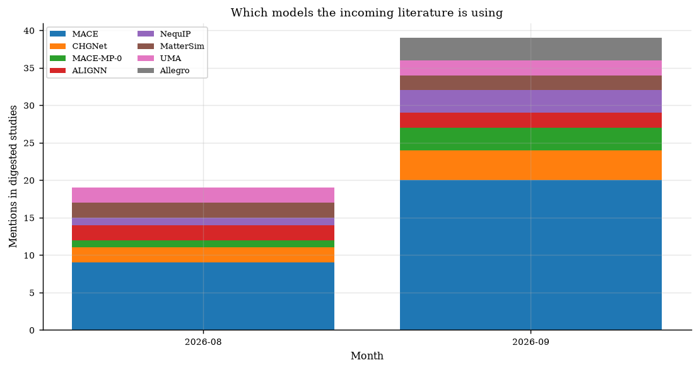

# AI Models for Materials Discovery - Performance Summary

Generated 2026-10-07 by `build_summary.py`. Rows are ordered by reported accuracy (descending), then by error (ascending) - not chronologically. Blank cells mean the value was not published in a machine-readable form; every blank is itemised in [NEEDS_DATA.md](NEEDS_DATA.md).

## How to read this document

Two tables, two very different evidentiary standards:

1. **Table 1** comes from the Matbench Discovery leaderboard, where every model is evaluated on the *same* held-out test set with the *same* DFT reference. These numbers are directly comparable.
2. **Table 2** comes from the daily digest, i.e. whatever the literature published this week. Each study uses its own test set and its own definition of error, so those numbers are **not** comparable to each other. Treat Table 2 as a lead list, not a ranking.

## Headline numbers

- **65** models tracked, **64** with comparable accuracy figures.
- Highest stability-classification accuracy: **EquFlashV2** at **97.8%** (F1 0.929).
- Lowest energy error: **EquFlashV2** at **18 meV/atom**.
- **574** studies parsed from the digest; **36** reported a numeric performance figure in the abstract.

## Figures

**Performance clusters: accuracy vs error**

**Trend: error frontier over time**

**Architecture families and their mean error**

**Energy accuracy vs thermal transport accuracy**

**Model mentions in the incoming literature**

## Table 1 - Benchmarked models, ranked by accuracy

Source: [Matbench Discovery](https://github.com/janosh/matbench-discovery) (CC-BY-4.0). Test set: WBM unique prototypes, ~215k inorganic crystals, scored against the Materials Project PBE convex hull. `kSRME` is the phonon thermal-conductivity error (lower is better); it is blank for models that were never evaluated on it.

| # | Model | Acc. (%) | MAE (meV/atom) | RMSE (meV/atom) | F1 | R2 | kSRME | Tier | Architecture | Params | Calculation method / reference | Materials tested | Training set | Date | DOI |
|---|---|---|---|---|---|---|---|---|---|---|---|---|---|---|---|
| 1 | **EquFlashV2** | 97.8 | 18 | 66 | 0.929 | 0.873 | 0.094 | 1 | gnn | 44.9M | DFT PBE(+U), Materials Project settings; DFT single-point + relaxation: energy, forces, stress | WBM (unique prototypes), inorganic crystals vs MP convex hull | MPtrj, OMat24, sAlex | 2026-06-11 | [link](https://proceedings.mlr.press/v267/lee25l.html) |
| 2 | **EquiformerV3+DeNS-OAM** | 97.8 | 18 | 67 | 0.931 | 0.868 | 0.118 | 1 | transformer | 30.3M | DFT PBE(+U), Materials Project settings; DFT single-point + relaxation: energy, forces, stress | WBM (unique prototypes), inorganic crystals vs MP convex hull | MPtrj, OMat24, sAlex | 2026-04-07 | [10.48550/arXiv.2604.09130](https://doi.org/10.48550/arXiv.2604.09130) |
| 3 | **TACE-OAM-RRA-Preview** | 97.8 | 18 | 68 | 0.928 | 0.866 | 0.101 | 1 | gnn | 213.7M | DFT PBE(+U), Materials Project settings; DFT single-point + relaxation: energy, forces, stress | WBM (unique prototypes), inorganic crystals vs MP convex hull | MPtrj, OMat24, sAlex | 2025-09-18 | [10.57967/hf/7458](https://doi.org/10.57967/hf/7458) |
| 4 | **TECE-OAM-RRA-1.0** | 97.8 | 18 | 66 | 0.929 | 0.871 | 0.093 | 1 | gnn | 221.9M | DFT PBE(+U), Materials Project settings; DFT single-point + relaxation: energy, forces, stress | WBM (unique prototypes), inorganic crystals vs MP convex hull | MPtrj, OMat24, sAlex | 2025-09-18 | [10.57967/hf/7458](https://doi.org/10.57967/hf/7458) |
| 5 | **eSEN-30M-OAM** | 97.7 | 18 | 67 | 0.925 | 0.866 | 0.17 | 1 | gnn | 30.2M | DFT PBE(+U), Materials Project settings; DFT single-point + relaxation: energy, forces, stress | WBM (unique prototypes), inorganic crystals vs MP convex hull | MPtrj, OMat24, sAlex | 2025-03-17 | [10.48550/arXiv.2502.12147](https://doi.org/10.48550/arXiv.2502.12147) |
| 6 | **GRACE-3L-OAM-L** | 97.7 | 18 | 65 | 0.925 | 0.875 | 0.121 | 1 | gnn | 42.1M | DFT PBE(+U), Materials Project settings; S2EF | WBM (unique prototypes), inorganic crystals vs MP convex hull | MPtrj, OMat24, sAlex | 2026-07-02 | [10.1038/s41524-026-01979-1](https://doi.org/10.1038/s41524-026-01979-1) |
| 7 | **PET-OAM-XL** | 97.7 | 19 | 68 | 0.924 | 0.864 | 0.119 | 1 | transformer | 730.0M | DFT PBE(+U), Materials Project settings; DFT single-point + relaxation: energy, forces, stress | WBM (unique prototypes), inorganic crystals vs MP convex hull | MPtrj, OMat24, sAlex | 2026-01-10 | [10.1038/s41467-025-65662-7](https://doi.org/10.1038/s41467-025-65662-7) |
| 8 | **MatRIS-10M-OAM** | 97.6 | 19 | 66 | 0.921 | 0.871 | 0.218 | 1 | gnn | 10.4M | DFT PBE(+U), Materials Project settings; DFT energy, forces, stress, magmoms | WBM (unique prototypes), inorganic crystals vs MP convex hull | MPtrj, OMat24, sAlex | 2025-10-29 | [10.48550/arXiv.2603.02002](https://doi.org/10.48550/arXiv.2603.02002) |
| 9 | **EquFlash** | 97.5 | 19 | 66 | 0.919 | 0.871 | 0.158 | 1 | gnn | 28.7M | DFT PBE(+U), Materials Project settings; DFT single-point + relaxation: energy, forces, stress | WBM (unique prototypes), inorganic crystals vs MP convex hull | MPtrj, OMat24, sAlex | 2025-06-23 | [link](https://proceedings.mlr.press/v267/lee25l.html) |
| 10 | **eqV2 M** | 97.5 | 20 | 72 | 0.917 | 0.848 | 1.771 | 1 | transformer | 86.6M | DFT PBE(+U), Materials Project settings; DFT single-point + relaxation: energy, forces, stress | WBM (unique prototypes), inorganic crystals vs MP convex hull | MPtrj, OMat24 | 2024-10-18 | [10.48550/arXiv.2410.12771](https://doi.org/10.48550/arXiv.2410.12771) |
| 11 | **TACE-OAM-L** | 97.2 | 20 | 67 | 0.91 | 0.868 | 0.126 | 1 | gnn | 82.9M | DFT PBE(+U), Materials Project settings; DFT single-point + relaxation: energy, forces, stress | WBM (unique prototypes), inorganic crystals vs MP convex hull | MPtrj, OMat24, sAlex | 2026-04-09 | [10.57967/hf/7458](https://doi.org/10.57967/hf/7458) |
| 12 | **Nequip-OAM-XL** | 97.1 | 20 | 66 | 0.906 | 0.872 | 0.125 | 1 | gnn | 32.1M | DFT PBE(+U), Materials Project settings; DFT single-point + relaxation: energy, forces, stress | WBM (unique prototypes), inorganic crystals vs MP convex hull | MPtrj, OMat24, sAlex | 2025-11-30 | [10.5281/zenodo.16980200](https://doi.org/10.5281/zenodo.16980200) |
| 13 | **SevenNet-Omni-i12** | 97.1 | 21 | 67 | 0.906 | 0.868 | 0.192 | 1 | gnn | 54.9M | DFT (see training set); DFT single-point + relaxation: energy, forces, stress | WBM (unique prototypes), inorganic crystals vs MP convex hull | COSMOSDataset | 2026-01-12 | [10.48550/arXiv.2510.11241](https://doi.org/10.48550/arXiv.2510.11241) |
| 14 | **ORB v3** | 97.1 | 24 | 78 | 0.905 | 0.821 | 0.21 | 1 | transformer | 25.5M | DFT PBE(+U), Materials Project settings; DFT single-point + relaxation: energy, forces, stress | WBM (unique prototypes), inorganic crystals vs MP convex hull | MPtrj, Alex, OMat24 | 2025-04-05 | [10.48550/arXiv.2504.06231](https://doi.org/10.48550/arXiv.2504.06231) |
| 15 | **SevenNet-MF-ompa** | 96.9 | 21 | 67 | 0.901 | 0.867 | 0.317 | 1 | gnn | 25.7M | DFT PBE(+U), Materials Project settings; DFT single-point + relaxation: energy, forces, stress | WBM (unique prototypes), inorganic crystals vs MP convex hull | MPtrj, OMat24, sAlex | 2025-03-13 | [10.1021/jacs.4c14455](https://doi.org/10.1021/jacs.4c14455) |
| 16 | **AlphaNet-v1-OAM** | 96.8 | 24 | 76 | 0.901 | 0.831 | 0.643 | 1 | gnn | 4.7M | DFT PBE(+U), Materials Project settings; DFT single-point + relaxation: energy, forces, stress | WBM (unique prototypes), inorganic crystals vs MP convex hull | MPtrj, OMat24, sAlex | 2025-05-12 | [10.48550/arXiv.2501.07155](https://doi.org/10.48550/arXiv.2501.07155) |
| 17 | **Nequip-OAM-L** | 96.7 | 22 | 68 | 0.893 | 0.865 | 0.166 | 1 | gnn | 9.6M | DFT PBE(+U), Materials Project settings; DFT single-point + relaxation: energy, forces, stress | WBM (unique prototypes), inorganic crystals vs MP convex hull | MPtrj, OMat24, sAlex | 2025-08-28 | [10.5281/zenodo.16980200](https://doi.org/10.5281/zenodo.16980200) |
| 18 | **Allegro-OAM-L** | 96.6 | 22 | 67 | 0.895 | 0.868 | 0.319 | 1 | gnn | 9.7M | DFT PBE(+U), Materials Project settings; DFT single-point + relaxation: energy, forces, stress | WBM (unique prototypes), inorganic crystals vs MP convex hull | MPtrj, OMat24, sAlex | 2025-08-28 | [10.5281/zenodo.16980200](https://doi.org/10.5281/zenodo.16980200) |
| 19 | **DPA3-v2-OpenLAM** | 96.6 | 22 | 67 | 0.89 | 0.869 | 0.688 | 1 | gnn | 7.0M | DFT (see training set); DFT single-point + relaxation: energy, forces, stress | WBM (unique prototypes), inorganic crystals vs MP convex hull | OpenLAM | 2025-03-14 | [10.1038/s41524-026-02146-2](https://doi.org/10.1038/s41524-026-02146-2) |
| 20 | **TACE-v1-OAM-M** | 96.5 | 22 | 68 | 0.889 | 0.865 | 0.173 | 1 | gnn | 18.8M | DFT PBE(+U), Materials Project settings; DFT single-point + relaxation: energy, forces, stress | WBM (unique prototypes), inorganic crystals vs MP convex hull | MPtrj, OMat24, sAlex | 2026-01-06 | [10.57967/hf/7458](https://doi.org/10.57967/hf/7458) |
| 21 | **ORB v2 MPA** | 96.5 | 28 | 77 | 0.88 | 0.824 | 1.734 | 1 | transformer | 25.2M | DFT PBE(+U), Materials Project settings; DFT single-point + relaxation: energy, forces, stress | WBM (unique prototypes), inorganic crystals vs MP convex hull | MPtrj, Alex | 2024-10-29 | [10.48550/arXiv.2410.22570](https://doi.org/10.48550/arXiv.2410.22570) |
| 22 | **GRACE-2L-OAM-L** | 96.4 | 22 | 68 | 0.883 | 0.862 | 0.169 | 1 | gnn | 26.4M | DFT PBE(+U), Materials Project settings; S2EF | WBM (unique prototypes), inorganic crystals vs MP convex hull | MPtrj, OMat24, sAlex | 2025-09-09 | [10.48550/arXiv.2508.17936](https://doi.org/10.48550/arXiv.2508.17936) |
| 23 | **DPA-3.1-3M-FT** | 96.3 | 23 | 67 | 0.884 | 0.869 | 0.469 | 1 | gnn | 3.3M | DFT (see training set); DFT single-point + relaxation: energy, forces, stress | WBM (unique prototypes), inorganic crystals vs MP convex hull | OpenLAM | 2025-06-05 | [10.1038/s41524-026-02146-2](https://doi.org/10.1038/s41524-026-02146-2) |
| 24 | **DPA3-v1-OpenLAM** | 96.3 | 23 | 67 | 0.883 | 0.869 | 0.741 | 1 | gnn | 8.2M | DFT (see training set); DFT single-point + relaxation: energy, forces, stress | WBM (unique prototypes), inorganic crystals vs MP convex hull | OpenLAM | 2025-01-10 | [10.1038/s41524-026-02146-2](https://doi.org/10.1038/s41524-026-02146-2) |
| 25 | **GRACE-2L-OAM** | 96.3 | 23 | 68 | 0.88 | 0.862 | 0.294 | 1 | gnn | 12.6M | DFT PBE(+U), Materials Project settings; S2EF | WBM (unique prototypes), inorganic crystals vs MP convex hull | MPtrj, OMat24, sAlex | 2025-02-06 | [10.1103/PhysRevX.14.021036](https://doi.org/10.1103/PhysRevX.14.021036) |
| 26 | **MatterSim v1 5M** | 95.9 | 24 | 68 | 0.862 | 0.863 | 0.575 | 1 | gnn | 4.5M | DFT (see training set); DFT single-point + relaxation: energy, forces, stress | WBM (unique prototypes), inorganic crystals vs MP convex hull | MatterSim | 2024-05-08 | [10.48550/arXiv.2405.04967](https://doi.org/10.48550/arXiv.2405.04967) |
| 27 | **DPA-4.0.1-Pro-MPtrj** | 95.6 | 29 | 74 | 0.857 | 0.836 | 0.211 | 1 | gnn | 22.8M | DFT PBE(+U), Materials Project settings; DFT single-point + relaxation: energy, forces, stress | WBM (unique prototypes), inorganic crystals vs MP convex hull | MPtrj | 2026-06-11 | [10.48550/arXiv.2606.02419](https://doi.org/10.48550/arXiv.2606.02419) |
| 28 | **EquiformerV3+DeNS-MP** | 95.6 | 29 | 74 | 0.863 | 0.84 | 0.275 | 1 | transformer | 30.3M | DFT PBE(+U), Materials Project settings; DFT single-point + relaxation: energy, forces, stress | WBM (unique prototypes), inorganic crystals vs MP convex hull | MPtrj | 2026-04-07 | [10.48550/arXiv.2604.09130](https://doi.org/10.48550/arXiv.2604.09130) |
| 29 | **MACE-MPA-0** | 95.4 | 28 | 73 | 0.852 | 0.842 | 0.412 | 1 | gnn | 9.1M | DFT PBE(+U), Materials Project settings; DFT single-point + relaxation: energy, forces, stress | WBM (unique prototypes), inorganic crystals vs MP convex hull | MPtrj, sAlex | 2024-12-09 | [10.48550/arXiv.2401.00096](https://doi.org/10.48550/arXiv.2401.00096) |
| 30 | **DPA-4.0-Pro-MPtrj** | 95.4 | 30 | 78 | 0.85 | 0.823 | 0.241 | 1 | gnn | 32.7M | DFT PBE(+U), Materials Project settings; DFT single-point + relaxation: energy, forces, stress | WBM (unique prototypes), inorganic crystals vs MP convex hull | MPtrj | 2026-05-20 | [10.48550/arXiv.2606.02419](https://doi.org/10.48550/arXiv.2606.02419) |
| 31 | **MatRIS-10M-MP** | 95.1 | 31 | 77 | 0.847 | 0.824 | 0.489 | 1 | gnn | 10.4M | DFT PBE(+U), Materials Project settings; DFT energy, forces, stress, magmoms | WBM (unique prototypes), inorganic crystals vs MP convex hull | MPtrj | 2025-10-29 | [10.48550/arXiv.2603.02002](https://doi.org/10.48550/arXiv.2603.02002) |
| 32 | **NequIP-GNoME** | 94.8 | 35 | 85 | 0.829 | 0.785 |  | 1 | gnn | 16.2M | DFT (see training set); DFT single-point + relaxation: energy, forces, stress | WBM (unique prototypes), inorganic crystals vs MP convex hull | GNoME | 2023-11-29 | [10.1038/s41586-023-06735-9](https://doi.org/10.1038/s41586-023-06735-9) |
| 33 | **eSEN-30M-MP** | 94.6 | 33 | 78 | 0.831 | 0.822 | 0.34 | 1 | gnn | 30.1M | DFT PBE(+U), Materials Project settings; DFT single-point + relaxation: energy, forces, stress | WBM (unique prototypes), inorganic crystals vs MP convex hull | MPtrj | 2025-02-17 | [10.48550/arXiv.2502.12147](https://doi.org/10.48550/arXiv.2502.12147) |
| 34 | **GRACE-1L-OAM** | 94.4 | 31 | 73 | 0.824 | 0.842 | 0.517 | 1 | gnn | 3.4M | DFT PBE(+U), Materials Project settings; S2EF | WBM (unique prototypes), inorganic crystals vs MP convex hull | MPtrj, OMat24, sAlex | 2025-02-06 | [10.1103/PhysRevX.14.021036](https://doi.org/10.1103/PhysRevX.14.021036) |
| 35 | **eqV2 S DeNS** | 93.9 | 36 | 85 | 0.815 | 0.788 | 1.676 | 2 | transformer | 31.2M | DFT PBE(+U), Materials Project settings; DFT single-point + relaxation: energy, forces, stress | WBM (unique prototypes), inorganic crystals vs MP convex hull | MPtrj | 2024-10-18 | [10.48550/arXiv.2410.12771](https://doi.org/10.48550/arXiv.2410.12771) |
| 36 | **MatRIS v0.5.0 MPtrj** | 93.8 | 37 | 82 | 0.809 | 0.803 | 0.865 | 2 | gnn | 5.8M | DFT PBE(+U), Materials Project settings; DFT energy, forces, stress, magmoms | WBM (unique prototypes), inorganic crystals vs MP convex hull | MPtrj | 2025-03-13 | [10.48550/arXiv.2603.02002](https://doi.org/10.48550/arXiv.2603.02002) |
| 37 | **DPA-3.1-MPtrj** | 93.6 | 37 | 80 | 0.803 | 0.812 | 0.65 | 2 | gnn | 4.8M | DFT PBE(+U), Materials Project settings; DFT single-point + relaxation: energy, forces, stress | WBM (unique prototypes), inorganic crystals vs MP convex hull | MPtrj | 2025-06-05 | [10.1038/s41524-026-02146-2](https://doi.org/10.1038/s41524-026-02146-2) |
| 38 | **AlphaNet-v1-MPtrj** | 93.3 | 41 | 93 | 0.799 | 0.745 | 1.305 | 2 | gnn | 16.2M | DFT PBE(+U), Materials Project settings; DFT single-point + relaxation: energy, forces, stress | WBM (unique prototypes), inorganic crystals vs MP convex hull | MPtrj | 2025-03-05 | [10.48550/arXiv.2501.07155](https://doi.org/10.48550/arXiv.2501.07155) |
| 39 | **DPA3-v2-MPtrj** | 92.9 | 39 | 81 | 0.786 | 0.804 | 0.96 | 2 | gnn | 4.9M | DFT PBE(+U), Materials Project settings; DFT single-point + relaxation: energy, forces, stress | WBM (unique prototypes), inorganic crystals vs MP convex hull | MPtrj | 2025-03-14 | [10.1038/s41524-026-02146-2](https://doi.org/10.1038/s41524-026-02146-2) |
| 40 | **Eqnorm MPtrj** | 92.9 | 40 | 83 | 0.786 | 0.799 | 0.408 | 2 | gnn | 1.3M | DFT PBE(+U), Materials Project settings; DFT single-point + relaxation: energy, forces, stress | WBM (unique prototypes), inorganic crystals vs MP convex hull | MPtrj | 2025-05-26 | [link](https://github.com/yzchen08/eqnorm) |
| 41 | **HIENet** | 92.9 | 41 | 84 | 0.777 | 0.793 | 0.642 | 2 | gnn | 7.5M | DFT PBE(+U), Materials Project settings; DFT single-point + relaxation: energy, forces, stress | WBM (unique prototypes), inorganic crystals vs MP convex hull | MPtrj | 2025-02-25 | [10.48550/arXiv.2503.05771](https://doi.org/10.48550/arXiv.2503.05771) |
| 42 | **ORB v2 MPtrj** | 92.2 | 45 | 91 | 0.765 | 0.756 | 1.726 | 2 | transformer | 25.2M | DFT PBE(+U), Materials Project settings; DFT single-point + relaxation: energy, forces, stress | WBM (unique prototypes), inorganic crystals vs MP convex hull | MPtrj | 2024-10-29 | [10.48550/arXiv.2410.22570](https://doi.org/10.48550/arXiv.2410.22570) |
| 43 | **DPA3-v1-MPtrj** | 92.1 | 42 | 83 | 0.765 | 0.798 | 0.965 | 2 | gnn | 3.4M | DFT PBE(+U), Materials Project settings; DFT single-point + relaxation: energy, forces, stress | WBM (unique prototypes), inorganic crystals vs MP convex hull | MPtrj | 2025-01-10 | [10.1038/s41524-026-02146-2](https://doi.org/10.1038/s41524-026-02146-2) |
| 44 | **Nequip-MP-L** | 92.1 | 43 | 84 | 0.761 | 0.791 | 0.466 | 2 | gnn | 9.6M | DFT PBE(+U), Materials Project settings; DFT single-point + relaxation: energy, forces, stress | WBM (unique prototypes), inorganic crystals vs MP convex hull | MPtrj | 2025-08-28 | [10.5281/zenodo.16980200](https://doi.org/10.5281/zenodo.16980200) |
| 45 | **SevenNet-l3i5** | 92 | 44 | 87 | 0.76 | 0.776 | 0.55 | 2 | gnn | 1.2M | DFT PBE(+U), Materials Project settings; DFT single-point + relaxation: energy, forces, stress | WBM (unique prototypes), inorganic crystals vs MP convex hull | MPtrj | 2024-02-06 | [10.1021/acs.jctc.4c00190](https://doi.org/10.1021/acs.jctc.4c00190) |
| 46 | **Allegro-MP-L** | 91.5 | 44 | 87 | 0.751 | 0.778 | 0.504 | 2 | gnn | 18.7M | DFT PBE(+U), Materials Project settings; DFT single-point + relaxation: energy, forces, stress | WBM (unique prototypes), inorganic crystals vs MP convex hull | MPtrj | 2025-08-28 | [10.5281/zenodo.16980200](https://doi.org/10.5281/zenodo.16980200) |
| 47 | **Nequix MP PFT** | 91.4 | 44 | 85 | 0.748 | 0.784 | 0.307 | 2 | gnn | 708k | DFT PBE(+U), Materials Project settings; DFT single-point + relaxation: energy, forces, stress | WBM (unique prototypes), inorganic crystals vs MP convex hull | MPtrj, MDR-MP PBE ω_q | 2026-01-08 | [10.48550/arXiv.2601.07742](https://doi.org/10.48550/arXiv.2601.07742) |
| 48 | **Nequix MP** | 91.4 | 44 | 86 | 0.751 | 0.782 | 0.446 | 2 | gnn | 708k | DFT PBE(+U), Materials Project settings; DFT single-point + relaxation: energy, forces, stress | WBM (unique prototypes), inorganic crystals vs MP convex hull | MPtrj | 2025-08-17 | [10.48550/arXiv.2508.16067](https://doi.org/10.48550/arXiv.2508.16067) |
| 49 | **SevenNet-0** | 90.4 | 48 | 92 | 0.724 | 0.75 | 0.762 | 2 | gnn | 842k | DFT PBE(+U), Materials Project settings; DFT single-point + relaxation: energy, forces, stress | WBM (unique prototypes), inorganic crystals vs MP convex hull | MPtrj | 2024-02-06 | [10.1021/acs.jctc.4c00190](https://doi.org/10.1021/acs.jctc.4c00190) |
| 50 | **GRACE-2L-MPtrj** | 89.5 | 52 | 94 | 0.691 | 0.741 | 0.525 | 2 | gnn | 15.3M | DFT PBE(+U), Materials Project settings; S2EF | WBM (unique prototypes), inorganic crystals vs MP convex hull | MPtrj | 2024-11-21 | [10.1103/PhysRevX.14.021036](https://doi.org/10.1103/PhysRevX.14.021036) |
| 51 | **MACE-MP-0** | 87.8 | 57 | 101 | 0.669 | 0.697 | 0.682 | 2 | gnn | 4.7M | DFT PBE(+U), Materials Project settings; DFT single-point + relaxation: energy, forces, stress | WBM (unique prototypes), inorganic crystals vs MP convex hull | MPtrj | 2022-05-13 | [10.48550/arXiv.2401.00096](https://doi.org/10.48550/arXiv.2401.00096) |
| 52 | **BAM-MP-core** | 86.9 | 60 | 99 | 0.623 | 0.712 | 0.848 | 2 | gnn | 17.0M | DFT PBE(+U), Materials Project settings; DFT single-point + relaxation: energy, forces, stress | WBM (unique prototypes), inorganic crystals vs MP convex hull | MPtrj | 2025-10-03 | [10.48550/arXiv.2510.03046](https://doi.org/10.48550/arXiv.2510.03046) |
| 53 | **ESNet** | 85.7 | 109 | 194 | 0.572 | -0.114 |  | 3 | transformer | 5.4M | DFT (see training set); relaxed structure to relaxed energy | WBM (unique prototypes), inorganic crystals vs MP convex hull | MP 2022 | 2025-06-20 | [10.21203/rs.3.rs-5979703/v1](https://doi.org/10.21203/rs.3.rs-5979703/v1) |
| 54 | **CHGNet** | 85.1 | 63 | 103 | 0.613 | 0.689 | 1.717 | 2 | gnn | 413k | DFT PBE(+U), Materials Project settings; DFT energy, forces, stress, magmoms | WBM (unique prototypes), inorganic crystals vs MP convex hull | MPtrj | 2023-03-01 | [10.48550/arXiv.2302.14231](https://doi.org/10.48550/arXiv.2302.14231) |
| 55 | **ALIGNN** | 84.1 | 93 | 154 | 0.567 | 0.297 |  | 3 | gnn | 4.0M | DFT (see training set); relaxed structure to relaxed energy | WBM (unique prototypes), inorganic crystals vs MP convex hull | MP 2022 | 2021-02-22 | [10.1038/s41524-021-00650-1](https://doi.org/10.1038/s41524-021-00650-1) |
| 56 | **MEGNet** | 82.6 | 130 | 206 | 0.51 | -0.248 |  | 3 | gnn | 168k | DFT (see training set); relaxed structure to relaxed energy | WBM (unique prototypes), inorganic crystals vs MP convex hull | MP Graphs | 2021-12-18 | [10.1021/acs.chemmater.9b01294](https://doi.org/10.1021/acs.chemmater.9b01294) |
| 57 | **CGCNN** | 81.8 | 138 | 233 | 0.507 | -0.603 |  | 3 | gnn | 128k | DFT (see training set); relaxed structure to relaxed energy | WBM (unique prototypes), inorganic crystals vs MP convex hull | MP 2022 | 2017-10-27 | [10.1103/PhysRevLett.120.145301](https://doi.org/10.1103/PhysRevLett.120.145301) |
| 58 | **M3GNet** | 81.2 | 75 | 118 | 0.569 | 0.585 | 1.409 | 2 | gnn | 228k | DFT PBE(+U), MPF2021; DFT single-point + relaxation: energy, forces, stress | WBM (unique prototypes), inorganic crystals vs MP convex hull | MPF | 2022-02-05 | [10.1038/s43588-022-00349-3](https://doi.org/10.1038/s43588-022-00349-3) |
| 59 | **EMA-GNN** | 79.7 | 86 | 141 | 0.558 | 0.412 |  | 3 | gnn | 2.2M | DFT (see training set); relaxed structure to relaxed energy | WBM (unique prototypes), inorganic crystals vs MP convex hull | MP 2022 | 2026-08-08 | [10.6084/m9.figshare.33111509](https://doi.org/10.6084/m9.figshare.33111509) |
| 60 | **CGCNN+P** | 78.6 | 113 | 182 | 0.5 | 0.019 |  | 3 | gnn | 128k | DFT (see training set); structure to relaxed energy | WBM (unique prototypes), inorganic crystals vs MP convex hull | MP 2022 | 2022-02-28 | [10.1038/s41524-022-00891-8](https://doi.org/10.1038/s41524-022-00891-8) |
| 61 | **Wrenformer** | 74.5 | 110 | 186 | 0.466 | -0.018 |  | 3 | transformer | 5.2M | DFT (see training set); relaxed prototype to relaxed energy | WBM (unique prototypes), inorganic crystals vs MP convex hull | MP 2022 | 2021-06-21 | [10.1126/sciadv.abn4117](https://doi.org/10.1126/sciadv.abn4117) |
| 62 | **AlchemBERT** | 71.3 | 117 | 175 | 0.421 | 0.096 |  | 3 | transformer | 110.0M | DFT (see training set); relaxed structure to relaxed energy | WBM (unique prototypes), inorganic crystals vs MP convex hull | MP 2022 | 2024-12-11 | [10.26434/chemrxiv-2024-r4dnl](https://doi.org/10.26434/chemrxiv-2024-r4dnl) |
| 63 | **BOWSR** | 69.7 | 118 | 167 | 0.423 | 0.151 |  | 3 | gnn, bayesian_optimization | 168k | DFT (see training set); relaxed structure to relaxed energy | WBM (unique prototypes), inorganic crystals vs MP convex hull | MP Graphs | 2021-04-20 | [10.1016/j.mattod.2021.08.012](https://doi.org/10.1016/j.mattod.2021.08.012) |
| 64 | **Voronoi RF** | 66.8 | 148 | 212 | 0.333 | -0.329 |  | 3 | fingerprint, random_forest | 26.2M | DFT (see training set); relaxed structure to relaxed energy | WBM (unique prototypes), inorganic crystals vs MP convex hull | MP 2022 | 2017-07-14 | [10.1103/PhysRevB.96.024104](https://doi.org/10.1103/PhysRevB.96.024104) |
| 65 | **ALIGNN FF** |  |  |  |  |  |  |  | gnn |  | DFT PBE(+U), Materials Project settings; DFT single-point + relaxation: energy, forces, stress |  | MPtrj | 2022-09-16 | [10.1039/D2DD00096B](https://doi.org/10.1039/D2DD00096B) |

## Table 2 - Studies from the daily digest

Extracted automatically from titles and abstracts. Ordered by the numeric figure found (accuracy %, or 100 - error %, or R2/F1 x 100), then blanks. **Caveat:** abstracts state a numeric performance figure only about 10% of the time, so most metric cells are blank by necessity, not by oversight.

| # | Sort value | Study | Models named | Materials / systems | Calculation method | Metrics found | Date | DOI |
|---|---|---|---|---|---|---|---|---|
| 1 | 660 | [A Gentle Push: Fine-Tuning Foundation Models for Complex Oxide Surface Reconstructions](https://doi.org/10.26434/chemrxiv.15001629/v3) |  | oxide | MLIP | R2 6.6 | 2026-09-11 | [10.26434/chemrxiv.15001629/v3](https://doi.org/10.26434/chemrxiv.15001629/v3) |
| 2 | 388 | [Single-Atom Palladium Functionalized Reduced Graphene Oxide Coupled with a Physics-Data Dual-Driven Deep Learning Framework for Interpretable Discrimi](https://doi.org/10.1021/acssensors.6c01470) |  | 2D material, oxide | DFT | F1 3.88 | 2026-09-08 | [10.1021/acssensors.6c01470](https://doi.org/10.1021/acssensors.6c01470) |
| 3 | 100 | [Numerical Photovoltaic Device Modeling and Machine Learning-AssistedPerformance Optimization of MAPbBr3/La2NiMnO6 Double-Absorber SolarCell](https://doi.org/10.2139/ssrn.7403521) |  | perovskite, photovoltaic, La2NiMnO6 |  | R2 1 | 2026-09-03 | [10.2139/ssrn.7403521](https://doi.org/10.2139/ssrn.7403521) |
| 4 | 99.7 | [Physics-Informed Dual-Path Deep Learning for Joint SOH and RUL Estimation of EV Batteries Under Variable-Temperature Fast Charging Conditions](https://doi.org/10.2139/ssrn.7528619) |  |  |  | MAE 0.35 %; MAE 0.48 %; R2 0.993 | 2026-09-26 | [10.2139/ssrn.7528619](https://doi.org/10.2139/ssrn.7528619) |
| 5 | 99.3 | [Solar photocatalytic degradation of seawater organic pollutants using RSM process optimization and advanced machine learning modeling](https://doi.org/10.2166/ws.2026.200) |  | catalyst, oxide, TiO2 |  | R2 0.993; R2 0.953; R2 0.973 | 2026-09-04 | [10.2166/ws.2026.200](https://doi.org/10.2166/ws.2026.200) |
| 6 | 99.2 | [CoTAR: Topology and Atomic State Reconstruction in Condensed Phases](https://doi.org/10.1021/acs.jcim.6c02184) |  |  | DFT, MD, MLIP | F1 0.992 | 2026-09-18 | [10.1021/acs.jcim.6c02184](https://doi.org/10.1021/acs.jcim.6c02184) |
| 7 | 98.4 | [Integrating Multi-Task Surrogate Modelling with Reinforcement Learning for Autonomous CO2 Reduction Catalyst Discovery: A Proof-of-Concept Framework](https://doi.org/10.26434/chemrxiv.15007484/v1) |  | catalyst, alloy, CO2 | DFT | R2 0.984; R2 0.974; R2 0.559 | 2026-08-17 | [10.26434/chemrxiv.15007484/v1](https://doi.org/10.26434/chemrxiv.15007484/v1) |
| 8 | 97.9 | [High-Performance Prediction of Thermodynamic Property of NaNO3–NaCl–NaF Molten Salt by Deep Potential Molecular Dynamics Simulation for High-Temperatu](https://doi.org/10.1021/acs.jpcb.6c04441) |  | NaNO3 | MD | error 2.11 % | 2026-09-24 | [10.1021/acs.jpcb.6c04441](https://doi.org/10.1021/acs.jpcb.6c04441) |
| 9 | 97.1 | [OptoMatKG: A Traceable Knowledge Graph Framework with Semantic Retrieval for Optoelectronic Materials Science](https://doi.org/10.26434/chemrxiv.15008315/v1) |  |  |  | F1 0.971 | 2026-09-04 | [10.26434/chemrxiv.15008315/v1](https://doi.org/10.26434/chemrxiv.15008315/v1) |
| 10 | 93 | [Beyond DFT: Quantum Chaos and Neural Networks for 2D Material Device Design](https://doi.org/10.21203/rs.3.rs-10784136/v1) |  | 2D material | DFT | R2 0.93 | 2026-09-04 | [10.21203/rs.3.rs-10784136/v1](https://doi.org/10.21203/rs.3.rs-10784136/v1) |
| 11 | 93 | [Analysis of fine-tuned foundation interatomic potentials and their knowledge distillation into a cluster expansion for Ni–Pt ordering thermodynamics](https://doi.org/10.26434/chemrxiv.15009736/v1) | CHGNet | alloy | DFT, MLIP | error 20 meV/atom; R2 0.93; R2 0.87 | 2026-10-01 | [10.26434/chemrxiv.15009736/v1](https://doi.org/10.26434/chemrxiv.15009736/v1) |
| 12 | 92 | [Interatomic Potential Prediction Based on Charge Equilibration and Equivariant Transformer](https://doi.org/10.70267/cai.26v3n4.3545) |  |  | MLIP | MAE 8 % | 2026-08-24 | [10.70267/cai.26v3n4.3545](https://doi.org/10.70267/cai.26v3n4.3545) |
| 13 | 91.7 | [AI Visualization for Analyzing Factors Influencing Tourists' Satisfaction Under Deep Learning Technology](https://doi.org/10.4018/ijitsa.422106) |  |  |  | accuracy 91.7 %; accuracy 92.1 % | 2026-09-16 | [10.4018/ijitsa.422106](https://doi.org/10.4018/ijitsa.422106) |
| 14 | 90.6 | [Uni-Macro-FRPN: Full-Resolution and Cross-Scale Learning for Polymers](https://doi.org/10.26434/chemrxiv.15009049/v1) |  | polymer |  | accuracy 90.6 %; accuracy 86.4 % | 2026-09-18 | [10.26434/chemrxiv.15009049/v1](https://doi.org/10.26434/chemrxiv.15009049/v1) |
| 15 | 90 | [Navigating sparse singlet fission chemical space: an intelligent generative-predictive paradigm](https://doi.org/10.24435/materialscloud:64-z6) |  | photovoltaic | DFT | success rate 90 % | 2026-09-22 | [10.24435/materialscloud:64-z6](https://doi.org/10.24435/materialscloud:64-z6) |
| 16 | 89.7 | [Machine Learning-Driven Multi-Objective Energy Management and Optimal Power Flow of Grid-Connected Photovoltaic–Battery Energy Storage Systems for Enh](https://doi.org/10.63125/n2fsq754) |  | photovoltaic |  | success rate 89.7 % | 2026-09-11 | [10.63125/n2fsq754](https://doi.org/10.63125/n2fsq754) |
| 17 | 88.8 | [Experimental data-driven machine learning for predicting and validating the photocatalytic performance of doped BiOBr-based materials](https://doi.org/10.2139/ssrn.7560752) |  | catalyst |  | R2 0.888 | 2026-10-04 | [10.2139/ssrn.7560752](https://doi.org/10.2139/ssrn.7560752) |
| 18 | 87 | [Automated Dislocation Detection in Electron Channelling Contrast Imaging: A Comparative Study of Rule-Based, Neural Network, and Deep Learning Approac](http://arxiv.org/abs/2608.28495v1) |  | semiconductor, nitride |  | accuracy 87 % | 2026-08-28 | [link](http://arxiv.org/abs/2608.28495v1) |
| 19 | 86.1 | [Tensor-Resolved Elastic Properties of Silicon Polymorphs from MACE-MP and JARVIS-DFT: A Benchmark Database for Mode-Dependent Elastic Softening](https://doi.org/10.5281/zenodo.22818433) | MACE |  | DFT, MLIP | error 13.94 %; error 37.12 % | 2026-09-17 | [10.5281/zenodo.22818433](https://doi.org/10.5281/zenodo.22818433) |
| 20 | 83.9 | [Efficient Screening of Inhibitors for Copper Film Chemical Mechanical Polishing by Integrating Machine Learning, DFT Calculations, and Experimental Va](https://doi.org/10.2139/ssrn.7537655) |  |  | DFT | accuracy 83.9 % | 2026-09-28 | [10.2139/ssrn.7537655](https://doi.org/10.2139/ssrn.7537655) |
| 21 | 82 | [MRI radiomics-based machine learning model for complete response classification after chemoradiotherapy in advanced rectal cancer](https://doi.org/10.1177/20552076261484806) |  |  |  | F1 0.82 | 2026-08-31 | [10.1177/20552076261484806](https://doi.org/10.1177/20552076261484806) |
| 22 | 79.5 | [Provincial photovoltaic power forecasting based on hierarchical optimization of a time-series foundation model and selective heterogeneous fusion](https://doi.org/10.2139/ssrn.7465198) |  | photovoltaic | MLIP | error 20.53 %; R2 0.976 | 2026-09-15 | [10.2139/ssrn.7465198](https://doi.org/10.2139/ssrn.7465198) |
| 23 | 79 | [The Interference Index: Quantifying and Improving Error Cancellation in Machine-Learned Thermodynamic Stability Predictions](https://doi.org/10.26434/chemrxiv.15008797/v1) |  |  | DFT | error 21 % | 2026-09-15 | [10.26434/chemrxiv.15008797/v1](https://doi.org/10.26434/chemrxiv.15008797/v1) |
| 24 | 77 | [Interpretable Machine Learning Disentangles Pore Confinement Across Multiple Zr-MOF CO2 Capture Targets](https://doi.org/10.26434/chemrxiv.15008444/v2) |  | MOF, CO2 |  | R2 0.77 | 2026-09-08 | [10.26434/chemrxiv.15008444/v2](https://doi.org/10.26434/chemrxiv.15008444/v2) |
| 25 | 76 | [From Heuristics to Machine Learning: The Performance Ceiling for Single-Ion Magnets and Its Electronic Origin](http://arxiv.org/abs/2609.24038v1) |  |  | DFT | accuracy 76 % | 2026-09-21 | [link](http://arxiv.org/abs/2609.24038v1) |
| 26 | 67 | [Transfer Learning Approach for Improved Wind Farm Wake Prediction Using Multi-Fidelity Convolutional Neural Networks](https://doi.org/10.1115/omae2026-181761) |  |  |  | RMSE 33 %; error 6 %; F1 3.9 | 2026-09-28 | [10.1115/omae2026-181761](https://doi.org/10.1115/omae2026-181761) |
| 27 | 63 | [Entropy-Guided Dataset Reduction for Machine-Learned Interatomic Potentials](https://doi.org/10.26434/chemrxiv.15008542/v1) |  |  | MLIP | MAE 37 % | 2026-09-09 | [10.26434/chemrxiv.15008542/v1](https://doi.org/10.26434/chemrxiv.15008542/v1) |
| 28 | 62.7 | [Slip System Structure Aware Neural Network for Local Slip Evolution Prediction in Crystal Plasticity: From Unseen Grain Testing to Independent RVE Val](https://doi.org/10.2139/ssrn.7524565) |  |  | finite element | error 37.26 %; error 67.9 % | 2026-09-25 | [10.2139/ssrn.7524565](https://doi.org/10.2139/ssrn.7524565) |
| 29 | 60.8 | [Polymer Informatics Atlas: Property-Specific Representations, Chemistry-Aware Generalization, and Reliability-Aware Machine Learning Across Five Polym](https://doi.org/10.26434/chemrxiv.15008969/v1) |  | polymer, glass / amorphous |  | R2 0.608; R2 0.326; R2 0.874 | 2026-09-17 | [10.26434/chemrxiv.15008969/v1](https://doi.org/10.26434/chemrxiv.15008969/v1) |
| 30 | 58.5 | [Accurate Structural Parameter Retrieval for One-Dimensional Nanogratings in Mueller-Matrix Spectroscopic Ellipsometry Using an Element-Adaptive Hybrid](https://doi.org/10.3390/app16188927) |  |  |  | MAE 41.5 %; MAE 13.3 % | 2026-09-08 | [10.3390/app16188927](https://doi.org/10.3390/app16188927) |
| 31 | 46.4 | [Discriminative-Generative Domain Generalization PersonRe-Identification via Identity-Domain Joint Prompting](https://doi.org/10.2139/ssrn.7549420) |  |  |  | accuracy 46.4 % | 2026-10-01 | [10.2139/ssrn.7549420](https://doi.org/10.2139/ssrn.7549420) |
| 32 | 42.5 | [From sparse boreholes to three-dimensional hydrofacies: integrating geophysics and machine learning to investigate groundwater recharge in a mountaino](https://doi.org/10.2139/ssrn.7556843) |  |  |  | accuracy 42.5 % | 2026-10-03 | [10.2139/ssrn.7556843](https://doi.org/10.2139/ssrn.7556843) |
| 33 | 38.6 | [Universal Machine-learning Molecular Dynamics at the Speed of Empirical Potentials](http://arxiv.org/abs/2608.19041v2) | MACE |  | DFT, MD, MLIP | error 61.4 % | 2026-08-19 | [link](http://arxiv.org/abs/2608.19041v2) |
| 34 | 30 | [Machine-learning-guided exploration of domain walls in the hybrid improper ferroelectric Ca3Ti2O7](https://doi.org/10.48550/arxiv.2609.35346) |  | Ca3Ti2O7 | DFT, MLIP | error 70 % | 2026-09-28 | [10.48550/arxiv.2609.35346](https://doi.org/10.48550/arxiv.2609.35346) |
| 35 | 16.2 | [Boundary-driven phase transformation in layered 3R In2Se3 captured by long range machine learning molecular dynamics](https://doi.org/10.26434/chemrxiv.15009227/v1) | MACE | surface / slab, In2Se3 | PBE, MD | RMSE 83.8 % | 2026-09-22 | [10.26434/chemrxiv.15009227/v1](https://doi.org/10.26434/chemrxiv.15009227/v1) |
| 36 | 6.5 | [Rapid Prediction and Source Identification of Accidental River Pollution Using a Hybrid Machine Learning and Optimization Framework](https://doi.org/10.3390/su18199895) |  |  |  | accuracy 6.49 %; R2 0.994 | 2026-09-28 | [10.3390/su18199895](https://doi.org/10.3390/su18199895) |
| 37 |  | [From Empirical Design To Autonomous Ecosystems: AI-Driven Advances, Challenges, And Future Directions In Precision Nanomedicine](https://doi.org/10.5281/zenodo.21931873) |  |  |  |  | 2026-08-14 | [10.5281/zenodo.21931873](https://doi.org/10.5281/zenodo.21931873) |
| 38 |  | [Materials Discovery and Design](https://doi.org/10.1002/9783527852048.ch9) |  | polymer |  |  | 2026-08-14 | [10.1002/9783527852048.ch9](https://doi.org/10.1002/9783527852048.ch9) |
| 39 |  | [Neural Networks Accelerate Ab Initio Multiple Spawning Simulations: A Case Study of Using Machine Learning Potentials for Excited State Dynamics](https://doi.org/10.26434/chemrxiv.15007443/v1) |  | molecule / organic | DFT, MLIP |  | 2026-08-14 | [10.26434/chemrxiv.15007443/v1](https://doi.org/10.26434/chemrxiv.15007443/v1) |
| 40 |  | [Electrostatic Phenomenology Benchmarks for Machine-Learned Interatomic Potentials in Electrochemistry: Beyond the Energy-Force Metric](http://arxiv.org/abs/2608.14153v1) |  |  | MLIP |  | 2026-08-14 | [link](http://arxiv.org/abs/2608.14153v1) |
| 41 |  | [Universal Thermodynamic Interatomic Potentials for Crystalline Materials](http://arxiv.org/abs/2608.14502v1) | UMA |  | MD, MLIP, free energy |  | 2026-08-14 | [link](http://arxiv.org/abs/2608.14502v1) |
| 42 |  | [Data-Efficient Construction of Material-Specific Machine-Learning Interatomic Potentials from Ab Initio Molecular Dynamics Trajectories](http://arxiv.org/abs/2608.14899v1) | GRACE-1L-OAM, SevenNet-0, MatterSim, MACE-MP-0 |  | DFT, AIMD, MD, MLIP |  | 2026-08-14 | [link](http://arxiv.org/abs/2608.14899v1) |
| 43 |  | [The Past and Future of AI Scientists](http://arxiv.org/abs/2608.14407v1) |  |  | MLIP |  | 2026-08-14 | [link](http://arxiv.org/abs/2608.14407v1) |
| 44 |  | [Discovering Physically Interpretable Mathematical Expression for Predicting CO2 Adsorption in Metal-Organic Frameworks via Machine Learning-Symbolic R](http://arxiv.org/abs/2608.14990v1) |  | MOF, CO2 |  |  | 2026-08-15 | [link](http://arxiv.org/abs/2608.14990v1) |
| 45 |  | [Crystal-structure design by agentic AI in a language of motifs](https://doi.org/10.48550/arxiv.2608.15900) |  | magnetic material | DFT |  | 2026-08-16 | [10.48550/arxiv.2608.15900](https://doi.org/10.48550/arxiv.2608.15900) |
| 46 |  | [Graph neural network prediction of temperature-dependent hydrogen diffusion and thermal conductivity tensors of tungsten containing helium bubbles and](http://arxiv.org/abs/2608.15609v1) |  |  | MD |  | 2026-08-16 | [link](http://arxiv.org/abs/2608.15609v1) |
| 47 |  | [Conservation-Resolved Error Decomposition: A Benchmark Axis for Electronic-Structure Methods and Machine-Learned Interatomic Potentials](https://doi.org/10.26434/chemrxiv.15007478/v1) | MACE | OFF23 | hybrid DFT, MLIP |  | 2026-08-17 | [10.26434/chemrxiv.15007478/v1](https://doi.org/10.26434/chemrxiv.15007478/v1) |
| 48 |  | [G2RINS: A Generative String-and-Graph Polymer Representation to Assist Computational Materials Discovery](https://doi.org/10.26434/chemrxiv.15007504/v1) |  | polymer | MD |  | 2026-08-17 | [10.26434/chemrxiv.15007504/v1](https://doi.org/10.26434/chemrxiv.15007504/v1) |
| 49 |  | [Machine Learning-Accelerated Band-Edge Engineering of Pnictogen Chalcohalide Solid Solutions for Solar Energy Technologies](http://arxiv.org/abs/2608.16611v1) |  |  | DFT |  | 2026-08-17 | [link](http://arxiv.org/abs/2608.16611v1) |
| 50 |  | [Extracting a nitrile-centered, ether-assisted motif hierarchy for lithium-battery electrolyte design from billion-scale molecular space](http://arxiv.org/abs/2608.16364v1) |  |  |  |  | 2026-08-17 | [link](http://arxiv.org/abs/2608.16364v1) |
| 51 |  | [Discovery of novel magnetic Y-Mn-B compounds via advanced machine learning guided framework](http://arxiv.org/abs/2608.17200v1) |  |  | DFT |  | 2026-08-17 | [link](http://arxiv.org/abs/2608.17200v1) |
| 52 |  | [Unlocking Multi-Component Bulk-Materials Molecular Dynamics with a Small-Footprint Machine Learning Interatomic Potential](http://arxiv.org/abs/2608.16329v1) |  |  | MD, MLIP |  | 2026-08-17 | [link](http://arxiv.org/abs/2608.16329v1) |
| 53 |  | [ChemReporter: A Framework for Curating and Exporting Large-Scale Chemical Datasets for MLIP Training](http://arxiv.org/abs/2608.16418v1) |  |  | MLIP |  | 2026-08-17 | [link](http://arxiv.org/abs/2608.16418v1) |
| 54 |  | [Optimization of active learning strategies for infrared spectra prediction in catalysis](https://doi.org/10.26434/chemrxiv.15007549/v1) |  | catalyst, molecule / organic | DFT, AIMD, MD, MLIP |  | 2026-08-18 | [10.26434/chemrxiv.15007549/v1](https://doi.org/10.26434/chemrxiv.15007549/v1) |
| 55 |  | [GRACE-OFF: A machine-learned interatomic potential for organic liquids using the GRACE architecture](https://doi.org/10.26434/chemrxiv.15001529/v2) | GRACE, MACE |  | MLIP |  | 2026-08-18 | [10.26434/chemrxiv.15001529/v2](https://doi.org/10.26434/chemrxiv.15001529/v2) |
| 56 |  | [Atomistic Structure Generation and Neural-Network Screening of Hard Carbons to Identify High-Capacity Sodium Storage](http://arxiv.org/abs/2608.17716v1) |  | Li-ion battery | MLIP |  | 2026-08-18 | [link](http://arxiv.org/abs/2608.17716v1) |
| 57 |  | [Active learning molecular beam epitaxy of complex quantum materials](http://arxiv.org/abs/2608.17742v1) |  |  |  |  | 2026-08-18 | [link](http://arxiv.org/abs/2608.17742v1) |
| 58 |  | [How AI Coding Agents Can Unlock Materials Simulation with NVIDIA ALCHEMI Toolkit](https://developer.nvidia.com/blog/how-ai-coding-agents-can-unlock-materials-simulation-with-nvidia-alchemi-toolkit/) | ALCHEMI |  |  |  | 2026-08-18 | [link](https://developer.nvidia.com/blog/how-ai-coding-agents-can-unlock-materials-simulation-with-nvidia-alchemi-toolkit/) |
| 59 |  | [PyAPX: python toolkit for atomic configuration pattern exploration](https://doi.org/10.1038/s41598-026-66072-5) |  |  | DFT, MLIP |  | 2026-08-19 | [10.1038/s41598-026-66072-5](https://doi.org/10.1038/s41598-026-66072-5) |
| 60 |  | [Local Symmetry Breaking and Correlated Fluctuations in Quantum Materials from Atomistic Foundation Models](https://doi.org/10.26434/chemrxiv.15001387/v2) |  | superconductor | DFT, AIMD, MD, phonons, MLIP |  | 2026-08-19 | [10.26434/chemrxiv.15001387/v2](https://doi.org/10.26434/chemrxiv.15001387/v2) |
| 61 |  | [HIP: Hessian Interatomic Potentials](https://doi.org/10.5281/zenodo.22003592) | EquiformerV2 | molecule / organic | MLIP |  | 2026-08-19 | [10.5281/zenodo.22003592](https://doi.org/10.5281/zenodo.22003592) |
| 62 |  | [Enhancing EBSD throughput of battery electrode materials using super-resolution generative adversarial networks](http://arxiv.org/abs/2608.19117v1) |  | Li-ion battery |  |  | 2026-08-19 | [link](http://arxiv.org/abs/2608.19117v1) |
| 63 |  | [JANUS: A Multi-modal Foundation Neural Sampler for Disordered Materials](http://arxiv.org/abs/2608.19116v1) |  | alloy | Monte Carlo |  | 2026-08-19 | [link](http://arxiv.org/abs/2608.19116v1) |
| 64 |  | [A single design choice determines whether machine learning models of materials make physically impossible predictions](http://arxiv.org/abs/2608.18714v1) |  |  | DFT |  | 2026-08-19 | [link](http://arxiv.org/abs/2608.18714v1) |
| 65 |  | [Dynamic Ensembles of Phosphine-Stabilized Gold Nanoclusters](http://arxiv.org/abs/2608.19404v1) |  |  | MD, MLIP |  | 2026-08-19 | [link](http://arxiv.org/abs/2608.19404v1) |
| 66 |  | [Integration of Machine Learning and Solid-State Chemistry for the Discovery of Electrochemical Materials for Fuel Cells and Electrolyzers](https://doi.org/10.5281/zenodo.22021890) | ALIGNN, MEGNet, CGCNN | Li-ion battery, catalyst, oxide | DFT |  | 2026-08-20 | [10.5281/zenodo.22021890](https://doi.org/10.5281/zenodo.22021890) |
| 67 |  | [Generative AI and Emerging Technologies: Transforming Engineering, Innovation and Entrepreneurship](https://doi.org/10.5281/zenodo.22025110) |  |  |  |  | 2026-08-20 | [10.5281/zenodo.22025110](https://doi.org/10.5281/zenodo.22025110) |
| 68 |  | [Lithium Layers Govern Wave-like Cross-Plane Transport and Thermal Anisotropy in LiCoO2](https://doi.org/10.1021/acsaem.6c01338) |  | Li-ion battery, LiCoO2, CoO2 | DFT, MD, phonons, MLIP |  | 2026-08-20 | [10.1021/acsaem.6c01338](https://doi.org/10.1021/acsaem.6c01338) |
| 69 |  | [Exploring celecoxib polymorph landscape using AIMNet2 machine learning interatomic potential](https://doi.org/10.17615/xd5h-sd62) | AIMNet2 |  | DFT, MLIP |  | 2026-08-20 | [10.17615/xd5h-sd62](https://doi.org/10.17615/xd5h-sd62) |
| 70 |  | [Machine Learning Guided Discovery of Corundum High Entropy Oxides](https://doi.org/10.48550/arxiv.2608.20596) |  | oxide | MLIP |  | 2026-08-20 | [10.48550/arxiv.2608.20596](https://doi.org/10.48550/arxiv.2608.20596) |
| 71 |  | [Stable Models, Unstable Candidates: Target Transferability in MOF Machine Learning for Gas Uptake Prediction](https://doi.org/10.26434/chemrxiv.15007729/v1) |  | MOF, CO2, CH4 |  |  | 2026-08-21 | [10.26434/chemrxiv.15007729/v1](https://doi.org/10.26434/chemrxiv.15007729/v1) |
| 72 |  | [Atomic-Scale Origin of the Cation Field Strength Dependence of Mechanical Properties in Divalent-Cation Aluminosilicate Glasses](https://doi.org/10.1021/acs.jpcb.6c03531) |  | oxide, glass / amorphous | r2SCAN, PBE, DFT, MD, MLIP |  | 2026-08-21 | [10.1021/acs.jpcb.6c03531](https://doi.org/10.1021/acs.jpcb.6c03531) |
| 73 |  | [Benchmarking Machine Learning Methods for Predicting Adiabatic Redox Potentials](https://doi.org/10.26434/chemrxiv.15007720/v1) | MACE |  | DFT |  | 2026-08-21 | [10.26434/chemrxiv.15007720/v1](https://doi.org/10.26434/chemrxiv.15007720/v1) |
| 74 |  | [Machine Learning to Foundation Models: Artificial Intelligence for Nanophotonic Modeling and Scientific Discovery](https://doi.org/10.48550/arxiv.2608.21612) |  |  | MLIP |  | 2026-08-21 | [10.48550/arxiv.2608.21612](https://doi.org/10.48550/arxiv.2608.21612) |
| 75 |  | [Charge-State-Aware Machine-Learned Molecular Dynamics for Reactive Systems with Charge Transfer](https://doi.org/10.26434/chemrxiv.15007718/v1) |  | NH3 | DFT, AIMD, MD, MLIP |  | 2026-08-21 | [10.26434/chemrxiv.15007718/v1](https://doi.org/10.26434/chemrxiv.15007718/v1) |
| 76 |  | [Vibrational, structural, and chemical fingerprints of ion diffusion in crystalline solids](https://doi.org/10.48550/arxiv.2608.21624) |  | solid electrolyte | MD, MLIP, free energy |  | 2026-08-21 | [10.48550/arxiv.2608.21624](https://doi.org/10.48550/arxiv.2608.21624) |
| 77 |  | [Data-Efficient and Fast Machine Learning Molecular Dynamics through Integrated Active Learning and Knowledge Distillation](https://doi.org/10.1021/acs.jctc.6c00917) | DeePMD, MACE |  | DFT, MD, MLIP |  | 2026-08-21 | [10.1021/acs.jctc.6c00917](https://doi.org/10.1021/acs.jctc.6c00917) |
| 78 |  | [Accurate and Efficient NMR Crystallography through Machine-Learning Geometry Optimization and Shielding Prediction](https://doi.org/10.1021/acs.jpclett.6c02446) | UMA |  | PBE, hybrid DFT, DFT |  | 2026-08-21 | [10.1021/acs.jpclett.6c02446](https://doi.org/10.1021/acs.jpclett.6c02446) |
| 79 |  | [First-Principles Atomistic Structure and Dynamics of Polyethylene During High-Pressure Radical Polymerization via Machine Learning Force Fields](https://doi.org/10.48550/arxiv.2608.21741) |  | polymer, high pressure | DFT, MLIP |  | 2026-08-22 | [10.48550/arxiv.2608.21741](https://doi.org/10.48550/arxiv.2608.21741) |
| 80 |  | [FastMD](https://doi.org/10.5281/zenodo.22051980) | CHGNet, ALIGNN |  | MD, MLIP |  | 2026-08-22 | [10.5281/zenodo.22051980](https://doi.org/10.5281/zenodo.22051980) |
| 81 |  | [The CHGNet uMLIP model fine-tuned for 2Hc-WS2](https://doi.org/10.5281/zenodo.22059539) | CHGNet | WS2, MoS2 | DFT, MLIP |  | 2026-08-22 | [10.5281/zenodo.22059539](https://doi.org/10.5281/zenodo.22059539) |
| 82 |  | [Equivariance as a Substitutable Resource: A Unified Scaling Law for Machine-Learned Interatomic Potentials](https://doi.org/10.5281/zenodo.22063807) | MACE | molecule / organic | MLIP |  | 2026-08-23 | [10.5281/zenodo.22063807](https://doi.org/10.5281/zenodo.22063807) |
| 83 |  | [Diagnosing and narrowing the simulation-to-real gap in powder X-ray diffraction with a wet-dry agentic loop](http://arxiv.org/abs/2608.22400v1) |  |  |  |  | 2026-08-23 | [link](http://arxiv.org/abs/2608.22400v1) |
| 84 |  | [Y-Mn-B Magnetic Materials: A DFT and Machine Learning Dataset](https://doi.org/10.5281/zenodo.22084773) |  | magnetic material, Y3MnB7, YMnB4 | DFT, phonons, MLIP |  | 2026-08-24 | [10.5281/zenodo.22084773](https://doi.org/10.5281/zenodo.22084773) |
| 85 |  | [Bayesian Neural Networks versus deep ensembles for uncertainty quantification in machine learning interatomic potentials](https://doi.org/10.1088/2632-2153/ae9de8) |  | molecule / organic | MLIP |  | 2026-08-24 | [10.1088/2632-2153/ae9de8](https://doi.org/10.1088/2632-2153/ae9de8) |
| 86 |  | [Dataset for the publication- A cylindrical sintering method for more realistic grain boundaries in nanocrystalline thin films](https://doi.org/10.5281/zenodo.22111105) |  |  |  |  | 2026-08-24 | [10.5281/zenodo.22111105](https://doi.org/10.5281/zenodo.22111105) |
| 87 |  | [Polymer-Linked Nanoparticle Networks Running on Heat Can Act as Computing Devices](http://arxiv.org/abs/2608.22841v1) |  | polymer | MD, phonons |  | 2026-08-24 | [link](http://arxiv.org/abs/2608.22841v1) |
| 88 |  | [Continuous Scalar Kernels for Quotients of Variable-Cell Periodic Structures: Compactness, Acquisition, and Target Boundaries](https://doi.org/10.26434/chemrxiv.15006891/v3) |  |  | MLIP |  | 2026-08-25 | [10.26434/chemrxiv.15006891/v3](https://doi.org/10.26434/chemrxiv.15006891/v3) |
| 89 |  | [Attention-based composition learning for thermodynamic and electronic property prediction in inorganic materials](https://doi.org/10.1016/j.nxmate.2026.103265) |  |  | DFT |  | 2026-08-25 | [10.1016/j.nxmate.2026.103265](https://doi.org/10.1016/j.nxmate.2026.103265) |
| 90 |  | [Machine learning for biomaterials design](https://doi.org/10.1038/s44222-026-00476-w) |  |  |  |  | 2026-08-25 | [10.1038/s44222-026-00476-w](https://doi.org/10.1038/s44222-026-00476-w) |
| 91 |  | [Machine Learning Prediction of Transport Properties in Amorphous Polymer Electrolytes Using Chemically Informed Structural Descriptors](https://doi.org/10.26434/chemrxiv.15000431/v2) |  | polymer, glass / amorphous |  |  | 2026-08-25 | [10.26434/chemrxiv.15000431/v2](https://doi.org/10.26434/chemrxiv.15000431/v2) |
| 92 |  | [PhononBench:A Large-Scale Phonon-Based Benchmark for Dynamical Stability in Crystal Generation](https://doi.org/10.1088/3050-287x/ae9ee4) | MatterGen, MatterSim |  | phonons |  | 2026-08-26 | [10.1088/3050-287x/ae9ee4](https://doi.org/10.1088/3050-287x/ae9ee4) |
| 93 |  | [DeepField: Condensed-Phase Quantum Learning for All-Atom Protein Dynamics in Explicit Water](https://doi.org/10.26434/chemrxiv.15007896/v1) |  |  | MD, MLIP |  | 2026-08-26 | [10.26434/chemrxiv.15007896/v1](https://doi.org/10.26434/chemrxiv.15007896/v1) |
| 94 |  | [Mechanistic study of mixed lithium halides solid-state electrolytes](https://doi.org/10.1103/czy4-7lfp) |  | solid electrolyte, alloy | HSE06, MLIP |  | 2026-08-26 | [10.1103/czy4-7lfp](https://doi.org/10.1103/czy4-7lfp) |
| 95 |  | [High-throughput Discovery of Magnetic Rare Earth Transition Metal Alloys](https://doi.org/10.48550/arxiv.2608.25270) |  | alloy, magnetic material | DFT, MLIP |  | 2026-08-26 | [10.48550/arxiv.2608.25270](https://doi.org/10.48550/arxiv.2608.25270) |
| 96 |  | [Text Embedding-Assisted Prediction of Corrosion Inhibition Efficiency Using Machine Learning under Small-Sample Conditions](https://doi.org/10.26434/chemrxiv.15007865/v1) |  | alloy |  |  | 2026-08-26 | [10.26434/chemrxiv.15007865/v1](https://doi.org/10.26434/chemrxiv.15007865/v1) |
| 97 |  | [Insights into Lithium Diffusion in Crystalline and Amorphous Solid Electrolytes with Machine Learning Interatomic Potentials](https://doi.org/10.26434/chemrxiv.15007863/v1) |  | solid electrolyte, Li-ion battery, glass / amorphous, Li3YCl6, Li7P3S11 | MD, MLIP |  | 2026-08-26 | [10.26434/chemrxiv.15007863/v1](https://doi.org/10.26434/chemrxiv.15007863/v1) |
| 98 |  | [Preprint of the publication- A cylindrical sintering method for more realistic grain boundaries in nanocrystalline thin films](https://doi.org/10.5281/zenodo.22112768) |  |  |  |  | 2026-08-26 | [10.5281/zenodo.22112768](https://doi.org/10.5281/zenodo.22112768) |
| 99 |  | [Atomistic Simulation Frameworks for Lithium-Ion Battery Materials: From First-Principles to Machine Learning Potentials](https://doi.org/10.1007/s42493-026-00160-6) |  | Li-ion battery | DFT |  | 2026-08-26 | [10.1007/s42493-026-00160-6](https://doi.org/10.1007/s42493-026-00160-6) |
| 100 |  | [Enhancing materials discovery with valence-constrained design in generative modeling](https://www.nature.com/articles/s43588-026-01037-2) |  |  |  |  | 2026-08-26 | [10.1038/s43588-026-01037-2](https://doi.org/10.1038/s43588-026-01037-2) |
| 101 |  | [A Hierarchical Synergistic Deep Learning Framework Integrating Composition, Structure, and Ionic Transport for Solid-State Electrolyte Discovery](http://arxiv.org/abs/2608.25592v1) |  | solid electrolyte |  |  | 2026-08-26 | [link](http://arxiv.org/abs/2608.25592v1) |
| 102 |  | [Bayesian Optimization for Self-Driving Materials Laboratories: From Algorithms to Physics-Informed Workflows](http://arxiv.org/abs/2608.26016v1) |  |  |  |  | 2026-08-26 | [link](http://arxiv.org/abs/2608.26016v1) |
| 103 |  | [Cross-Scale Assessment of MACE Foundation Models and from Scratch Trained Potentials for Bi-Pt Systems](https://doi.org/10.26434/chemrxiv.15007985/v1) | MACE | Bi18Pt24 | DFT, phonons, MLIP |  | 2026-08-27 | [10.26434/chemrxiv.15007985/v1](https://doi.org/10.26434/chemrxiv.15007985/v1) |
| 104 |  | [Comparative study of ensemble-based uncertainty quantification methods for neural network interatomic potentials](https://doi.org/10.1088/2632-2153/ae9fb4) |  |  | DFT, phonons, MLIP |  | 2026-08-27 | [10.1088/2632-2153/ae9fb4](https://doi.org/10.1088/2632-2153/ae9fb4) |
| 105 |  | [Designing High-Entropy Alloys: From Physical Metallurgy to Machine Learning Enabled Discovery](https://doi.org/10.20944/preprints202608.1952.v1) |  | alloy | MLIP |  | 2026-08-27 | [10.20944/preprints202608.1952.v1](https://doi.org/10.20944/preprints202608.1952.v1) |
| 106 |  | [A multi-scale mixture of experts model for cross-size structural prediction of Cu nanoparticles](https://doi.org/10.1038/s41524-026-02280-x) |  |  | DFT, MD, MLIP |  | 2026-08-27 | [10.1038/s41524-026-02280-x](https://doi.org/10.1038/s41524-026-02280-x) |
| 107 |  | [Benchmarking of Fast and Interpretable UF Machine Learning Potentials](https://doi.org/10.48550/arxiv.2608.27277) |  |  | DFT, MD, MLIP |  | 2026-08-27 | [10.48550/arxiv.2608.27277](https://doi.org/10.48550/arxiv.2608.27277) |
| 108 |  | [Grain-Boundary Premelting in High-Entropy Transition Metal Carbides](https://doi.org/10.48550/arxiv.2608.27273) | MACE |  | MD, Monte Carlo, MLIP |  | 2026-08-27 | [10.48550/arxiv.2608.27273](https://doi.org/10.48550/arxiv.2608.27273) |
| 109 |  | [Carbon Nanotube-Induced Magnetic Shielding Effects on 129Xe NMR from Equivariant Neural Networks](https://doi.org/10.26434/chemrxiv.15007956/v1) |  |  | MD, MLIP |  | 2026-08-27 | [10.26434/chemrxiv.15007956/v1](https://doi.org/10.26434/chemrxiv.15007956/v1) |
| 110 |  | [Commentary on ten selected 2025 papers in AI for Materials Science](https://doi.org/10.20517/jmi.2026.36) |  |  |  |  | 2026-08-27 | [10.20517/jmi.2026.36](https://doi.org/10.20517/jmi.2026.36) |
| 111 |  | [Packora: Systematic Design for Generative Molecular Crystal Structure Prediction](http://arxiv.org/abs/2608.26962v1) |  |  |  |  | 2026-08-27 | [link](http://arxiv.org/abs/2608.26962v1) |
| 112 |  | [Docking-Score Landscapes Shape Active-Learning Performance across Vina, Glide, and SILCS](https://doi.org/10.26434/chemrxiv-2025-3t356/v2) |  |  |  |  | 2026-08-28 | [10.26434/chemrxiv-2025-3t356/v2](https://doi.org/10.26434/chemrxiv-2025-3t356/v2) |
| 113 |  | [When less is more: simplified models for interpretable materials design](https://doi.org/10.26434/chemrxiv.15008004/v1) |  | polymer |  |  | 2026-08-28 | [10.26434/chemrxiv.15008004/v1](https://doi.org/10.26434/chemrxiv.15008004/v1) |
| 114 |  | [Ferroelastic hysteresis, shear modulus softening, and the tetragonal↔cubic transition in davemaoite](https://doi.org/10.1126/sciadv.aed7601) |  | perovskite | MD, MLIP |  | 2026-08-28 | [10.1126/sciadv.aed7601](https://doi.org/10.1126/sciadv.aed7601) |
| 115 |  | [Autoregressive Generative Latent Diffusion Models for Magnetohydrodynamics](https://doi.org/10.1109/icops53334.2026.11660190) |  |  |  |  | 2026-08-28 | [10.1109/icops53334.2026.11660190](https://doi.org/10.1109/icops53334.2026.11660190) |
| 116 |  | [Crystal structure prediction with nuclear quantum and finite-temperature effects via deep free energy learning](https://doi.org/10.1103/3qjr-mgv7) |  |  | free energy |  | 2026-08-28 | [10.1103/3qjr-mgv7](https://doi.org/10.1103/3qjr-mgv7) |
| 117 |  | [Neural network finds twisted crystals that steer light at the nanoscale](https://www.nature.com/articles/s41563-026-02744-x) |  |  |  |  | 2026-08-28 | [10.1038/s41563-026-02744-x](https://doi.org/10.1038/s41563-026-02744-x) |
| 118 |  | [uMOF: A Universal Database, Benchmark, and Machine Learning Interatomic Potentials for Metal-Organic Frameworks](http://arxiv.org/abs/2608.28100v1) |  | MOF | r2SCAN, DFT, MLIP |  | 2026-08-28 | [link](http://arxiv.org/abs/2608.28100v1) |
| 119 |  | [Work Function and High-Coverage Adsorption Energy as Hydrogen-Evolution Descriptors on Ag-Au-Pd-Pt Alloys](http://arxiv.org/abs/2608.28347v1) |  | alloy |  |  | 2026-08-28 | [link](http://arxiv.org/abs/2608.28347v1) |
| 120 |  | [Compact Variational Neural Networks for Spectral Inference from a Single Nonlinear 2D Perovskite Photodetector](http://arxiv.org/abs/2608.27977v1) |  | perovskite |  |  | 2026-08-28 | [link](http://arxiv.org/abs/2608.27977v1) |
| 121 |  | [OrbGNN: A Wave function-based Machine Learning Interelectronic Representation](http://arxiv.org/abs/2608.27806v1) |  |  | MLIP |  | 2026-08-28 | [link](http://arxiv.org/abs/2608.27806v1) |
| 122 |  | [QUBO-Compatible Active Learning for Inverse Design of High-Entropy Alloys](http://arxiv.org/abs/2608.28239v1) |  | alloy |  |  | 2026-08-28 | [link](http://arxiv.org/abs/2608.28239v1) |
| 123 |  | [Atomistic simulations of high-entropy alloys: from density functional theory to machine-learning interatomic potentials](https://doi.org/10.1007/s10853-026-13520-2) |  | alloy | DFT, MLIP, free energy |  | 2026-08-29 | [10.1007/s10853-026-13520-2](https://doi.org/10.1007/s10853-026-13520-2) |
| 124 |  | [Volumetric reference data of the orbit: a deep learning MRI analysis in the German national cohort](https://doi.org/10.1038/s41598-026-68393-x) |  |  |  |  | 2026-08-29 | [10.1038/s41598-026-68393-x](https://doi.org/10.1038/s41598-026-68393-x) |
| 125 |  | [DFT and machine learning insights into productive versus self-metathesis selectivity in ruthenium-catalyzed ethenolysis](https://doi.org/10.1016/j.jcat.2026.117142) |  |  | DFT |  | 2026-08-29 | [10.1016/j.jcat.2026.117142](https://doi.org/10.1016/j.jcat.2026.117142) |
| 126 |  | [PCFM-based small-sample data augmentation and inverse design of an all-dielectric metasurface supporting triple Fano resonances](https://doi.org/10.1016/j.optcom.2026.133711) |  |  |  |  | 2026-08-29 | [10.1016/j.optcom.2026.133711](https://doi.org/10.1016/j.optcom.2026.133711) |
| 127 |  | [Accelerating Materials Discovery: A Review of Machine Learning in X‐Ray Absorption Spectroscopy](https://doi.org/10.1002/aisy.70529) |  |  |  |  | 2026-08-30 | [10.1002/aisy.70529](https://doi.org/10.1002/aisy.70529) |
| 128 |  | [Multiscale insights into the diffusion of SF6/N2 mixtures via machine-learning interatomic potentials](https://doi.org/10.1038/s41598-026-67691-8) |  | SF6 | DFT, AIMD, MD, MLIP |  | 2026-08-30 | [10.1038/s41598-026-67691-8](https://doi.org/10.1038/s41598-026-67691-8) |
| 129 |  | [Learning 3D void growth and coalescence in heterogeneous polycrystalline materials using vision Transformer models](https://doi.org/10.1016/j.engfracmech.2026.112576) |  |  |  |  | 2026-08-30 | [10.1016/j.engfracmech.2026.112576](https://doi.org/10.1016/j.engfracmech.2026.112576) |
| 130 |  | [DFA-Grasp: Depth Foundation Model-Augmented Transparent Object Depth Completion for Robotic Grasping](https://doi.org/10.1016/j.robot.2026.105733) |  |  | MLIP |  | 2026-08-30 | [10.1016/j.robot.2026.105733](https://doi.org/10.1016/j.robot.2026.105733) |
| 131 |  | [Cesium Clustering and Fluoroberyllate Network Disruption in FLiBe: A Total Scattering and Molecular Dynamics Study](http://arxiv.org/abs/2608.29898v1) |  |  | MD |  | 2026-08-30 | [link](http://arxiv.org/abs/2608.29898v1) |
| 132 |  | [Compiling Matter: An AI-Driven Research Program for Universal Nanofabrication, Matter Compilation, and Programmable Matter](https://doi.org/10.5281/zenodo.22206444) |  |  | MLIP |  | 2026-08-31 | [10.5281/zenodo.22206444](https://doi.org/10.5281/zenodo.22206444) |
| 133 |  | [AI-Guided Self-Driving Laboratories for Advanced Materials Discovery](https://doi.org/10.69709/caic.2026.133382) |  | alloy |  |  | 2026-08-31 | [10.69709/caic.2026.133382](https://doi.org/10.69709/caic.2026.133382) |
| 134 |  | [GMD Task 4 composition-support audit - structures and public-checkpoint predictions](https://doi.org/10.5281/zenodo.22215787) | NequIP, MACE |  | DFT, MLIP |  | 2026-08-31 | [10.5281/zenodo.22215787](https://doi.org/10.5281/zenodo.22215787) |
| 135 |  | [Cartesian tensor equivariant machine-learning force field for spin-dependent atomistic simulations](https://doi.org/10.48550/arxiv.2608.30338) |  | 2D material, magnetic material | DFT, MLIP |  | 2026-08-31 | [10.48550/arxiv.2608.30338](https://doi.org/10.48550/arxiv.2608.30338) |
| 136 |  | [A Dual-Mode Crystal Structure Prediction Framework for Fixed Element Sets and Fixed Structural Prototypes](https://doi.org/10.1021/acs.inorgchem.6c02906) |  | B2N3, In4Sb4, Ga4Sb4 |  |  | 2026-08-31 | [10.1021/acs.inorgchem.6c02906](https://doi.org/10.1021/acs.inorgchem.6c02906) |
| 137 |  | [AdaptNTK: Adaptive Uncertainty Quantification and Active Learning for Neural Network Potentials](https://doi.org/10.48550/arxiv.2609.00488) |  |  | DFT, MD, MLIP | speedup 2.6 x | 2026-08-31 | [10.48550/arxiv.2609.00488](https://doi.org/10.48550/arxiv.2609.00488) |
| 138 |  | [CrystalGRW: generative modeling of crystal structures with targeted crystallographic properties via geodesic random walks](https://doi.org/10.1038/s41598-026-62470-x) |  |  | DFT |  | 2026-08-31 | [10.1038/s41598-026-62470-x](https://doi.org/10.1038/s41598-026-62470-x) |
| 139 |  | [Workflow design as a research variable in computational materials discovery](https://doi.org/10.26434/chemrxiv.15008076/v1) |  |  |  |  | 2026-08-31 | [10.26434/chemrxiv.15008076/v1](https://doi.org/10.26434/chemrxiv.15008076/v1) |
| 140 |  | [Composition optimization of FeCrAl alloys for enhanced mechanical properties via machine learning potential molecular dynamics](https://doi.org/10.1063/5.0352217) |  | alloy | MD, MLIP |  | 2026-08-31 | [10.1063/5.0352217](https://doi.org/10.1063/5.0352217) |
| 141 |  | [Realistic Simulations of Energy Materials Using Foundation Models and Electrode-Potential Learning](https://doi.org/10.26434/chemrxiv.15007895/v2) | SevenNet |  | DFT, MLIP |  | 2026-08-31 | [10.26434/chemrxiv.15007895/v2](https://doi.org/10.26434/chemrxiv.15007895/v2) |
| 142 |  | [Nonlinear Crystal Structure Prediction](https://doi.org/10.5281/zenodo.22195386) |  |  |  |  | 2026-08-31 | [10.5281/zenodo.22195386](https://doi.org/10.5281/zenodo.22195386) |
| 143 |  | [bayesaenet: uncertainty quantification for machine learning interatomic potentials](https://doi.org/10.5281/zenodo.22201403) |  |  | MLIP |  | 2026-08-31 | [10.5281/zenodo.22201403](https://doi.org/10.5281/zenodo.22201403) |
| 144 |  | [Inverse design of functional materials: a case study in thermoelectrics](https://www.nature.com/articles/s41524-026-02307-3) |  | thermoelectric |  |  | 2026-08-31 | [10.1038/s41524-026-02307-3](https://doi.org/10.1038/s41524-026-02307-3) |
| 145 |  | [Learning Materials Properties from Scarce Labels and Unlabeled Crystals](http://arxiv.org/abs/2608.30682v1) |  |  |  |  | 2026-08-31 | [link](http://arxiv.org/abs/2608.30682v1) |
| 146 |  | [Generative artificial intelligence for reliable mechanistic reasoning for corrosion](http://arxiv.org/abs/2609.00099v1) | Llama | alloy |  |  | 2026-08-31 | [link](http://arxiv.org/abs/2609.00099v1) |
| 147 |  | [GigaPath-Flash and GigaTIME-Flash: Toward population-scale discovery with efficient pathology foundation models](https://www.microsoft.com/en-us/research/blog/gigapath-flash-and-gigatime-flash-toward-population-scale-discovery-with-efficient-pathology-foundation-models/) |  |  | MLIP |  | 2026-08-31 | [link](https://www.microsoft.com/en-us/research/blog/gigapath-flash-and-gigatime-flash-toward-population-scale-discovery-with-efficient-pathology-foundation-models/) |
| 148 |  | [When Do Models Win? A Learning Curve Benchmark for Molecular Property Prediction in Low-Data Regimes](https://doi.org/10.26434/chemrxiv.15001253/v6) |  |  | DFT |  | 2026-09-01 | [10.26434/chemrxiv.15001253/v6](https://doi.org/10.26434/chemrxiv.15001253/v6) |
| 149 |  | [Multicenter Validation of Foundation Model Adaptation for Automated Pancreatic Tumor Delineation on CT Scans](https://doi.org/10.3390/cancers18172836) |  |  | MLIP |  | 2026-09-01 | [10.3390/cancers18172836](https://doi.org/10.3390/cancers18172836) |
| 150 |  | [Conditional Latent-Prior Generative Compressed Sensing with Application to Petrophysical Target-Log Reconstruction](https://doi.org/10.2139/ssrn.7385284) |  |  |  |  | 2026-09-01 | [10.2139/ssrn.7385284](https://doi.org/10.2139/ssrn.7385284) |
| 151 |  | [Thermal transport in defective uranium nitride: Effects of point defects, anharmonicity, and electronic contributions](https://doi.org/10.1063/5.0344135) |  | nitride | phonons, MLIP |  | 2026-09-01 | [10.1063/5.0344135](https://doi.org/10.1063/5.0344135) |
| 152 |  | [AI‐Accelerated Design and Modeling of Organic Electrochemical Energy Materials: From Redox‐Active Molecules to Polymer Electrolytes](https://doi.org/10.1002/mame.70340) |  | polymer |  |  | 2026-09-01 | [10.1002/mame.70340](https://doi.org/10.1002/mame.70340) |
| 153 |  | [Fourier Neural Operators for Composition-Driven Crystal Structure Discovery](https://doi.org/10.48550/arxiv.2609.00900) |  | catalyst |  |  | 2026-09-01 | [10.48550/arxiv.2609.00900](https://doi.org/10.48550/arxiv.2609.00900) |
| 154 |  | [Supplementary trained models for "Zn2+ phase engineering of the red fluoride phosphor K2TiF6:Mn4+" (Laser & Photonics Reviews, submitted)](https://doi.org/10.5281/zenodo.22199074) | MACE | K2TiF6, ZnCl2, TiF6 | MD, MLIP |  | 2026-09-01 | [10.5281/zenodo.22199074](https://doi.org/10.5281/zenodo.22199074) |
| 155 |  | [Data-Efficient Exploration of Atomic Clusters via Uncertainty Quantification on Complex Potential Energy Surfaces](https://doi.org/10.60893/figshare.jcp.c.8649087.v1) |  | Ta2N3, LaSi24 | DFT, Monte Carlo, MLIP |  | 2026-09-01 | [10.60893/figshare.jcp.c.8649087.v1](https://doi.org/10.60893/figshare.jcp.c.8649087.v1) |
| 156 |  | [Predicting Faster Than We Can Make: Polymer‐Specific Process Physics as a Frontier for Autonomous Soft‐Matter Discovery](https://doi.org/10.1002/marc.70420) |  | polymer |  |  | 2026-09-01 | [10.1002/marc.70420](https://doi.org/10.1002/marc.70420) |
| 157 |  | [Diagnosing Latent Energy Decomposition in Machine-Learning Interatomic Potentials via Interacting Quantum Atoms](https://doi.org/10.48550/arxiv.2609.00674) | Allegro |  | MLIP |  | 2026-09-01 | [10.48550/arxiv.2609.00674](https://doi.org/10.48550/arxiv.2609.00674) |
| 158 |  | [Lead-free piezoelectric perovskites for arterial-pulse e-skin: from configurational complexity to equivariant machine-learning potentials](https://doi.org/10.48550/arxiv.2609.00580) |  | perovskite | phonons, MLIP |  | 2026-09-01 | [10.48550/arxiv.2609.00580](https://doi.org/10.48550/arxiv.2609.00580) |
| 159 |  | [AtomVoxelizer: Periodic atom-centered voxel grids for fast spatial atomistic analysis](https://doi.org/10.1016/j.softx.2026.102992) |  |  | MLIP |  | 2026-09-01 | [10.1016/j.softx.2026.102992](https://doi.org/10.1016/j.softx.2026.102992) |
| 160 |  | [Artificial Intelligence-Assisted Investigation of Ion Transport Mechanisms and Material Screening for Solid-State Electrolytes](https://doi.org/10.1016/j.ensm.2026.105511) |  | solid electrolyte |  |  | 2026-09-01 | [10.1016/j.ensm.2026.105511](https://doi.org/10.1016/j.ensm.2026.105511) |
| 161 |  | [Active Learning for Neural Classifiers: Selecting Training and Test Areas in Satellite Image Object Recognition](https://doi.org/10.1007/978-3-032-16265-6_4) |  |  |  |  | 2026-09-01 | [10.1007/978-3-032-16265-6_4](https://doi.org/10.1007/978-3-032-16265-6_4) |
| 162 |  | [Accelerating materials discovery for room-temperature qubits via Generative Quantum Machine Learning](https://doi.org/10.1016/j.physb.2026.419255) |  |  |  |  | 2026-09-01 | [10.1016/j.physb.2026.419255](https://doi.org/10.1016/j.physb.2026.419255) |
| 163 |  | [Dynamical analysis of fractional order corruption diffusion model with optimal control and cost-effectiveness analysis](https://doi.org/10.1080/0022250x.2026.2726737) |  |  |  |  | 2026-09-01 | [10.1080/0022250x.2026.2726737](https://doi.org/10.1080/0022250x.2026.2726737) |
| 164 |  | [Machine learning driven multi-property prediction for rare earth permanent magnet materials](https://www.nature.com/articles/s41524-026-02299-0) |  | magnetic material |  |  | 2026-09-01 | [10.1038/s41524-026-02299-0](https://doi.org/10.1038/s41524-026-02299-0) |
| 165 |  | [Accelerating dynamic simulations of photoexcited materials and their evolution by electron-informed machine learning](http://arxiv.org/abs/2609.01492v1) |  |  | DFT, MD |  | 2026-09-01 | [link](http://arxiv.org/abs/2609.01492v1) |
| 166 |  | [A Generalized Approach for Incorporating Geometry and Directionality into Coarse-Grained Machine-Learned Potentials](http://arxiv.org/abs/2609.01911v1) | MACE |  | MLIP |  | 2026-09-01 | [link](http://arxiv.org/abs/2609.01911v1) |
| 167 |  | [Why Multi-Layer Message Passing Works: Completeness Theory for Graph Neural Network Interatomic Potentials](http://arxiv.org/abs/2609.00528v1) |  |  |  |  | 2026-09-01 | [link](http://arxiv.org/abs/2609.00528v1) |
| 168 |  | [Element priors and target support shape chemical transfer in materials graph networks](http://arxiv.org/abs/2609.00915v1) |  |  |  |  | 2026-09-01 | [link](http://arxiv.org/abs/2609.00915v1) |
| 169 |  | [Text-guided flow matching enables sample-efficient crystal structure generation](http://arxiv.org/abs/2609.01076v1) |  |  |  |  | 2026-09-01 | [link](http://arxiv.org/abs/2609.01076v1) |
| 170 |  | [Machine Learning Local Potentials for Accelerated Electron-Phonon Interactions Calculations within the Projector Augmented-Wave Framework](http://arxiv.org/abs/2609.01923v1) |  |  | phonons |  | 2026-09-01 | [link](http://arxiv.org/abs/2609.01923v1) |
| 171 |  | [HiPoly: a hierarchical polymer-native AI framework for property prediction and generative design](https://doi.org/10.48550/arxiv.2609.02746) |  | polymer |  |  | 2026-09-02 | [10.48550/arxiv.2609.02746](https://doi.org/10.48550/arxiv.2609.02746) |
| 172 |  | [Multiscale modelling of ferroelectrics using a physics-informed neural network driven by molecular dynamics data: parameter identification and field r](https://www.nature.com/articles/s41524-026-02300-w) |  | perovskite | MD, finite element |  | 2026-09-02 | [10.1038/s41524-026-02300-w](https://doi.org/10.1038/s41524-026-02300-w) |
| 173 |  | [Unveiling Phase Transformation Mechanism in BN from Large-Scale Machine Learning Molecular Dynamics](https://doi.org/10.26434/chemrxiv.15008201/v1) | MACE |  | DFT, AIMD, MD, MLIP |  | 2026-09-02 | [10.26434/chemrxiv.15008201/v1](https://doi.org/10.26434/chemrxiv.15008201/v1) |
| 174 |  | [AI-Driven Blockchain Tokenization as a Catalyst for Global Economic Transformation in Real Estate and Digital Services](https://doi.org/10.4018/979-8-3373-7267-9.ch015) |  | catalyst |  |  | 2026-09-02 | [10.4018/979-8-3373-7267-9.ch015](https://doi.org/10.4018/979-8-3373-7267-9.ch015) |
| 175 |  | [A Machine Learning–Based Surrogate Model for the Assessment of Geological Fault Reactivation](https://doi.org/10.3997/2214-4609.202637038) |  |  |  |  | 2026-09-02 | [10.3997/2214-4609.202637038](https://doi.org/10.3997/2214-4609.202637038) |
| 176 |  | [History matching of realistic oil fields using deep-learning based surrogate models and MCMC](https://doi.org/10.3997/2214-4609.202637181) |  |  |  |  | 2026-09-02 | [10.3997/2214-4609.202637181](https://doi.org/10.3997/2214-4609.202637181) |
| 177 |  | [An MLP Surrogate Model for Accelerated Well Placement Optimization in Hydrocarbon Reservoirs](https://doi.org/10.3997/2214-4609.202637085) |  |  |  |  | 2026-09-02 | [10.3997/2214-4609.202637085](https://doi.org/10.3997/2214-4609.202637085) |
| 178 |  | [Design of a real-time prediction device for lithium battery SOC based on BP neural network and STM32 chip](https://doi.org/10.1117/12.3122410) |  |  |  |  | 2026-09-02 | [10.1117/12.3122410](https://doi.org/10.1117/12.3122410) |
| 179 |  | [Deep Learning Surrogate Models for Multiscale, Time-Dependent Heat Transport in Geothermal Reservoirs](https://doi.org/10.3997/2214-4609.202637011) |  |  |  |  | 2026-09-02 | [10.3997/2214-4609.202637011](https://doi.org/10.3997/2214-4609.202637011) |
| 180 |  | [Design of an optical-metrology-assisted MEMS thermoelectric microwave power sensor based on BP neural network optimization](https://doi.org/10.1117/12.3122449) |  | thermoelectric |  |  | 2026-09-02 | [10.1117/12.3122449](https://doi.org/10.1117/12.3122449) |
| 181 |  | [Accelerating the Discovery of Deep-Ultraviolet Nonlinear Optical Materials by Combining Machine Learning Interatomic Potentials with First-Principles ](https://doi.org/10.1021/acs.cgd.6c00461.s001) |  | LiB2O3F | DFT, MLIP |  | 2026-09-02 | [10.1021/acs.cgd.6c00461.s001](https://doi.org/10.1021/acs.cgd.6c00461.s001) |
| 182 |  | [Low-Temperature Transport in Li-Ion Battery EC/EMC/FEC Electrolytes: Molecular Dynamics and Machine-Learning Modeling](http://arxiv.org/abs/2609.02824v1) |  | Li-ion battery | MD |  | 2026-09-02 | [link](http://arxiv.org/abs/2609.02824v1) |
| 183 |  | [Physics-Informed Neural Network Surrogate for Oxygen Vacancy Dynamics in epitaxial $\mathrm{SrTiO_3}$ on Si memristors via Dynamic Spectral Optimizati](http://arxiv.org/abs/2609.02966v1) |  | semiconductor, oxide |  |  | 2026-09-02 | [link](http://arxiv.org/abs/2609.02966v1) |
| 184 |  | [Finite-temperature dynamic stability separates foundation machine-learning interatomic potentials that harmonic benchmarks rank equally](https://doi.org/10.26434/chemrxiv.15008248/v1) | SevenNet-0, MatterSim, MACE-MP-0, CHGNet | perovskite, halide perovskite, oxide, SrTiO3 | DFT, phonons, MLIP, free energy |  | 2026-09-03 | [10.26434/chemrxiv.15008248/v1](https://doi.org/10.26434/chemrxiv.15008248/v1) |
| 185 |  | [Machine learning for predicting the glass transition and melting temperatures of polymers: molecular representations, model architectures, and interpr](https://doi.org/10.3389/fmats.2026.1919251) |  | polymer, glass / amorphous |  |  | 2026-09-03 | [10.3389/fmats.2026.1919251](https://doi.org/10.3389/fmats.2026.1919251) |
| 186 |  | [Accelerated Discovery of BPA-Free Dental Resin Candidates through Active Learning of Network-Emergent Properties](https://doi.org/10.26434/chemrxiv.15008229/v1) |  | glass / amorphous |  |  | 2026-09-03 | [10.26434/chemrxiv.15008229/v1](https://doi.org/10.26434/chemrxiv.15008229/v1) |
| 187 |  | [Electronic configuration vectors provide transferable elemental representations for machine learning across the periodic table](https://doi.org/10.26434/chemrxiv.15008244/v1) |  | perovskite |  | MAE 0.39 eV; MAE 0.16 eV | 2026-09-03 | [10.26434/chemrxiv.15008244/v1](https://doi.org/10.26434/chemrxiv.15008244/v1) |
| 188 |  | [Deep Learning for Discovering Novel Materials with Desired Properties](https://doi.org/10.5281/zenodo.22270638) |  |  |  |  | 2026-09-03 | [10.5281/zenodo.22270638](https://doi.org/10.5281/zenodo.22270638) |
| 189 |  | [A dynamic multi-objective optimization framework for geothermal systems via deep learning surrogate models](https://doi.org/10.1016/j.icheatmasstransfer.2026.112491) |  |  |  |  | 2026-09-03 | [10.1016/j.icheatmasstransfer.2026.112491](https://doi.org/10.1016/j.icheatmasstransfer.2026.112491) |
| 190 |  | [Inverse design of digital metamaterials with tailored mechanical responses](https://doi.org/10.1016/j.commatsci.2026.115034) |  |  |  |  | 2026-09-03 | [10.1016/j.commatsci.2026.115034](https://doi.org/10.1016/j.commatsci.2026.115034) |
| 191 |  | [Interplay of B-Site Off-Centering and Molecular Orientations in the Mixed Hybrid Perovskite MAGe1xSnxI3](http://arxiv.org/abs/2609.03510v1) |  | perovskite, halide perovskite | MD, MLIP |  | 2026-09-03 | [link](http://arxiv.org/abs/2609.03510v1) |
| 192 |  | [A Robust and Sustainable Machine Learning Framework for Indoor Localization in Mobile IoT Networks](https://doi.org/10.3390/electronics15173994) |  |  |  |  | 2026-09-04 | [10.3390/electronics15173994](https://doi.org/10.3390/electronics15173994) |
| 193 |  | [Unveiling Surface Reaction Networks in Biomass-Derived Compound Upgrading](https://doi.org/10.26434/chemrxiv.15008286/v1) |  | catalyst, oxide | MLIP |  | 2026-09-04 | [10.26434/chemrxiv.15008286/v1](https://doi.org/10.26434/chemrxiv.15008286/v1) |
| 194 |  | [Multi-task deep-learning optimization of trade-off properties for superior-performance Fe-based soft magnetic alloys](http://arxiv.org/abs/2609.04845v1) |  | alloy, magnetic material, glass / amorphous |  |  | 2026-09-04 | [10.1088/1674-1056/ae5b5f](https://doi.org/10.1088/1674-1056/ae5b5f) |
| 195 |  | [Field-aware and charge-informed machine learning for predicting molecular and condensed-phase responses and vibrational spectra](https://doi.org/10.1038/s41524-026-02293-6) |  |  | MLIP |  | 2026-09-04 | [10.1038/s41524-026-02293-6](https://doi.org/10.1038/s41524-026-02293-6) |
| 196 |  | [Accelerated stable structure prediction of Li-intercalated bilayer graphene using a data-efficient deep learning framework](https://doi.org/10.1038/s41524-026-02314-4) |  | Li-ion battery, 2D material | DFT, MLIP |  | 2026-09-04 | [10.1038/s41524-026-02314-4](https://doi.org/10.1038/s41524-026-02314-4) |
| 197 |  | [Evaluating Sequence Foundation Models for Insect Olfactory Gene Discovery: Failure Modes, Evidence Standards, and a Benchmark Agenda](https://doi.org/10.3390/insects17090928) |  |  | MLIP |  | 2026-09-04 | [10.3390/insects17090928](https://doi.org/10.3390/insects17090928) |
| 198 |  | [BiFuN: Machine Learning-Guided Bifunctional Catalysis in Hydrogenation Reactions](https://doi.org/10.26434/chemrxiv.15008296/v1) |  | catalyst, CO2 |  |  | 2026-09-04 | [10.26434/chemrxiv.15008296/v1](https://doi.org/10.26434/chemrxiv.15008296/v1) |
| 199 |  | [UniTG: A Unified System for Efficient and Seamless Textual Graph Learning](https://doi.org/10.14778/3836663.3836688) |  |  |  |  | 2026-09-04 | [10.14778/3836663.3836688](https://doi.org/10.14778/3836663.3836688) |
| 200 |  | [Distinguishing the mixed conduction interphase: a machine learning molecular dynamics study on the Na 3 PS 4 /Na battery interface](https://doi.org/10.1088/2632-2153/aea2f0) |  | solid electrolyte, Li-ion battery, glass / amorphous | MD, MLIP |  | 2026-09-04 | [10.1088/2632-2153/aea2f0](https://doi.org/10.1088/2632-2153/aea2f0) |
| 201 |  | [Machine learning interatomic potentials for solid-state precipitation](https://doi.org/10.1103/qyb1-7j1p) |  | alloy | MLIP |  | 2026-09-04 | [10.1103/qyb1-7j1p](https://doi.org/10.1103/qyb1-7j1p) |
| 202 |  | [Visible-infrared spectrum tunable aperiodic Ge 2 Sb 2 Te 5 photonic crystals](https://doi.org/10.1039/d6tc01283c) |  |  |  |  | 2026-09-04 | [10.1039/d6tc01283c](https://doi.org/10.1039/d6tc01283c) |
| 203 |  | [Machine learning interatomic potentials for high-entropy alloys: from atomic mechanisms to macroscopic design](https://doi.org/10.1016/j.commatsci.2026.115016) |  | alloy | MLIP |  | 2026-09-04 | [10.1016/j.commatsci.2026.115016](https://doi.org/10.1016/j.commatsci.2026.115016) |
| 204 |  | [Reaction - diffusion model of multicomponent myocardial injury based on Dirichlet concentration parameters](https://doi.org/10.20537/2076-7633-2026-18-4-929-972) |  |  |  |  | 2026-09-04 | [10.20537/2076-7633-2026-18-4-929-972](https://doi.org/10.20537/2076-7633-2026-18-4-929-972) |
| 205 |  | [Voltage-embedded equivariant machine learning potential for open system simulations](http://arxiv.org/abs/2609.04696v1) |  |  | DFT |  | 2026-09-04 | [link](http://arxiv.org/abs/2609.04696v1) |
| 206 |  | [Hessian-based molecular conformation augmentation for a scalable and efficient strategy of machine learning interatomic potentials](http://arxiv.org/abs/2609.05233v1) |  |  | MLIP |  | 2026-09-04 | [link](http://arxiv.org/abs/2609.05233v1) |
| 207 |  | [Thermal conductivity predictions with foundation atomistic models](https://doi.org/10.1038/s41467-026-76391-w) |  |  | DFT, MLIP |  | 2026-09-05 | [10.1038/s41467-026-76391-w](https://doi.org/10.1038/s41467-026-76391-w) |
| 208 |  | [lahirukk01/mace-uq: v0.1.0](https://doi.org/10.5281/zenodo.22336573) | MACE |  | DFT, MD, MLIP |  | 2026-09-05 | [10.5281/zenodo.22336573](https://doi.org/10.5281/zenodo.22336573) |
| 209 |  | [Using Approximations of Practice to Support Calculus Instructors’ Enactment of Equitable Active Learning Teaching Practices](https://doi.org/10.1007/s40753-026-00315-8) |  |  |  |  | 2026-09-05 | [10.1007/s40753-026-00315-8](https://doi.org/10.1007/s40753-026-00315-8) |
| 210 |  | [Deep learning statistical defect models on magnetic material dynamic and static properties](https://www.nature.com/articles/s41524-026-02285-6) |  | magnetic material |  |  | 2026-09-05 | [10.1038/s41524-026-02285-6](https://doi.org/10.1038/s41524-026-02285-6) |
| 211 |  | [The Effect of Wayang Huruf Interactive Learning Media on Letter Recognition Skills in Children Aged 4–5 Years](https://doi.org/10.25273/jcare.v14i1.23550) |  |  |  |  | 2026-09-06 | [10.25273/jcare.v14i1.23550](https://doi.org/10.25273/jcare.v14i1.23550) |
| 212 |  | [LOGIN: A Large Language Model Consulted Graph Neural Network Training Framework](https://doi.org/10.1145/3845996) |  |  |  |  | 2026-09-06 | [10.1145/3845996](https://doi.org/10.1145/3845996) |
| 213 |  | [Interpretable Physically Constrained Framework for Anisotropic Constitutive Model of CoCrNi Plasticity over Wide Strain Rates](https://doi.org/10.2139/ssrn.7422739) |  | alloy |  |  | 2026-09-06 | [10.2139/ssrn.7422739](https://doi.org/10.2139/ssrn.7422739) |
| 214 |  | [Process-Driven Property Variability in PEGDA-Based Photopolymers: Multiscale Characterization and Implications for Data-Driven Materials Design](https://doi.org/10.2139/ssrn.7422818) |  |  |  |  | 2026-09-06 | [10.2139/ssrn.7422818](https://doi.org/10.2139/ssrn.7422818) |
| 215 |  | [Complex crystal structure prediction using ML-enhanced multi-minima iterative genetic algorithm](https://doi.org/10.2139/ssrn.7422744) |  | magnetic material, La4Co4Pb, La5CoPb2, La3CoPb |  |  | 2026-09-06 | [10.2139/ssrn.7422744](https://doi.org/10.2139/ssrn.7422744) |
| 216 |  | [Implementasi Gamifikasi Berbasis Canva AI dalam Pembelajaran Bahasa Inggris di Sekolah Dasar: Pendekatan Technology Acceptance Model](https://doi.org/10.63447/jimik.v7i3.2011) |  |  |  |  | 2026-09-06 | [10.63447/jimik.v7i3.2011](https://doi.org/10.63447/jimik.v7i3.2011) |
| 217 |  | [Interactive Learning Media On Dynamic Electrical Materials For Concept-Based High School Students](https://doi.org/10.32764/20yhc152) |  |  |  |  | 2026-09-06 | [10.32764/20yhc152](https://doi.org/10.32764/20yhc152) |
| 218 |  | [Inverse Design of a Wide-Angle Wideband Programmable THz Reflectarray Through Generative Adversarial Networks](https://doi.org/10.66224/itrc.17.3.1) |  |  |  |  | 2026-09-06 | [10.66224/itrc.17.3.1](https://doi.org/10.66224/itrc.17.3.1) |
| 219 |  | [Prediction and experimental study on hydrogen storage performance of Ti-Fe-Zr-Mn-V-based high-entropy alloys based on machine learning](https://doi.org/10.1016/j.ijhydene.2026.157414) |  | alloy |  |  | 2026-09-06 | [10.1016/j.ijhydene.2026.157414](https://doi.org/10.1016/j.ijhydene.2026.157414) |
| 220 |  | [Out-of-Distribution Inverse Design of Elastic Networks with Differentiable Graph Neural Network Molecular Dynamics](http://arxiv.org/abs/2609.06655v1) |  |  | MD |  | 2026-09-06 | [link](http://arxiv.org/abs/2609.06655v1) |
| 221 |  | [Machine learning for the design and prediction of soft-magnetic electromagnetic shielding FeCo-based alloys in laser cladding](http://arxiv.org/abs/2609.06417v1) |  | alloy, magnetic material |  |  | 2026-09-06 | [link](http://arxiv.org/abs/2609.06417v1) |
| 222 |  | [Dataset and Deep Potential Model for Vacancy-driven atomistic reconstruction and phase stability across the Fe2O3–Fe3O4–FeO–Fe reduction sequence](https://doi.org/10.5281/zenodo.22592673) |  | Fe2O3, Fe3O4, CP2K | DFT, MD, MLIP |  | 2026-09-07 | [10.5281/zenodo.22592673](https://doi.org/10.5281/zenodo.22592673) |
| 223 |  | [High-throughput determination of threshold displacement energies in AlGaN alloys](https://doi.org/10.12688/nuclscitechnolopenres.17814.1) |  | alloy, semiconductor, nitride | DFT, MD, MLIP |  | 2026-09-07 | [10.12688/nuclscitechnolopenres.17814.1](https://doi.org/10.12688/nuclscitechnolopenres.17814.1) |
| 224 |  | [pdb2reaction: End-to-End Reaction-Path Elucidation from PDB Structures Using Machine-Learning Interatomic Potentials](https://doi.org/10.26434/chemrxiv.15003538/v2) |  |  | DFT, MLIP |  | 2026-09-07 | [10.26434/chemrxiv.15003538/v2](https://doi.org/10.26434/chemrxiv.15003538/v2) |
| 225 |  | [Dataset for High Throughput Screening of Heusler Alloy for electrochemical NRR](https://doi.org/10.6084/m9.figshare.33456433) |  | catalyst, alloy | MLIP, free energy |  | 2026-09-07 | [10.6084/m9.figshare.33456433](https://doi.org/10.6084/m9.figshare.33456433) |
| 226 |  | [Benchmarking Universal Machine Learning Force Fields for Crystal Structure Prediction of High-Energy Molecular Systems](https://doi.org/10.48550/arxiv.2609.07477) | MACE, UMA |  | MLIP |  | 2026-09-07 | [10.48550/arxiv.2609.07477](https://doi.org/10.48550/arxiv.2609.07477) |
| 227 |  | [Vessel-like Channeled Superelastic and Biocompatible Aerogels for Acoustic Absorption and Oil Removal](https://doi.org/10.1021/acsami.6c12142) |  |  |  |  | 2026-09-07 | [10.1021/acsami.6c12142](https://doi.org/10.1021/acsami.6c12142) |
| 228 |  | [The tabGAP files for "A General-Purpose and Efficient Machine-Learned Potential for SiC from Ambient to Extreme Environments"](https://doi.org/10.6084/m9.figshare.33443881.v1) |  |  | MLIP |  | 2026-09-07 | [10.6084/m9.figshare.33443881.v1](https://doi.org/10.6084/m9.figshare.33443881.v1) |
| 229 |  | [PI-AttnGAN: Physics-informed attention generative modeling for cross-modal FT-IR-to-Raman serum spectral reconstruction](https://doi.org/10.1016/j.saa.2026.128744) |  |  |  |  | 2026-09-07 | [10.1016/j.saa.2026.128744](https://doi.org/10.1016/j.saa.2026.128744) |
| 230 |  | [Machine learning-assisted DFT screening of 1D covalent organic frameworks for highly selective CO2 reduction reactions](https://doi.org/10.1016/j.surfin.2026.110570) |  | CO2 | DFT |  | 2026-09-07 | [10.1016/j.surfin.2026.110570](https://doi.org/10.1016/j.surfin.2026.110570) |
| 231 |  | [Scalable machine learning framework for multiphase identification from powder X-ray diffraction](http://arxiv.org/abs/2609.06908v1) |  |  |  |  | 2026-09-07 | [link](http://arxiv.org/abs/2609.06908v1) |
| 232 |  | [Cross-Scale Machine Learning for Polymer Materials: Linking Molecular Structure, Mesoscale Organization, Processing History, and Macroscopic Propertie](https://doi.org/10.1021/acsapm.6c02610) |  | polymer |  |  | 2026-09-08 | [10.1021/acsapm.6c02610](https://doi.org/10.1021/acsapm.6c02610) |
| 233 |  | [Generating is not discovering: a pre-registered physics judge for AI-proposed superconductors, calibrated on six known superconductors and one negativ](https://doi.org/10.5281/zenodo.22651559) | MatterGen | superconductor | PBE+U, DFT |  | 2026-09-08 | [10.5281/zenodo.22651559](https://doi.org/10.5281/zenodo.22651559) |
| 234 |  | [Flow-Guided Chemical Language Modeling for Linker Design in Reticular Chemistry](https://doi.org/10.1021/jacs.6c06920) |  | MOF |  |  | 2026-09-08 | [10.1021/jacs.6c06920](https://doi.org/10.1021/jacs.6c06920) |
| 235 |  | [A computed thermoelectric feature database for 50,992 GNoME materials](https://doi.org/10.26434/chemrxiv.15007873/v2) | CHGNet, GNoME | thermoelectric | DFT, MLIP | MAE 0.036 eV/atom | 2026-09-08 | [10.26434/chemrxiv.15007873/v2](https://doi.org/10.26434/chemrxiv.15007873/v2) |
| 236 |  | [∆-Machine Learning for LC-DFT-level Excitation Energies of Bacteriochlorophyll Molecules in a LH2 Complex](https://doi.org/10.26434/chemrxiv.15002714/v2) |  |  | DFT, tight-binding |  | 2026-09-08 | [10.26434/chemrxiv.15002714/v2](https://doi.org/10.26434/chemrxiv.15002714/v2) |
| 237 |  | [Research on the Architecture of Artificial Intelligence-Driven Personalized Customization Industrial Design System](https://doi.org/10.4018/ijismd.421484) |  |  |  |  | 2026-09-08 | [10.4018/ijismd.421484](https://doi.org/10.4018/ijismd.421484) |
| 238 |  | [MLIP Detective: Active Failure Mode Discovery Beyond Benchmark Scores for Machine-Learning Interatomic Potentials](https://doi.org/10.48550/arxiv.2609.08399) | MACE-MPA-0 | surface / slab | MLIP |  | 2026-09-08 | [10.48550/arxiv.2609.08399](https://doi.org/10.48550/arxiv.2609.08399) |
| 239 |  | [QSARmil: A Package for Molecular Multi-Instance Machine Learning](https://doi.org/10.26434/chemrxiv.15008449/v1) |  |  | MLIP |  | 2026-09-08 | [10.26434/chemrxiv.15008449/v1](https://doi.org/10.26434/chemrxiv.15008449/v1) |
| 240 |  | [Publisher Correction: Atomistic simulations of high-entropy alloys: from density functional theory to machine-learning interatomic potentials](https://doi.org/10.1007/s10853-026-13714-8) |  | alloy | DFT, MLIP |  | 2026-09-08 | [10.1007/s10853-026-13714-8](https://doi.org/10.1007/s10853-026-13714-8) |
| 241 |  | [Cation Engineering of Cubic AGaBr3 (A = Na, K) Halide Perovskites: A First-Principles and Machine Learning Study](https://doi.org/10.1016/j.physb.2026.419329) |  | perovskite, halide perovskite | DFT |  | 2026-09-08 | [10.1016/j.physb.2026.419329](https://doi.org/10.1016/j.physb.2026.419329) |
| 242 |  | [Statistical and deep learning approaches for predicting degradation of polymeric materials in photovoltaics](https://doi.org/10.1080/00224065.2026.2723885) |  | photovoltaic |  |  | 2026-09-08 | [10.1080/00224065.2026.2723885](https://doi.org/10.1080/00224065.2026.2723885) |
| 243 |  | [Band Structure Modulation of ZrO2 Nanoparticles for Control of CO Adsorption Properties: A Combined Density Functional Theory - Density Functional Tig](http://arxiv.org/abs/2609.08329v1) |  | ZrO2 | DFT, tight-binding |  | 2026-09-08 | [link](http://arxiv.org/abs/2609.08329v1) |
| 244 |  | [Quantum-accurate atomistic modeling of enzyme catalysis using a machine learned potential](http://arxiv.org/abs/2609.09293v1) | eSEN | catalyst | MLIP |  | 2026-09-08 | [link](http://arxiv.org/abs/2609.09293v1) |
| 245 |  | [uFlowCSP: Crystal Structure Prediction using Mean flow generative models](https://doi.org/10.48550/arxiv.2609.09799) | DiffCSP, FlowMM, CDVAE |  |  | speedup 58 x | 2026-09-09 | [10.48550/arxiv.2609.09799](https://doi.org/10.48550/arxiv.2609.09799) |
| 246 |  | [Multicomponent reaction-diffusion model of glioblastoma with anisotropic invasion, immune microenvironment and fractionated radiotherapy](https://doi.org/10.36871/2618-9976.2026.08.003) |  |  |  |  | 2026-09-09 | [10.36871/2618-9976.2026.08.003](https://doi.org/10.36871/2618-9976.2026.08.003) |
| 247 |  | [Identification and Experimental Validation of Candidate Biomarkers for Parkinson’s Disease through Integrated Bioinformatics, Mendelian Randomization,](https://doi.org/10.21203/rs.3.rs-10776401/v1) |  |  | MD |  | 2026-09-09 | [10.21203/rs.3.rs-10776401/v1](https://doi.org/10.21203/rs.3.rs-10776401/v1) |
| 248 |  | [PASS: Perturbation augmented space group structure sampling for transferable Fe-O machine learning interatomic potential](https://doi.org/10.21203/rs.3.rs-10844125/v1) |  | oxide | DFT, MLIP |  | 2026-09-09 | [10.21203/rs.3.rs-10844125/v1](https://doi.org/10.21203/rs.3.rs-10844125/v1) |
| 249 |  | [Exploring the Need for Interactive Learning Multimedia to Foster Students’ Mathematical Computational Thinking](https://doi.org/10.56773/ierj.v4i1.144) |  |  |  |  | 2026-09-09 | [10.56773/ierj.v4i1.144](https://doi.org/10.56773/ierj.v4i1.144) |
| 250 |  | [Machine learning-accelerated evolutionary Monte Carlo for rapid phase exploration of compositionally complex materials in reactive environments](https://doi.org/10.26434/chemrxiv-2025-l9gnz/v4) |  | catalyst, alloy, oxide | Monte Carlo |  | 2026-09-09 | [10.26434/chemrxiv-2025-l9gnz/v4](https://doi.org/10.26434/chemrxiv-2025-l9gnz/v4) |
| 251 |  | [Accelerating density functional theory calculations using conditional generative-adversarial neural networks](https://www.nature.com/articles/s41524-026-02308-2) |  |  | DFT |  | 2026-09-09 | [10.1038/s41524-026-02308-2](https://doi.org/10.1038/s41524-026-02308-2) |
| 252 |  | [CarrierLattice Coupling Drives Oxidative Degradation in Mixed TinLead Halide Perovskites: Machine Learning Combined with Nonadiabatic Molecular Dynami](https://doi.org/10.1021/jacs.6c10222.s001) |  | perovskite, halide perovskite | MD |  | 2026-09-09 | [10.1021/jacs.6c10222.s001](https://doi.org/10.1021/jacs.6c10222.s001) |
| 253 |  | [Strong Impact of Halide Ordering on Structural Phase Transitions in Mixed Perovskites](http://arxiv.org/abs/2609.09956v1) |  | perovskite, halide perovskite, semiconductor, photovoltaic | DFT, MD, Monte Carlo, MLIP |  | 2026-09-09 | [link](http://arxiv.org/abs/2609.09956v1) |
| 254 |  | [pyeCE: A Python Implementation of the Embedded Cluster Expansion](http://arxiv.org/abs/2609.10190v1) |  | alloy | DFT |  | 2026-09-09 | [link](http://arxiv.org/abs/2609.10190v1) |
| 255 |  | [Fast, Accurate, and Scalable Fermionic Neural Networks via Translation Equivariance](http://arxiv.org/abs/2609.10186v1) |  |  |  |  | 2026-09-09 | [link](http://arxiv.org/abs/2609.10186v1) |
| 256 |  | [Machine Learning Optimization of Polymeric Complex Coacervate Micelles Reveals Cell-Type-Specific Formulations for Enhanced mRNA Delivery](https://doi.org/10.26434/chemrxiv.15008601/v1) |  | polymer |  |  | 2026-09-10 | [10.26434/chemrxiv.15008601/v1](https://doi.org/10.26434/chemrxiv.15008601/v1) |
| 257 |  | [Formation of Strong Brønsted Acid Sites on Aluminosilicate Surfaces during Catalytic Cracking](https://doi.org/10.1021/acscatal.6c03544) |  | catalyst, glass / amorphous, Al2O3, PH2O, SiO2 | DFT, MLIP |  | 2026-09-10 | [10.1021/acscatal.6c03544](https://doi.org/10.1021/acscatal.6c03544) |
| 258 |  | [Machine-Learned Potentials for Accelerated CCSD(T)-level Evaluations: Applications to OH(H2O)n](https://doi.org/10.26434/chemrxiv.15008636/v1) |  | H2O | CCSD(T), Monte Carlo |  | 2026-09-10 | [10.26434/chemrxiv.15008636/v1](https://doi.org/10.26434/chemrxiv.15008636/v1) |
| 259 |  | [Inverse design of near-infrared narrow-spacing achromatic metalenses based on an improved adaptive genetic algorithm](https://doi.org/10.1063/5.0326482) |  | TiO2 |  |  | 2026-09-10 | [10.1063/5.0326482](https://doi.org/10.1063/5.0326482) |
| 260 |  | [Hierarchical Bonding Induced Promising Thermoelectric Performance in Monoclinic Cs2SnSe3](https://doi.org/10.1021/acsami.6c10698) |  | semiconductor, thermoelectric, Cs2SnSe3 | HSE06, DFT, phonons, MLIP |  | 2026-09-10 | [10.1021/acsami.6c10698](https://doi.org/10.1021/acsami.6c10698) |
| 261 |  | [Phonon-Driven Limitations of AI-Predicted Stability in Li-Ion Anode Materials: A Computational Meta-Analysis of Vibrational Instabilities](https://doi.org/10.33003/fjs-2026-1015-5931) |  | Li-ion battery | DFT, phonons, MLIP |  | 2026-09-10 | [10.33003/fjs-2026-1015-5931](https://doi.org/10.33003/fjs-2026-1015-5931) |
| 262 |  | [Cross-Property Transfer Learning and Generative Crystal Design for Accelerated Discovery of Low-Thermal-Conductivity Materials](https://doi.org/10.1021/acsami.6c10770) | CrystaLLM, ALIGNN, CGCNN | thermoelectric | DFT, phonons |  | 2026-09-10 | [10.1021/acsami.6c10770](https://doi.org/10.1021/acsami.6c10770) |
| 263 |  | [Domain-specific dataset enable accurate MLIPs for disordered halide-based solid electrolytes](https://doi.org/10.1088/2632-2153/aea5d8) | MACE | solid electrolyte, Li-ion battery | DFT, MLIP |  | 2026-09-10 | [10.1088/2632-2153/aea5d8](https://doi.org/10.1088/2632-2153/aea5d8) |
| 264 |  | [Data-driven strategies for enzyme engineering: From machine learning to protein language models](https://doi.org/10.26434/chemrxiv.15008605/v1) |  | catalyst | MLIP |  | 2026-09-10 | [10.26434/chemrxiv.15008605/v1](https://doi.org/10.26434/chemrxiv.15008605/v1) |
| 265 |  | [Machine-Learned Interatomic Potentials for Battery Materials: From Fundamental Methodology to Emerging Applications in Electrodes, Electrolytes, and I](https://doi.org/10.1039/d6cp01595f) |  | Li-ion battery | DFT, MLIP |  | 2026-09-10 | [10.1039/d6cp01595f](https://doi.org/10.1039/d6cp01595f) |
| 266 |  | [Green AgNPs/TiO2 for sustainable photocatalytic degradation of AO10 azo dye under eco-friendly white LED illumination: experimental, DFT calculations,](https://doi.org/10.1007/s11356-026-38209-6) |  | TiO2 | DFT |  | 2026-09-10 | [10.1007/s11356-026-38209-6](https://doi.org/10.1007/s11356-026-38209-6) |
| 267 |  | [Multifidelity machine learning interatomic potentials for charged point defects](https://doi.org/10.1103/tzwd-cl3y) |  |  | MLIP |  | 2026-09-10 | [10.1103/tzwd-cl3y](https://doi.org/10.1103/tzwd-cl3y) |
| 268 |  | [Breaking Water at Graphene Defects](http://arxiv.org/abs/2609.11602v1) |  | catalyst, 2D material, photovoltaic | MLIP |  | 2026-09-10 | [link](http://arxiv.org/abs/2609.11602v1) |
| 269 |  | [Accelerating Proton Affinity Prediction with Multi-Fidelity Machine Learning](https://doi.org/10.26434/chemrxiv.15002556/v2) |  |  | hybrid DFT, DFT |  | 2026-09-11 | [10.26434/chemrxiv.15002556/v2](https://doi.org/10.26434/chemrxiv.15002556/v2) |
| 270 |  | [IntelliPore: A Foundation Model for Gas Adsorption in Porous Materials](https://doi.org/10.26434/chemrxiv.15008693/v1) |  | MOF, zeolite, polymer | MLIP |  | 2026-09-11 | [10.26434/chemrxiv.15008693/v1](https://doi.org/10.26434/chemrxiv.15008693/v1) |
| 271 |  | [Artificial Intelligence-Based Alzheimer’s Disease Classification Using Brain MRI: A Review of Machine Learning, Deep Learning and Emerging Intelligent](https://doi.org/10.9734/jerr/2026/v28i91998) |  |  |  |  | 2026-09-11 | [10.9734/jerr/2026/v28i91998](https://doi.org/10.9734/jerr/2026/v28i91998) |
| 272 |  | [Machine Learning‐Driven Design of Electrolytes and Interfaces for Solid‐State Lithium Batteries: Progress and Outlook](https://doi.org/10.1002/adfm.78357) |  |  | DFT |  | 2026-09-11 | [10.1002/adfm.78357](https://doi.org/10.1002/adfm.78357) |
| 273 |  | [Machine learning-accelerated calculation of diffusion coefficients in crystalline structures from molecular dynamics](https://doi.org/10.1016/j.commatsci.2026.115079) |  |  | DFT, MD, MLIP |  | 2026-09-11 | [10.1016/j.commatsci.2026.115079](https://doi.org/10.1016/j.commatsci.2026.115079) |
| 274 |  | [Modeling and design optimization of off-axis beam expanders using super element method and active learning-based Kriging model](https://doi.org/10.1117/12.3122199) |  |  |  |  | 2026-09-11 | [10.1117/12.3122199](https://doi.org/10.1117/12.3122199) |
| 275 |  | [Machine Learning for Magnetite Nanoparticles Contaminant Adsorption under Uncertainty: Revealing Data Quality Limits](https://doi.org/10.1021/acsestwater.6c00772.s001) |  |  |  |  | 2026-09-11 | [10.1021/acsestwater.6c00772.s001](https://doi.org/10.1021/acsestwater.6c00772.s001) |
| 276 |  | [A Survey of Automated Time Series Forecasting: From Deep Learning to Foundation Models with Financial Applications](https://doi.org/10.70267/aitia.2026316325) |  |  | MLIP |  | 2026-09-13 | [10.70267/aitia.2026316325](https://doi.org/10.70267/aitia.2026316325) |
| 277 |  | [Towards human-centered and efficient video synthesis: a survey of multimodal diffusion models](https://doi.org/10.1007/s10462-026-11699-z) |  |  |  |  | 2026-09-13 | [10.1007/s10462-026-11699-z](https://doi.org/10.1007/s10462-026-11699-z) |
| 278 |  | [The Impact of Artificial Intelligence on the Generative Design and Cross-Domain Performance of Athletic Footwear](https://doi.org/10.70267/aitia.2026435440) |  |  | finite element |  | 2026-09-13 | [10.70267/aitia.2026435440](https://doi.org/10.70267/aitia.2026435440) |
| 279 |  | [OmniTCR: a foundation model unifying T cell receptor recognition prediction and conditional sequence generation](https://doi.org/10.64898/2026.09.10.750588) |  |  | MLIP |  | 2026-09-13 | [10.64898/2026.09.10.750588](https://doi.org/10.64898/2026.09.10.750588) |
| 280 |  | [A Review of the Applications of Artificial Intelligence in the Full-Process Design of Integrated Circuits](https://doi.org/10.70267/aitia.2026266270) |  |  |  |  | 2026-09-13 | [10.70267/aitia.2026266270](https://doi.org/10.70267/aitia.2026266270) |
| 281 |  | [MXene-based biosensors for hospital-on-chip diagnostics: a coordination chemistry framework from materials design to clinical translation](https://doi.org/10.1016/j.ccr.2026.218514) |  | 2D material |  |  | 2026-09-13 | [10.1016/j.ccr.2026.218514](https://doi.org/10.1016/j.ccr.2026.218514) |
| 282 |  | [AGENTIC SOCIO-TECHNICAL SYSTEMS FOR AGING DEMOGRAPHICS: INTEGRATING GRAPH NEURAL NETWORKS AND DEEP REINFORCEMENT LEARNING FOR RESILIENT HEALTHCARE LOG](https://doi.org/10.58257/ijprems53211) |  |  |  |  | 2026-09-13 | [10.58257/ijprems53211](https://doi.org/10.58257/ijprems53211) |
| 283 |  | [El Agente Potente: High-Throughput Agentic Atomistic Simulations](http://arxiv.org/abs/2609.14840v1) |  |  | DFT, MLIP |  | 2026-09-13 | [link](http://arxiv.org/abs/2609.14840v1) |
| 284 |  | [Multi4D: an end-to-end neural network for structural determination at complex material interfaces](http://arxiv.org/abs/2609.14348v1) |  |  |  |  | 2026-09-13 | [link](http://arxiv.org/abs/2609.14348v1) |
| 285 |  | [Prescreening Point Defects in Semiconductors With Machine Learning](http://arxiv.org/abs/2609.14846v1) |  | semiconductor | DFT, phonons |  | 2026-09-13 | [link](http://arxiv.org/abs/2609.14846v1) |
| 286 |  | [NextCrystal: a Symmetry-Driven Generative Framework for Crystal Structure Prediction](https://doi.org/10.1088/0256-307x/43/10/100802) |  | high pressure | DFT |  | 2026-09-14 | [10.1088/0256-307x/43/10/100802](https://doi.org/10.1088/0256-307x/43/10/100802) |
| 287 |  | [AI-Driven Self-Healing Automation in Large-Scale Distributed Systems: Predictive Detection, Autonomous Recovery, and Reliability Governance](https://doi.org/10.32628/ijsrset261255) |  |  |  |  | 2026-09-14 | [10.32628/ijsrset261255](https://doi.org/10.32628/ijsrset261255) |
| 288 |  | [Benchmarking Machine-Learning Interatomic Potentials for Dynamical Stability in Inorganic Semiconductor Nanocrystals: A CdSe Case Study](https://doi.org/10.48550/arxiv.2609.15299) | Allegro, NequIP, SchNet, PaiNN, MACE | semiconductor | DFT, MD, MLIP | MAE 14 meV | 2026-09-14 | [10.48550/arxiv.2609.15299](https://doi.org/10.48550/arxiv.2609.15299) |
| 289 |  | [Domain-Informed AI Multimodal Foundation Model for Materials Science](https://doi.org/10.26434/chemrxiv.15008789/v1) |  |  | MLIP |  | 2026-09-14 | [10.26434/chemrxiv.15008789/v1](https://doi.org/10.26434/chemrxiv.15008789/v1) |
| 290 |  | [A cylindrical sintering method for more realistic grain boundaries in nanocrystalline thin films](https://doi.org/10.48550/arxiv.2609.15246) |  |  | MD |  | 2026-09-14 | [10.48550/arxiv.2609.15246](https://doi.org/10.48550/arxiv.2609.15246) |
| 291 |  | [FastNano Liquid: An Automated Platform for Small‐Angle X‐ray Scattering‐Based Materials Discovery](https://doi.org/10.1002/adem.71267) |  |  |  |  | 2026-09-14 | [10.1002/adem.71267](https://doi.org/10.1002/adem.71267) |
| 292 |  | [Unveiling Urban Thermal Dynamics at the Micro-Neighborhood Scale: A Vision Foundation Model and UAV Approach](https://doi.org/10.2139/ssrn.7460674) |  |  | MLIP |  | 2026-09-14 | [10.2139/ssrn.7460674](https://doi.org/10.2139/ssrn.7460674) |
| 293 |  | [Vacancy diffusion in transition metal diborides using diverse machine-learning potentials](https://doi.org/10.1063/5.0329286) | MACE | TiB2, TaB2, WB2 | DFT, MD, MLIP |  | 2026-09-14 | [10.1063/5.0329286](https://doi.org/10.1063/5.0329286) |
| 294 |  | [Supporting data for "Multi-fidelity Machine Learning Interatomic Potentials for Charged Point Defects"](https://doi.org/10.5281/zenodo.22756144) | MACE |  | PBE, HSE06, DFT, MLIP |  | 2026-09-14 | [10.5281/zenodo.22756144](https://doi.org/10.5281/zenodo.22756144) |
| 295 |  | [Artificial intelligence-driven magnetic property prediction and materials discovery for next-generation spintronics](https://doi.org/10.1039/d6ra02308h) |  | magnetic material |  |  | 2026-09-14 | [10.1039/d6ra02308h](https://doi.org/10.1039/d6ra02308h) |
| 296 |  | [Flexible Supercapacitors Based on Conducting and Hybrid Materials: Materials Design, Mechanical Tolerance, and Stability](https://doi.org/10.1016/j.synthmet.2026.118300) |  |  |  |  | 2026-09-14 | [10.1016/j.synthmet.2026.118300](https://doi.org/10.1016/j.synthmet.2026.118300) |
| 297 |  | [AI-accelerated discovery of altermagnetic metal-organic frameworks via interpretable machine learning](https://www.nature.com/articles/s41524-026-02323-3) |  | MOF |  |  | 2026-09-14 | [10.1038/s41524-026-02323-3](https://doi.org/10.1038/s41524-026-02323-3) |
| 298 |  | [Materials design for biocompatible electronics](https://www.nature.com/articles/s41563-026-02739-8) |  |  |  |  | 2026-09-14 | [10.1038/s41563-026-02739-8](https://doi.org/10.1038/s41563-026-02739-8) |
| 299 |  | [Multi-Task Graph Neural Network Predictions of Auger-Electron and X-ray Photoelectron Spectroscopy](http://arxiv.org/abs/2609.16339v1) |  |  |  |  | 2026-09-14 | [link](http://arxiv.org/abs/2609.16339v1) |
| 300 |  | [Neural-Network Solutions to Real-Space Charge Density and Generalization](http://arxiv.org/abs/2609.14906v1) |  |  | DFT |  | 2026-09-14 | [link](http://arxiv.org/abs/2609.14906v1) |
| 301 |  | [Machine-Learning-Assisted Inverse Design of Biopharmaceutical Formulations and Delivery Systems](https://doi.org/10.20944/preprints202609.1142.v1) |  |  |  |  | 2026-09-15 | [10.20944/preprints202609.1142.v1](https://doi.org/10.20944/preprints202609.1142.v1) |
| 302 |  | [Generative AI in Science: Challenges and Opportunities](https://doi.org/10.1093/9780197852712.003.0208) |  |  |  |  | 2026-09-15 | [10.1093/9780197852712.003.0208](https://doi.org/10.1093/9780197852712.003.0208) |
| 303 |  | [Robust and Efficient AI Frameworks for Scalable Material Design and Property Prediction](https://doi.org/10.48550/arxiv.2609.17646) |  |  | DFT |  | 2026-09-15 | [10.48550/arxiv.2609.17646](https://doi.org/10.48550/arxiv.2609.17646) |
| 304 |  | [Symbolic Ensemble Learning Enables Discovery of Fast Accurate Physics-Based Interatomic Potentials](https://doi.org/10.48550/arxiv.2609.16526) |  |  | DFT, Monte Carlo, phonons |  | 2026-09-15 | [10.48550/arxiv.2609.16526](https://doi.org/10.48550/arxiv.2609.16526) |
| 305 |  | [Concerted, Facile CO2 Hydrogenation in Ni-MOF-74 Revealed by Machine Learning Interatomic Potential-Based Enhanced Sampling Simulations](https://doi.org/10.26434/chemrxiv.15008834/v1) |  | catalyst, MOF, CO2 | DFT, MD, MLIP, free energy |  | 2026-09-15 | [10.26434/chemrxiv.15008834/v1](https://doi.org/10.26434/chemrxiv.15008834/v1) |
| 306 |  | [Predicting Heavy-Duty Diesel Engine Performance and Emissions: A Comparative Evaluation of Statistical and Machine Learning Models](https://doi.org/10.2139/ssrn.7465157) |  | catalyst, oxide |  |  | 2026-09-15 | [10.2139/ssrn.7465157](https://doi.org/10.2139/ssrn.7465157) |
| 307 |  | [Integrating Theory–Experiment Active Learning and Mechanistic Insights for High-Entropy Alloy Design Toward Efficient Alkaline Hydrogen Evolution](https://doi.org/10.26434/chemrxiv.15008410/v2) |  | Li-ion battery, catalyst, alloy, Au16Cu5Pd35Pt35Ir9 | MD |  | 2026-09-15 | [10.26434/chemrxiv.15008410/v2](https://doi.org/10.26434/chemrxiv.15008410/v2) |
| 308 |  | [Efficiency and Accessibility Are Not Enough: Chemical-Validity Filtering in High-Throughput Screening of Organic Photovoltaic Materials](https://doi.org/10.26434/chemrxiv.15006402/v3) |  | semiconductor, photovoltaic |  |  | 2026-09-15 | [10.26434/chemrxiv.15006402/v3](https://doi.org/10.26434/chemrxiv.15006402/v3) |
| 309 |  | [Artificial Intelligence in Materials Discovery: A Comprehensive Review of Methods, Applications, and Future Directions](https://doi.org/10.56201/wjimt.v10.no3.2026.pg9.25) |  |  |  |  | 2026-09-15 | [10.56201/wjimt.v10.no3.2026.pg9.25](https://doi.org/10.56201/wjimt.v10.no3.2026.pg9.25) |
| 310 |  | [Amorphization-Mediated Si-I to Si-V Phase Transition and Reversible Amorphous Si-V Phase Memory in Silicon Nanoparticles](https://doi.org/10.1021/acs.nanolett.6c02592) |  | glass / amorphous | MD, MLIP |  | 2026-09-15 | [10.1021/acs.nanolett.6c02592](https://doi.org/10.1021/acs.nanolett.6c02592) |
| 311 |  | [Leveraging Machine Learning Interatomic Potentials into Fitting Fast and Accurate AMBER-Compatible Precise Force Field](https://doi.org/10.26434/chemrxiv.15008812/v1) |  |  | MLIP |  | 2026-09-15 | [10.26434/chemrxiv.15008812/v1](https://doi.org/10.26434/chemrxiv.15008812/v1) |
| 312 |  | [A new funnel for thermoelectric materials discovery](https://www.nature.com/articles/s41578-026-00965-9) |  | thermoelectric |  |  | 2026-09-15 | [10.1038/s41578-026-00965-9](https://doi.org/10.1038/s41578-026-00965-9) |
| 313 |  | [Prediction of vacancy formation energies in Ni-based superalloys by density functional theory calculations and machine learning](https://www.nature.com/articles/s41524-026-02284-7) |  |  | DFT |  | 2026-09-15 | [10.1038/s41524-026-02284-7](https://doi.org/10.1038/s41524-026-02284-7) |
| 314 |  | [Exotic centrosymmetric phase of acentric urea under high pressure](http://arxiv.org/abs/2609.16545v1) |  | high pressure | DFT |  | 2026-09-15 | [link](http://arxiv.org/abs/2609.16545v1) |
| 315 |  | [QALPA: Property-guided diffusion modeling for efficient exploration of chemical spaces of flexible molecules](http://arxiv.org/abs/2609.16527v1) |  |  |  |  | 2026-09-15 | [link](http://arxiv.org/abs/2609.16527v1) |
| 316 |  | [Machine learning kinetics from molecular dynamics data](http://arxiv.org/abs/2609.17736v1) |  |  | MD |  | 2026-09-15 | [link](http://arxiv.org/abs/2609.17736v1) |
| 317 |  | [Scaling LLM Agents for Materials Design through Hierarchical Collective Reasoning](http://arxiv.org/abs/2609.16466v1) |  |  |  |  | 2026-09-15 | [link](http://arxiv.org/abs/2609.16466v1) |
| 318 |  | [ALIGNN 2.0: A Unified Line-Graph Neural Network Framework for Materials Screening, Force Fields, Inverse Design, Spectroscopy, and Microscopy](https://doi.org/10.48550/arxiv.2609.19487) | ALIGNN | superconductor | DFT, MD, phonons, MLIP |  | 2026-09-16 | [10.48550/arxiv.2609.19487](https://doi.org/10.48550/arxiv.2609.19487) |
| 319 |  | [Load balancing for adaptive-precision interatomic potentials in materials science](https://doi.org/10.48550/arxiv.2609.18604) |  |  | MD |  | 2026-09-16 | [10.48550/arxiv.2609.18604](https://doi.org/10.48550/arxiv.2609.18604) |
| 320 |  | [Deep learning in lung cancer imaging: A narrative review of CT, MRI, PET, and X-ray-based diagnostic models](https://doi.org/10.1556/1647.2026.00454) |  |  |  |  | 2026-09-16 | [10.1556/1647.2026.00454](https://doi.org/10.1556/1647.2026.00454) |
| 321 |  | [A Systematic Approach to Batch Active Learning for Material Optimization](https://doi.org/10.26434/chemrxiv.15008883/v1) |  |  |  |  | 2026-09-16 | [10.26434/chemrxiv.15008883/v1](https://doi.org/10.26434/chemrxiv.15008883/v1) |
| 322 |  | [Li15Si4 Revisited: Phase Separation Drives Crystallization in Lithiated Silicon](https://doi.org/10.5281/zenodo.22799173) |  | Li15Si4 | DFT, MLIP |  | 2026-09-16 | [10.5281/zenodo.22799173](https://doi.org/10.5281/zenodo.22799173) |
| 323 |  | [From First Principles to Machine Learning: Accelerating the Design and Discovery of Hybrid Organic–Inorganic Perovskites](https://doi.org/10.1039/d6dd00303f) |  | perovskite, photovoltaic | DFT |  | 2026-09-16 | [10.1039/d6dd00303f](https://doi.org/10.1039/d6dd00303f) |
| 324 |  | [TCA-Net: A Multi-Frequency Interactive Learning Network for Automatic Modulation Recognition](https://doi.org/10.1016/j.sigpro.2026.110914) |  |  |  |  | 2026-09-16 | [10.1016/j.sigpro.2026.110914](https://doi.org/10.1016/j.sigpro.2026.110914) |
| 325 |  | [Uncertainty-guided multi-stage adaptive active learning framework for pareto optimization of blast-resistant fiber-metal laminates](https://doi.org/10.1016/j.matdes.2026.117066) |  |  |  |  | 2026-09-16 | [10.1016/j.matdes.2026.117066](https://doi.org/10.1016/j.matdes.2026.117066) |
| 326 |  | [Hypothesis-Driven Autonomous Materials Synthesis with Multimodal LLM Agents](http://arxiv.org/abs/2609.18598v1) |  |  |  |  | 2026-09-16 | [link](http://arxiv.org/abs/2609.18598v1) |
| 327 |  | [Rapid Parameter Estimation from Photoluminescence Decays of Halide Perovskite Thin Films](http://arxiv.org/abs/2609.18438v1) |  | perovskite, halide perovskite |  |  | 2026-09-16 | [link](http://arxiv.org/abs/2609.18438v1) |
| 328 |  | [Gauge-including neural-network quantum Monte Carlo for molecules in magnetic fields](http://arxiv.org/abs/2609.18826v1) |  |  | QMC, Monte Carlo |  | 2026-09-16 | [link](http://arxiv.org/abs/2609.18826v1) |
| 329 |  | [Machine-Learned Dynamical Representations for Accelerated RiteWeight Convergence](http://arxiv.org/abs/2609.19388v1) |  |  | MD |  | 2026-09-16 | [link](http://arxiv.org/abs/2609.19388v1) |
| 330 |  | [A review of machine learning in polymer composite materials: Advances, challenges, and future perspectives](https://doi.org/10.1016/j.rineng.2026.113068) |  | polymer |  |  | 2026-09-17 | [10.1016/j.rineng.2026.113068](https://doi.org/10.1016/j.rineng.2026.113068) |
| 331 |  | [Machine learning interatomic potential study of grain boundaries thermal conductance and tensile strength in hexagonal boron nitride](https://doi.org/10.1007/s44379-026-00097-5) |  | 2D material, nitride | DFT, MD, phonons, MLIP |  | 2026-09-17 | [10.1007/s44379-026-00097-5](https://doi.org/10.1007/s44379-026-00097-5) |
| 332 |  | [Structure of Molten FeCl2 and FeCl3](https://doi.org/10.1021/acsmaterialsau.6c00155) | MACE | polymer, FeCl2, FeCl3, Fe2Cl6 | MD, MLIP |  | 2026-09-17 | [10.1021/acsmaterialsau.6c00155](https://doi.org/10.1021/acsmaterialsau.6c00155) |
| 333 |  | [TopoCrackSAM: A Topology-Aware, Parameter-Efficient Fine-Tuned Segment Anything Model for Multi-Class Pavement Distress Segmentation](https://doi.org/10.2139/ssrn.7465044) |  |  | MLIP |  | 2026-09-17 | [10.2139/ssrn.7465044](https://doi.org/10.2139/ssrn.7465044) |
| 334 |  | [A Review of Atomistic Machine Learning for Grain Boundaries in Advanced Manufacturing: From Metastable Structures to Processing–Structure–Property Des](https://doi.org/10.1007/s11837-026-08693-9) |  |  | MLIP |  | 2026-09-17 | [10.1007/s11837-026-08693-9](https://doi.org/10.1007/s11837-026-08693-9) |
| 335 |  | [Closed-Loop Autonomous Laboratories: SiLA 2 gRPC Orchestration, Self-Optimizing Bayesian DoE, and Zero-Human-in-the-Loop Synthesis Pipelines](https://doi.org/10.5281/zenodo.22818736) |  |  |  |  | 2026-09-17 | [10.5281/zenodo.22818736](https://doi.org/10.5281/zenodo.22818736) |
| 336 |  | [Truncated automatic sparse differentiation for machine learning interatomic potentials](https://doi.org/10.48550/arxiv.2609.20510) |  |  | MD, MLIP |  | 2026-09-17 | [10.48550/arxiv.2609.20510](https://doi.org/10.48550/arxiv.2609.20510) |
| 337 |  | [aiida-mlip](https://doi.org/10.5281/zenodo.22817570) |  |  | MLIP |  | 2026-09-17 | [10.5281/zenodo.22817570](https://doi.org/10.5281/zenodo.22817570) |
| 338 |  | [Agentic System for Autonomous Electromagnetic Research](https://doi.org/10.46620/ursigass26/bcuo4549) |  |  |  |  | 2026-09-17 | [10.46620/ursigass26/bcuo4549](https://doi.org/10.46620/ursigass26/bcuo4549) |
| 339 |  | [Materials design and integration strategies for next-generation smart batteries](https://www.nature.com/articles/s41578-026-00957-9) |  |  |  |  | 2026-09-17 | [10.1038/s41578-026-00957-9](https://doi.org/10.1038/s41578-026-00957-9) |
| 340 |  | [Physics-guided diffusion models for inverse design of disordered metamaterials](https://www.nature.com/articles/s41524-026-02328-y) |  |  |  |  | 2026-09-17 | [10.1038/s41524-026-02328-y](https://doi.org/10.1038/s41524-026-02328-y) |
| 341 |  | [Machine Learning for High-Entropy Catalysts: Methods and Applications](http://arxiv.org/abs/2609.19837v1) |  | catalyst, alloy |  |  | 2026-09-17 | [link](http://arxiv.org/abs/2609.19837v1) |
| 342 |  | [Mirror-Symmetry Breaking Induced Tunable Topological Phononic Thermal Transport in Monolayer MgO via Electrophononic Effect](https://doi.org/10.60893/figshare.apr.c.8672961) |  | 2D material | phonons, MLIP |  | 2026-09-18 | [10.60893/figshare.apr.c.8672961](https://doi.org/10.60893/figshare.apr.c.8672961) |
| 343 |  | [European Enterprise Foundation Model Law](https://doi.org/10.2139/ssrn.7482201) |  |  | MLIP |  | 2026-09-18 | [10.2139/ssrn.7482201](https://doi.org/10.2139/ssrn.7482201) |
| 344 |  | [High-quality, high-information datasets for universal atomistic machine learning](https://doi.org/10.24435/materialscloud:9g-68) |  |  | r2SCAN, meta-GGA, DFT |  | 2026-09-18 | [10.24435/materialscloud:9g-68](https://doi.org/10.24435/materialscloud:9g-68) |
| 345 |  | [Artificial Intelligence-Assisted Dopant Discovery toward Air-Stable Sulfide Solid-State Electrolytes](https://doi.org/10.26434/chemrxiv.15009059/v1) |  | solid electrolyte, sulfide, BiF3, CoF3, InF3 | free energy |  | 2026-09-18 | [10.26434/chemrxiv.15009059/v1](https://doi.org/10.26434/chemrxiv.15009059/v1) |
| 346 |  | [A Molecular Generation–Validation Workflow Combining Reversible Junction Tree Reinforcement Learning and Semi-empirical Quantum Chemistry: A Case Stud](https://doi.org/10.26434/chemrxiv.15009066/v1) |  |  | tight-binding |  | 2026-09-18 | [10.26434/chemrxiv.15009066/v1](https://doi.org/10.26434/chemrxiv.15009066/v1) |
| 347 |  | [A Systems-Approach Framework for Fatigue-Aware Interactive Evolutionary Design Adaptive Human-AI Evaluation and Generative Co-Evolution](https://doi.org/10.4018/ijitsa.422315) |  |  |  |  | 2026-09-18 | [10.4018/ijitsa.422315](https://doi.org/10.4018/ijitsa.422315) |
| 348 |  | [Quantum-inspired inverse design of heterogeneous catalysts for hydrogen evolution reaction](https://www.nature.com/articles/s41524-026-02324-2) |  | catalyst |  |  | 2026-09-18 | [10.1038/s41524-026-02324-2](https://doi.org/10.1038/s41524-026-02324-2) |
| 349 |  | [Orbital-Free Surrogate Functionals Yield Transferable Interatomic Potentials and Electron Densities](http://arxiv.org/abs/2609.21882v1) |  | molecule / organic | DFT |  | 2026-09-18 | [link](http://arxiv.org/abs/2609.21882v1) |
| 350 |  | [From sparse quantum-computing data to atomistic simulation with universal machine-learning interatomic potentials](http://arxiv.org/abs/2609.21536v1) |  | MOF, alloy | DFT, MLIP |  | 2026-09-18 | [link](http://arxiv.org/abs/2609.21536v1) |
| 351 |  | [Machine learning magnetic interactions from neutron powder diffraction data](http://arxiv.org/abs/2609.21970v1) |  |  |  |  | 2026-09-18 | [link](http://arxiv.org/abs/2609.21970v1) |
| 352 |  | [Complete Neural Electronic Initialization Accelerates Materials DFT](http://arxiv.org/abs/2609.21759v1) |  |  | DFT |  | 2026-09-18 | [link](http://arxiv.org/abs/2609.21759v1) |
| 353 |  | [cboamd: A Machine Learning Molecular Dynamics Framework for Vibrational Strong Coupling](http://arxiv.org/abs/2609.22022v1) |  |  | MD, MLIP |  | 2026-09-18 | [link](http://arxiv.org/abs/2609.22022v1) |
| 354 |  | [Topology-Guided End-to-End Machine Learning for Rapid Spectrum-Dependent Photovoltaic Optimization](https://doi.org/10.2139/ssrn.7488401) |  | perovskite, photovoltaic |  |  | 2026-09-19 | [10.2139/ssrn.7488401](https://doi.org/10.2139/ssrn.7488401) |
| 355 |  | [Synthetic-data-trained deep learning enables quantitative terahertz metrology in pharmaceutical coatings](https://doi.org/10.1038/s41598-026-71052-w) |  |  |  |  | 2026-09-19 | [10.1038/s41598-026-71052-w](https://doi.org/10.1038/s41598-026-71052-w) |
| 356 |  | [VPMDK: VASP-Protocol Machine-learning Dynamics Kit](https://doi.org/10.5281/zenodo.20236617) |  |  | MD, MLIP |  | 2026-09-19 | [10.5281/zenodo.20236617](https://doi.org/10.5281/zenodo.20236617) |
| 357 |  | [ECENet: An Edge Cluster Expansion Line-Graph Neural Network](http://arxiv.org/abs/2609.23134v1) |  |  | DFT, MLIP |  | 2026-09-19 | [link](http://arxiv.org/abs/2609.23134v1) |
| 358 |  | [Task-restricted learning of generic structural cues for transferable segmentation in image-based analysis of construction aggregates](https://doi.org/10.2139/ssrn.7492880) |  |  | MLIP |  | 2026-09-20 | [10.2139/ssrn.7492880](https://doi.org/10.2139/ssrn.7492880) |
| 359 |  | [Learning through Graph Neural Networks: Efficient Surrogate Modeling for Preliminary Building Design](https://doi.org/10.2139/ssrn.7492881) |  |  | finite element |  | 2026-09-20 | [10.2139/ssrn.7492881](https://doi.org/10.2139/ssrn.7492881) |
| 360 |  | [Water Layering and Orientation Modulate Lanthanide Hydration in Carbon Nanotubes](https://doi.org/10.26434/chemrxiv.15009104/v1) | MACE |  | MD, MLIP |  | 2026-09-20 | [10.26434/chemrxiv.15009104/v1](https://doi.org/10.26434/chemrxiv.15009104/v1) |
| 361 |  | [Explainable artificial intelligence for deep learning-based delamination detection in Carbon Fiber Reinforced Polymer composites](https://doi.org/10.1016/j.engappai.2026.116272) |  | polymer |  |  | 2026-09-20 | [10.1016/j.engappai.2026.116272](https://doi.org/10.1016/j.engappai.2026.116272) |
| 362 |  | [Large-Scale Formation Energy Prediction in One Million Crystalline Materials Using Deep Learning and Principal Component Analysis](https://doi.org/10.32604/cmc.2026.089520) |  |  |  |  | 2026-09-20 | [10.32604/cmc.2026.089520](https://doi.org/10.32604/cmc.2026.089520) |
| 363 |  | [Machine learning based prediction of luminescence properties of ion-doped Cs2ZrCl6 crystalline powders](https://doi.org/10.55092/aimat20260010) |  | Cs2ZrCl6 |  |  | 2026-09-20 | [10.55092/aimat20260010](https://doi.org/10.55092/aimat20260010) |
| 364 |  | [De-biasing Skeleton-Based Action Recognition with Convex Hull Adaptive Shift](https://doi.org/10.1007/s11263-026-03037-1) |  |  |  |  | 2026-09-20 | [10.1007/s11263-026-03037-1](https://doi.org/10.1007/s11263-026-03037-1) |
| 365 |  | [Isurwars/Correlation: Correlation 3.9.5](https://doi.org/10.5281/zenodo.22882668) | Allegro, NequIP |  | MLIP |  | 2026-09-21 | [10.5281/zenodo.22882668](https://doi.org/10.5281/zenodo.22882668) |
| 366 |  | [Hydration-Mechanism-Based Strength Modeling and Binder-Level Inverse Design of Low-Carbon Slag–Fly Ash Ternary Concrete](https://doi.org/10.3390/buildings16183719) |  |  |  |  | 2026-09-21 | [10.3390/buildings16183719](https://doi.org/10.3390/buildings16183719) |
| 367 |  | [Large Language Models in Chemistry and Materials Science: A Comprehensive Survey](https://doi.org/10.26434/chemrxiv.15009184/v1) |  |  |  |  | 2026-09-21 | [10.26434/chemrxiv.15009184/v1](https://doi.org/10.26434/chemrxiv.15009184/v1) |
| 368 |  | [Graph Neural Network-Driven Adaptive MARL with Meta-Learning for Resilient Dynamic Optimization of Sports Building Facilities](https://doi.org/10.3390/buildings16183720) |  |  |  |  | 2026-09-21 | [10.3390/buildings16183720](https://doi.org/10.3390/buildings16183720) |
| 369 |  | [Inverse design and back-substitution validation of dual-EIT photonic crystal structures based on CVAE](https://doi.org/10.1117/12.3125670) |  |  |  |  | 2026-09-21 | [10.1117/12.3125670](https://doi.org/10.1117/12.3125670) |
| 370 |  | [Small-supercell and Small-dataset Training Strategy of Machine Learning Interatomic Potentials for Point Defects](https://doi.org/10.48550/arxiv.2609.24293) |  |  | DFT, MLIP | error 0.3 eV | 2026-09-21 | [10.48550/arxiv.2609.24293](https://doi.org/10.48550/arxiv.2609.24293) |
| 371 |  | [Implementation of Deep Learning-Based Interactive Learning Media in Strengthening the Graduate Profile Dimension (DPL) in Early Childhood Education (P](https://doi.org/10.70610/edujavare.2072) |  |  |  |  | 2026-09-21 | [10.70610/edujavare.2072](https://doi.org/10.70610/edujavare.2072) |
| 372 |  | [Crystal Structure Prediction of Inorganic Materials: A Benchmark and Modern Evaluation](https://doi.org/10.1002/aidi.70162) |  | CSP180 | DFT |  | 2026-09-21 | [10.1002/aidi.70162](https://doi.org/10.1002/aidi.70162) |
| 373 |  | [Colour me shocked: Exact Molecular Hessians from local MLIPs in O(N) time using sparse differentiation!](https://doi.org/10.48550/arxiv.2609.24720) |  |  | MLIP |  | 2026-09-21 | [10.48550/arxiv.2609.24720](https://doi.org/10.48550/arxiv.2609.24720) |
| 374 |  | [Computational database and analysis workflow for the article "Harnessing lattice distortion for point defects self-healing in multi-principal element ](https://doi.org/10.5281/zenodo.22685863) |  | alloy | Monte Carlo, MLIP |  | 2026-09-21 | [10.5281/zenodo.22685863](https://doi.org/10.5281/zenodo.22685863) |
| 375 |  | [Supporting data for "Mechanism of Alkene Skeletal Isomerization in Zeolites Revealed by Coupled-Cluster Accurate free energy Simulations"](https://doi.org/10.5281/zenodo.21415521) |  | zeolite, CP2K | CCSD(T), MD, MLIP, free energy |  | 2026-09-21 | [10.5281/zenodo.21415521](https://doi.org/10.5281/zenodo.21415521) |
| 376 |  | [Machine-learning models for Li3PO4 molecular dynamics under electric fields (GRACE potential and Equivar Born-effective-charge model)](https://doi.org/10.5281/zenodo.22869726) | GRACE-2L-OAM | glass / amorphous, Li3PO4 | DFT, MD, phonons |  | 2026-09-21 | [10.5281/zenodo.22869726](https://doi.org/10.5281/zenodo.22869726) |
| 377 |  | [Decoding Catalyst Descriptors Governing Higher Hydrocarbon Formation in CO₂ Hydrogenation Using Explainable Machine Learning](https://doi.org/10.1016/j.jece.2026.125069) |  | catalyst |  |  | 2026-09-21 | [10.1016/j.jece.2026.125069](https://doi.org/10.1016/j.jece.2026.125069) |
| 378 |  | [OMC-bench and AtomBit-OMC: task-aligned benchmarks and robust, interpretable machine-learned interatomic potentials for organic molecular crystals](https://doi.org/10.1038/s41524-026-02315-3) |  | molecule / organic | MLIP |  | 2026-09-21 | [10.1038/s41524-026-02315-3](https://doi.org/10.1038/s41524-026-02315-3) |
| 379 |  | [Associating panting levels of broiler breeders in commercial battery cage barns with environmental and age factors via machine learning modeling](https://doi.org/10.1016/j.psj.2026.107819) |  |  |  |  | 2026-09-21 | [10.1016/j.psj.2026.107819](https://doi.org/10.1016/j.psj.2026.107819) |
| 380 |  | [A hybrid Fourier neural operator–convolutional surrogate for predicting geometrically necessary dislocation density in polycrystalline aluminum](https://openalex.org/W7214130285) |  |  |  |  | 2026-09-21 | [link](https://openalex.org/W7214130285) |
| 381 |  | [Transitions between bulk and interfacial fracture in diamond/$c$BN heterostructures](http://arxiv.org/abs/2609.23963v1) |  | nitride | DFT, MLIP |  | 2026-09-21 | [link](http://arxiv.org/abs/2609.23963v1) |
| 382 |  | [Deep potential-driven molecular dynamics unveiling composition–structure–property correlations in LiF–BeF2–UF4 molten salt system](https://doi.org/10.1063/5.0348608) |  | BeF2, UF4 | DFT, AIMD, MD, MLIP |  | 2026-09-22 | [10.1063/5.0348608](https://doi.org/10.1063/5.0348608) |
| 383 |  | [MACHINE LEARNING FOR CELLULOSE MEMBRANES: A REPRESENTATION–MODEL–TASK FRAMEWORK FOR SMALL-DATA REGIMES](https://doi.org/10.26434/chemrxiv.15009248/v1) |  | oxide, polymer | DFT |  | 2026-09-22 | [10.26434/chemrxiv.15009248/v1](https://doi.org/10.26434/chemrxiv.15009248/v1) |
| 384 |  | [Does enforcing physics improve evapotranspiration downscaling? A controlled comparison of mass-conserving and direct deep-learning models for WaPOR](https://doi.org/10.21203/rs.3.rs-10805791/v1) |  |  | MLIP |  | 2026-09-22 | [10.21203/rs.3.rs-10805791/v1](https://doi.org/10.21203/rs.3.rs-10805791/v1) |
| 385 |  | [Machine‐Learning‐Powered Screening of CuNi@FeO Electrocatalyst for Nitrate‐to‐Ammonia Conversion in Industrial Wastewater Concentrate](https://doi.org/10.1002/adfm.78621) |  | catalyst |  |  | 2026-09-22 | [10.1002/adfm.78621](https://doi.org/10.1002/adfm.78621) |
| 386 |  | [DeepPot-SE potential and calculated properties of liquid Ti–Al alloys](https://doi.org/10.5281/zenodo.22893096) |  | alloy | DFT, MLIP |  | 2026-09-22 | [10.5281/zenodo.22893096](https://doi.org/10.5281/zenodo.22893096) |
| 387 |  | [Topology-Stratified Materials Discovery with A Flow-Based Generative Model](https://doi.org/10.48550/arxiv.2609.26547) |  |  |  |  | 2026-09-22 | [10.48550/arxiv.2609.26547](https://doi.org/10.48550/arxiv.2609.26547) |
| 388 |  | [Design of High-Ionic-Conductivity Doped Li2ZrO3 Cathode Coating with Machine Learning Interatomic Potentials](https://doi.org/10.26434/chemrxiv.15009236/v1) |  | Li-ion battery, glass / amorphous, Li2ZrO3 | DFT, MD, MLIP |  | 2026-09-22 | [10.26434/chemrxiv.15009236/v1](https://doi.org/10.26434/chemrxiv.15009236/v1) |
| 389 |  | [OMatG-flash: An All-Atom Flow Map with Reinforce Adjoint Matching for Scalable Materials Discovery](https://doi.org/10.48550/arxiv.2609.26402) |  |  |  |  | 2026-09-22 | [10.48550/arxiv.2609.26402](https://doi.org/10.48550/arxiv.2609.26402) |
| 390 |  | [ase-calculator-kit: a unified ASE calculator factory for MLIP and DFT calculators](https://doi.org/10.5281/zenodo.22885284) | MatterSim, SevenNet, CHGNet, NequIP, MACE, eSEN |  | DFT, MLIP |  | 2026-09-22 | [10.5281/zenodo.22885284](https://doi.org/10.5281/zenodo.22885284) |
| 391 |  | [Learning to Ask Efficiently in Dialogue: Reinforcement Learning Extensions for Stream-based Active Learning](https://doi.org/10.18653/v1/2025.sigdial-1.34) |  |  |  |  | 2026-09-22 | [10.18653/v1/2025.sigdial-1.34](https://doi.org/10.18653/v1/2025.sigdial-1.34) |
| 392 |  | [Lithium-Ion battery SOH estimation via a physics-feature-enhanced method integrating DRT mechanism and multi-scale deep learning](https://doi.org/10.1007/s11581-026-07519-7) |  | Li-ion battery |  |  | 2026-09-22 | [10.1007/s11581-026-07519-7](https://doi.org/10.1007/s11581-026-07519-7) |
| 393 |  | [An open benchmark for machine learning-based polymer property prediction](http://arxiv.org/abs/2609.27036v1) |  | polymer | DFT, MD |  | 2026-09-22 | [link](http://arxiv.org/abs/2609.27036v1) |
| 394 |  | [Towards Extended Active Learning for Modelling Ferroelectric Switching: the Need for 'Gold Standards'](http://arxiv.org/abs/2609.27108v1) |  |  | r2SCAN, PBE, DFT, MLIP |  | 2026-09-22 | [link](http://arxiv.org/abs/2609.27108v1) |
| 395 |  | [Deep Generative Crystal Structure Prediction: A Benchmark Study and a Controlled Test of Prototype Dependence](http://arxiv.org/abs/2609.26502v1) |  |  |  |  | 2026-09-22 | [link](http://arxiv.org/abs/2609.26502v1) |
| 396 |  | [Full-Field Online Temperature Monitoring and Cooling Tracking Methods for Alloy Steel Wire Rod in Air-Cooling Section Using Multispectral Imaging and ](https://doi.org/10.2139/ssrn.7512479) |  | alloy |  |  | 2026-09-23 | [10.2139/ssrn.7512479](https://doi.org/10.2139/ssrn.7512479) |
| 397 |  | [Docking, Molecular Dynamics, QSAR, and Machine Learning in Alzheimer's Small-Molecule Drug Discovery: Current Utility, Key Limitations, and Reproducib](https://doi.org/10.26434/chemrxiv.15009354/v1) |  |  | MD |  | 2026-09-23 | [10.26434/chemrxiv.15009354/v1](https://doi.org/10.26434/chemrxiv.15009354/v1) |
| 398 |  | [Machine Learned Interatomic Forces as Inference-Time Physical Guidance for All-Atom Diffusion Peptide Design](https://doi.org/10.26434/chemrxiv.15009322/v1) | MACE |  | MLIP |  | 2026-09-23 | [10.26434/chemrxiv.15009322/v1](https://doi.org/10.26434/chemrxiv.15009322/v1) |
| 399 |  | [Probing the generalisability of Machine learning interatomic potentials for Zeolites with inelastic neutron spectroscopy](https://doi.org/10.5286/isis.e.rb2620468-1) |  | zeolite | DFT, MLIP |  | 2026-09-23 | [10.5286/isis.e.rb2620468-1](https://doi.org/10.5286/isis.e.rb2620468-1) |
| 400 |  | [Integrative Physics and Machine Learning-Based Optimal Binding Pose Generator for Protein-Ligand Complexes](https://doi.org/10.26434/chemrxiv.15009330/v1) |  |  | MD |  | 2026-09-23 | [10.26434/chemrxiv.15009330/v1](https://doi.org/10.26434/chemrxiv.15009330/v1) |
| 401 |  | [A Comparative Study of Multiwalled WS 2 Nanotubes Using Universal Machine Learning Interatomic Potentials and an Atomistic Force Field](https://doi.org/10.1002/cphc.70575) | CHGNet |  | MLIP |  | 2026-09-23 | [10.1002/cphc.70575](https://doi.org/10.1002/cphc.70575) |
| 402 |  | [Energy-aware routing in underwater wireless sensor networks via temporal graph neural network and reinforcement learning](https://doi.org/10.1016/j.oceaneng.2026.128200) |  |  |  |  | 2026-09-23 | [10.1016/j.oceaneng.2026.128200](https://doi.org/10.1016/j.oceaneng.2026.128200) |
| 403 |  | [SoLiD26: A First Principles Solid-Liquid Interface Dataset for Machine-learned Interatomic Potentials](http://arxiv.org/abs/2609.28013v1) |  | catalyst | DFT, AIMD, MD, MLIP |  | 2026-09-23 | [link](http://arxiv.org/abs/2609.28013v1) |
| 404 |  | [The Mechanics of Delta Learning: Target Design for Generalizable Scientific Machine Learning](http://arxiv.org/abs/2609.28782v1) |  |  |  |  | 2026-09-23 | [link](http://arxiv.org/abs/2609.28782v1) |
| 405 |  | [Physics-guided inverse design of Co-based superalloys using machine learning and multi-objective optimization for enhanced $γ'$ solvus temperature](http://arxiv.org/abs/2609.27405v1) |  | alloy |  |  | 2026-09-23 | [link](http://arxiv.org/abs/2609.27405v1) |
| 406 |  | [A System-Independent Metadynamics Strategy for Reactive Training Data: Application to Gas-Phase Organic Reactions](https://doi.org/10.48550/arxiv.2609.29105) | MACE |  | DFT, MLIP |  | 2026-09-24 | [10.48550/arxiv.2609.29105](https://doi.org/10.48550/arxiv.2609.29105) |
| 407 |  | [Computational screening of alloy-type H2/O2 recombination catalysts: A hybrid approach using machine-learning interatomic potentials, molecular dynami](https://doi.org/10.1016/j.mtchem.2026.104064) |  | catalyst, alloy | MD, MLIP |  | 2026-09-24 | [10.1016/j.mtchem.2026.104064](https://doi.org/10.1016/j.mtchem.2026.104064) |
| 408 |  | [COFFlow: Building-Block-Based Generative Modeling for Two-Dimensional Covalent Organic Framework Discovery](https://doi.org/10.1021/acs.chemmater.6c01524) |  |  |  |  | 2026-09-24 | [10.1021/acs.chemmater.6c01524](https://doi.org/10.1021/acs.chemmater.6c01524) |
| 409 |  | [Machine learning-enabled prediction of dynamic vertical triplet energies underscores the role of vibrational anharmonicity in energy transfer](https://doi.org/10.26434/chemrxiv.15007359/v2) | MACE | molecule / organic | MD, MLIP | MAE 1.7 kcal/mol | 2026-09-24 | [10.26434/chemrxiv.15007359/v2](https://doi.org/10.26434/chemrxiv.15007359/v2) |
| 410 |  | [Combining physical models with dynamically acquired experimental information for the optimization of multicomponent NASICON fast ionic conductors in a](https://doi.org/10.48550/arxiv.2609.29344) |  | solid electrolyte |  |  | 2026-09-24 | [10.48550/arxiv.2609.29344](https://doi.org/10.48550/arxiv.2609.29344) |
| 411 |  | [UpTCR: a unified progressive knowledge transfer foundation model for robust T-cell receptor-antigen binding recognition](https://www.nature.com/articles/s41467-026-78075-x) |  |  | MLIP |  | 2026-09-24 | [10.1038/s41467-026-78075-x](https://doi.org/10.1038/s41467-026-78075-x) |
| 412 |  | [lrcfmd/pigen: PIGEN: Physics-Informed Generative Diffusion Model for Crystal Structure Exploration Beyond Known Motifs](https://doi.org/10.5281/zenodo.22941518) |  |  | DFT |  | 2026-09-24 | [10.5281/zenodo.22941518](https://doi.org/10.5281/zenodo.22941518) |
| 413 |  | [A Sentinel-3 Foundation Model for Ocean Color](https://doi.org/10.1109/tgrs.2026.3732792) |  |  | MLIP |  | 2026-09-24 | [10.1109/tgrs.2026.3732792](https://doi.org/10.1109/tgrs.2026.3732792) |
| 414 |  | [Novel Dynamic Integrated Surrogate Model for Dual-Sided Permanent Magnet Arc Motor Optimization](https://doi.org/10.1109/tie.2026.3730086) |  | magnetic material |  |  | 2026-09-24 | [10.1109/tie.2026.3730086](https://doi.org/10.1109/tie.2026.3730086) |
| 415 |  | [DRD-SSALNet: A Dual-Representation Decoupled Self-Supervised Active Learning Network for Remote Sensing Semantic Segmentation](https://doi.org/10.1109/lgrs.2026.3736365) |  |  |  |  | 2026-09-24 | [10.1109/lgrs.2026.3736365](https://doi.org/10.1109/lgrs.2026.3736365) |
| 416 |  | [MARS: Feature-guided physics-informed deep learning for real-time battery health and lifetime prediction](https://doi.org/10.1109/tte.2026.3734031) |  |  |  |  | 2026-09-24 | [10.1109/tte.2026.3734031](https://doi.org/10.1109/tte.2026.3734031) |
| 417 |  | [A Sentinel-3 foundation model for ocean color_supp1-3732792.pdf](https://doi.org/10.1109/tgrs.2026.3732792/mm1) |  |  | MLIP |  | 2026-09-24 | [10.1109/tgrs.2026.3732792/mm1](https://doi.org/10.1109/tgrs.2026.3732792/mm1) |
| 418 |  | [AI-guided high-throughput discovery of iridium- and ruthenium-free palladium-oxide catalysts for durable acidic oxygen evolution](http://arxiv.org/abs/2609.30133v1) |  | Li-ion battery, catalyst, oxide, H2SO4 |  |  | 2026-09-24 | [link](http://arxiv.org/abs/2609.30133v1) |
| 419 |  | [Growth-Inspired Graph Generation and Inverse Design of Mechanical Lattices via Dot Matrices Database Augmentation and GCNN](http://arxiv.org/abs/2609.29024v1) |  |  |  |  | 2026-09-24 | [link](http://arxiv.org/abs/2609.29024v1) |
| 420 |  | [Efficient MoE Training for Biological Foundation Models](https://developer.nvidia.com/blog/efficient-moe-training-for-biological-foundation-models/) |  |  | MLIP |  | 2026-09-24 | [link](https://developer.nvidia.com/blog/efficient-moe-training-for-biological-foundation-models/) |
| 421 |  | [Where Foundation Machine-Learning Potentials Fail for Iron-Sulfide Defect Kinetics: Failure Modes, Pre-Flight Checks, and a DFT Benchmark of Vacancy-A](https://doi.org/10.5281/zenodo.20540263) | MACE-MP-0 | sulfide | PBE, DFT, NEB, MLIP | MAE 4.6 meV; error 371 meV; error 23 meV | 2026-09-25 | [10.5281/zenodo.20540263](https://doi.org/10.5281/zenodo.20540263) |
| 422 |  | [Projected Hessian learning: Fast curvature supervision for accurate machine-learning interatomic potentials](https://doi.org/10.1088/2632-2153/aeac9b) |  | molecule / organic | MLIP |  | 2026-09-25 | [10.1088/2632-2153/aeac9b](https://doi.org/10.1088/2632-2153/aeac9b) |
| 423 |  | [Bridging the Training–Application Gap in Kohn–Sham Hamiltonian Learning through Dual-Space Supervision](https://doi.org/10.26434/chemrxiv.15009467/v1) |  |  | DFT, MD |  | 2026-09-25 | [10.26434/chemrxiv.15009467/v1](https://doi.org/10.26434/chemrxiv.15009467/v1) |
| 424 |  | [Influence of exchange–correlation functional on machine-learnt interatomic potentials accuracy: a systematic study in borosilicate glasses](https://doi.org/10.26434/chemrxiv.15002879/v2) |  | glass / amorphous | meta-GGA, DFT, AIMD, MD, MLIP |  | 2026-09-25 | [10.26434/chemrxiv.15002879/v2](https://doi.org/10.26434/chemrxiv.15002879/v2) |
| 425 |  | [Multimodality of Antimony Selenide: Emerging Multifunctional Semiconductor for Optoelectronics, Photonics, Catalysis, and Biomedical Applications](https://doi.org/10.1002/admt.71336) |  | catalyst, semiconductor, photovoltaic |  |  | 2026-09-25 | [10.1002/admt.71336](https://doi.org/10.1002/admt.71336) |
| 426 |  | [Review of AI-driven discovery of cathode anode and electrolyte materials for advancing sodium-ion batteries](https://doi.org/10.1007/s44508-026-00022-x) |  | Li-ion battery, alloy, oxide |  |  | 2026-09-25 | [10.1007/s44508-026-00022-x](https://doi.org/10.1007/s44508-026-00022-x) |
| 427 |  | [From Control-Oriented AI to Generative AI: A Conceptual Review of Artificial Intelligence in Engineering](https://doi.org/10.2139/ssrn.7524650) |  |  | MLIP |  | 2026-09-25 | [10.2139/ssrn.7524650](https://doi.org/10.2139/ssrn.7524650) |
| 428 |  | [Optimal Design of the Microwave Oven Magnetic Shunt Transformer Using Physics-Based Equivalent Circuit Model and GNN-Guided NSGA-III Method](https://doi.org/10.3390/electronics15194423) |  |  |  |  | 2026-09-25 | [10.3390/electronics15194423](https://doi.org/10.3390/electronics15194423) |
| 429 |  | [Development of a Surrogate Model for Predicting Hydraulic Fracture Geometry Using Proppant Distribution](https://doi.org/10.2139/ssrn.7524652) |  |  |  |  | 2026-09-25 | [10.2139/ssrn.7524652](https://doi.org/10.2139/ssrn.7524652) |
| 430 |  | [Trained MACE machine-learned interatomic potential and DFT reference dataset for Janus BrClM (M = Ti, Zr, Hf) monolayers](https://doi.org/10.5281/zenodo.22951096) | MACE | 2D material | PBE, DFT, AIMD, MLIP |  | 2026-09-25 | [10.5281/zenodo.22951096](https://doi.org/10.5281/zenodo.22951096) |
| 431 |  | [Integration of artificial intelligence in renewable polymers recycling](https://doi.org/10.1016/b978-0-443-27739-9.00010-4) |  | polymer |  |  | 2026-09-25 | [10.1016/b978-0-443-27739-9.00010-4](https://doi.org/10.1016/b978-0-443-27739-9.00010-4) |
| 432 |  | [CorrTie: Correction-Aware Tie-Breaking for Active Learning with Vision-Language Models](https://doi.org/10.1007/978-981-92-5699-0_26) |  |  |  |  | 2026-09-25 | [10.1007/978-981-92-5699-0_26](https://doi.org/10.1007/978-981-92-5699-0_26) |
| 433 |  | [Topology-aware E(3)-equivariant learning for physically consistent piezoelectric tensor prediction](https://www.nature.com/articles/s41524-026-02331-3) |  |  |  |  | 2026-09-25 | [10.1038/s41524-026-02331-3](https://doi.org/10.1038/s41524-026-02331-3) |
| 434 |  | [Energetically Driven Structure Matching for Autonomous Total X-ray Scattering Experiments](http://arxiv.org/abs/2609.30852v1) |  |  | MD, MLIP |  | 2026-09-25 | [link](http://arxiv.org/abs/2609.30852v1) |
| 435 |  | [Multivariate conformal uncertainty propagation in multitask atomistic simulation: Successes and pitfalls](http://arxiv.org/abs/2609.31384v1) |  |  |  |  | 2026-09-25 | [link](http://arxiv.org/abs/2609.31384v1) |
| 436 |  | [GRACE: Graph-Structured Cross-Market Recommendation with Context-Aware Transfer Learning](https://doi.org/10.2139/ssrn.7528626) | GRACE |  |  |  | 2026-09-26 | [10.2139/ssrn.7528626](https://doi.org/10.2139/ssrn.7528626) |
| 437 |  | [Artificial Intelligence-Assisted Design of Affinity Peptide Ligand for Botulinum Neurotoxin A](https://doi.org/10.2139/ssrn.7528337) |  |  | MD, free energy |  | 2026-09-26 | [10.2139/ssrn.7528337](https://doi.org/10.2139/ssrn.7528337) |
| 438 |  | [Molecular modelling of high-entropy alloys: from quantum to atomistic, and machine learning](https://www.nature.com/articles/s41524-026-02319-z) |  | alloy | DFT |  | 2026-09-26 | [10.1038/s41524-026-02319-z](https://doi.org/10.1038/s41524-026-02319-z) |
| 439 |  | [Unveiling the calcium-sensing receptor mechanism underlying kokumi perception in Wuding chicken soup: An integrated machine learning and molecular dyn](https://doi.org/10.1016/j.lwt.2026.119987) |  |  | MD |  | 2026-09-26 | [10.1016/j.lwt.2026.119987](https://doi.org/10.1016/j.lwt.2026.119987) |
| 440 |  | [Site-Selective Initial Hydration of Boron at Multicomponent Borosilicate GlassWater Interfaces Revealed Using Machine Learning Molecular Dynamics](https://doi.org/10.1021/acsami.6c09704.s002) |  |  | MD |  | 2026-09-26 | [10.1021/acsami.6c09704.s002](https://doi.org/10.1021/acsami.6c09704.s002) |
| 441 |  | [Composition-Driven Metal-to-Semiconductor Transition and Enhanced Phonon Transport in B-C substituted Clathrate](http://arxiv.org/abs/2609.32894v1) |  | semiconductor, BaB3C3, BaB2C4 | DFT, phonons, MLIP |  | 2026-09-26 | [link](http://arxiv.org/abs/2609.32894v1) |
| 442 |  | [🌍🤖 AI, RESPONSIBLE SCALE & NANOTECHNOLOGY CIVILIZATION AT THE LIMIT Artificial Intelligence, NanoEHS, Circularity, Autonomous Laboratories, Standards,](https://doi.org/10.5281/zenodo.23001576) |  |  | MLIP |  | 2026-09-27 | [10.5281/zenodo.23001576](https://doi.org/10.5281/zenodo.23001576) |
| 443 |  | [Benchmark data and scripts: MACE-MP-0 evaluation cost, per-task orchestration overhead, and GPU energy for 120 hypothetical metal-organic frameworks](https://doi.org/10.5281/zenodo.23002311) | MACE-MP-0 | MOF | MLIP |  | 2026-09-27 | [10.5281/zenodo.23002311](https://doi.org/10.5281/zenodo.23002311) |
| 444 |  | [Performance changes in automated lesion detection under federated learning with sequential institution addition](https://doi.org/10.1007/s11548-026-03795-w) |  |  |  |  | 2026-09-27 | [10.1007/s11548-026-03795-w](https://doi.org/10.1007/s11548-026-03795-w) |
| 445 |  | [SLUSCHI-UP: A web infrastructure for SLUSCHI melting-temperature calculations using universal machine-learning interatomic potentials](https://doi.org/10.1016/j.commatsci.2026.115108) | Allegro-OAM-L |  | PBE, DFT, MD, MLIP | MAE 283 K; MAE 197 K | 2026-09-27 | [10.1016/j.commatsci.2026.115108](https://doi.org/10.1016/j.commatsci.2026.115108) |
| 446 |  | [When Avatars Debate: Design and Evaluation of an LLM-Based Debate Platform for Educational Applications](https://doi.org/10.1007/978-3-032-38618-2_14) | Llama |  |  |  | 2026-09-27 | [10.1007/978-3-032-38618-2_14](https://doi.org/10.1007/978-3-032-38618-2_14) |
| 447 |  | [Democratizing Atomistic Simulation Workflows for the AI Era with the Quantum Accelerator](https://doi.org/10.48550/arxiv.2609.33823) |  |  | DFT, tight-binding, MLIP |  | 2026-09-27 | [10.48550/arxiv.2609.33823](https://doi.org/10.48550/arxiv.2609.33823) |
| 448 |  | [Let CSP Be Your ANCHOR: Adaptive Crystal Search over Frozen Structure Priors](http://arxiv.org/abs/2609.33407v1) |  |  |  |  | 2026-09-27 | [link](http://arxiv.org/abs/2609.33407v1) |
| 449 |  | [CalibHyper: Chance-Corrected Relational Hypergraphs for Few-Shot Molecular Property Prediction](http://arxiv.org/abs/2609.33342v1) |  |  |  |  | 2026-09-27 | [link](http://arxiv.org/abs/2609.33342v1) |
| 450 |  | [Physics Based Machine Learning Surrogate Model for Real-Time Mooring Condition Assessment](https://doi.org/10.1115/omae2026-182350) |  |  |  |  | 2026-09-28 | [10.1115/omae2026-182350](https://doi.org/10.1115/omae2026-182350) |
| 451 |  | [Foundation model-powered deep learning of endometrial histology for predicting the cumulative live birth of an in vitro fertilization cycle](https://doi.org/10.1371/journal.pdig.0001744) |  | UNI2 | MLIP |  | 2026-09-28 | [10.1371/journal.pdig.0001744](https://doi.org/10.1371/journal.pdig.0001744) |
| 452 |  | [Empowering material defect research with machine learning](https://doi.org/10.55092/aimat20260012) |  | perovskite, halide perovskite, solid electrolyte, Li-ion battery, semiconductor | DFT, MD, MLIP |  | 2026-09-28 | [10.55092/aimat20260012](https://doi.org/10.55092/aimat20260012) |
| 453 |  | [Toward Sustainable AI in Digital Financial Services: A Hybrid Data-Grounded Architecture for Reducing Generative Model Dependency](https://doi.org/10.3390/su18199907) |  |  |  |  | 2026-09-28 | [10.3390/su18199907](https://doi.org/10.3390/su18199907) |
| 454 |  | [An Active Learning Framework for Long-Term Prediction of Mean Outcrossing Rates in Wave-Induced Ship Responses](https://doi.org/10.1115/omae2026-174907) |  |  | Monte Carlo |  | 2026-09-28 | [10.1115/omae2026-174907](https://doi.org/10.1115/omae2026-174907) |
| 455 |  | [Chemical tuning of framework libration as a design principle for Na-oxide superionic conductors](https://doi.org/10.26434/chemrxiv.15009573/v1) |  | solid electrolyte, oxide | MD, MLIP |  | 2026-09-28 | [10.26434/chemrxiv.15009573/v1](https://doi.org/10.26434/chemrxiv.15009573/v1) |
| 456 |  | [A green solvent screening tool for emerging materials via uncertainty aware, transformer enhanced transfer learning](https://doi.org/10.1038/s41598-026-72415-z) |  | catalyst, photovoltaic |  |  | 2026-09-28 | [10.1038/s41598-026-72415-z](https://doi.org/10.1038/s41598-026-72415-z) |
| 457 |  | [Intelligent Design of Offshore Jacket Structures Based on Topology Optimization and Graph Neural Networks](https://doi.org/10.1115/omae2026-174737) |  |  |  |  | 2026-09-28 | [10.1115/omae2026-174737](https://doi.org/10.1115/omae2026-174737) |
| 458 |  | [Attribution assignment for deep-generative sequence models enables interpretability analysis using positive-only data](https://doi.org/10.1371/journal.pcbi.1014805) |  |  |  |  | 2026-09-28 | [10.1371/journal.pcbi.1014805](https://doi.org/10.1371/journal.pcbi.1014805) |
| 459 |  | [E3J: An Efficient and Open-Source Backend for Euclidean Equivariant Operations on GPU and TPU](https://doi.org/10.48550/arxiv.2609.35099) | MACE |  | MLIP |  | 2026-09-28 | [10.48550/arxiv.2609.35099](https://doi.org/10.48550/arxiv.2609.35099) |
| 460 |  | [Soft-Templated Carbon Models Elucidate the Anomalous Increase of Capacitance in Nanopores](https://doi.org/10.1021/acsnano.6c11953) |  |  | MD, MLIP |  | 2026-09-28 | [10.1021/acsnano.6c11953](https://doi.org/10.1021/acsnano.6c11953) |
| 461 |  | [Machine Learning Interatomic Potentials for Modeling Solid-State Batteries](https://doi.org/10.1021/acs.chemmater.6c01051) |  |  | DFT, MLIP |  | 2026-09-28 | [10.1021/acs.chemmater.6c01051](https://doi.org/10.1021/acs.chemmater.6c01051) |
| 462 |  | [Reinterpreting Simulation Results for New Materials Applications with a Large Language Model](https://doi.org/10.26434/chemrxiv.15009527/v1) |  | CO2, CH4, C2H2, C2H6 |  |  | 2026-09-28 | [10.26434/chemrxiv.15009527/v1](https://doi.org/10.26434/chemrxiv.15009527/v1) |
| 463 |  | [Flexible On-the-Fly Active Learning for Molecular Infrared Spectra](https://doi.org/10.1021/acs.jctc.6c00756) |  |  | DFT, MLIP |  | 2026-09-28 | [10.1021/acs.jctc.6c00756](https://doi.org/10.1021/acs.jctc.6c00756) |
| 464 |  | [Topology-aware AI for porous materials: from structural representation to counterfactual testing and inverse design](https://doi.org/10.21203/rs.3.rs-10932955/v1) |  |  |  |  | 2026-09-28 | [10.21203/rs.3.rs-10932955/v1](https://doi.org/10.21203/rs.3.rs-10932955/v1) |
| 465 |  | [AI-Assisted Identification of Magnetic Orders and Skyrmions](http://arxiv.org/abs/2609.35566v1) |  | magnetic material |  |  | 2026-09-28 | [link](http://arxiv.org/abs/2609.35566v1) |
| 466 |  | [Where Should Physics Enter a Molecular Crystal Generator?](http://arxiv.org/abs/2609.36398v1) | UMA |  |  |  | 2026-09-28 | [link](http://arxiv.org/abs/2609.36398v1) |
| 467 |  | [Measuring trainable degrees of freedom in materials graph neural networks: a random-subspace intrinsic dimension analysis](http://arxiv.org/abs/2609.36084v1) | DimeNet, ALIGNN, CGCNN |  |  |  | 2026-09-28 | [link](http://arxiv.org/abs/2609.36084v1) |
| 468 |  | [Reweighting free energy profiles between universal machine learning interatomic potentials for fast consensus building](https://doi.org/10.5281/zenodo.20142455) | MACE-MP-0, UMA | zeolite, H2O | PBE, DFT, MLIP, free energy |  | 2026-09-29 | [10.5281/zenodo.20142455](https://doi.org/10.5281/zenodo.20142455) |
| 469 |  | [AI-Driven Electrocatalyst Discovery: Integrating Machine Learning, Density Functional Theory, and High-Throughput Screening for Sustainable Energy Con](https://doi.org/10.35940/ijsce.e3727.16051126) |  | perovskite, catalyst, alloy, oxide | DFT, MLIP |  | 2026-09-29 | [10.35940/ijsce.e3727.16051126](https://doi.org/10.35940/ijsce.e3727.16051126) |
| 470 |  | [Reaction-anchored generative informatics for million-scale CO2 catalyst screening via multi-adsorbate constraints](https://doi.org/10.20517/jmi.2026.63) | UMA | catalyst, surface / slab, CO2 | DFT |  | 2026-09-29 | [10.20517/jmi.2026.63](https://doi.org/10.20517/jmi.2026.63) |
| 471 |  | [Room‐Temperature Anomalous Hall Effect and Out‐of‐Plane Spin–Orbit Torques in CoFe 2 O 4 ‐Buffered RuO 2](https://doi.org/10.1002/adfm.78734) |  | magnetic material, oxide |  |  | 2026-09-29 | [10.1002/adfm.78734](https://doi.org/10.1002/adfm.78734) |
| 472 |  | [Polyhedral-Cluster Machine Learning Potential for Efficient and Accurate Modeling of Complex Li-Ion Cathodes](https://doi.org/10.1021/acs.jpclett.6c02477) |  | Li-ion battery | DFT, MLIP |  | 2026-09-29 | [10.1021/acs.jpclett.6c02477](https://doi.org/10.1021/acs.jpclett.6c02477) |
| 473 |  | [Enabling Domain-Specific Atomistic Models: A Machine Learning Potential for the Solid Acid Family](https://doi.org/10.48550/arxiv.2609.38531) |  |  | DFT, MLIP |  | 2026-09-29 | [10.48550/arxiv.2609.38531](https://doi.org/10.48550/arxiv.2609.38531) |
| 474 |  | [Harnessing Machine Learning and Composite Quantum Chemical Methods for Computing Accurate Bond Dissociation Energies of PFAS](https://doi.org/10.26434/chemrxiv.15009576/v1) |  | molecule / organic | DFT |  | 2026-09-29 | [10.26434/chemrxiv.15009576/v1](https://doi.org/10.26434/chemrxiv.15009576/v1) |
| 475 |  | [A Divide-and-Conquer Embedded Correlated Wavefunction Transfer Learning Approach for Chemically Accurate Condensed-Phase Interatomic Potentials: Liqui](https://doi.org/10.1021/acs.jpclett.6c02897) |  |  | CCSD(T), DFT, MLIP |  | 2026-09-29 | [10.1021/acs.jpclett.6c02897](https://doi.org/10.1021/acs.jpclett.6c02897) |
| 476 |  | [Beyond Expensive Simulations: Trustworthy Machine Learning Surrogates for Scalable Geophysical Predictions](https://doi.org/10.2139/ssrn.7541037) |  |  | Monte Carlo |  | 2026-09-29 | [10.2139/ssrn.7541037](https://doi.org/10.2139/ssrn.7541037) |
| 477 |  | [RetroGEF: Dynamic Graph Edit Flow for Single-Step Retrosynthesis](https://doi.org/10.48550/arxiv.2609.38484) |  |  |  |  | 2026-09-29 | [10.48550/arxiv.2609.38484](https://doi.org/10.48550/arxiv.2609.38484) |
| 478 |  | [Electronic Coupling and Charge-Transfer Landscape of Graphene on Ge(001)/Si(001): Multiscale Analysis Assisted by Machine Learning](http://arxiv.org/abs/2609.37827v1) |  | 2D material, semiconductor | DFT |  | 2026-09-29 | [link](http://arxiv.org/abs/2609.37827v1) |
| 479 |  | [Anomalous pressure-dependent viscosity of basaltic melts and its role in asthenosphere melt accumulation](http://arxiv.org/abs/2609.36623v1) |  | high pressure | MD |  | 2026-09-29 | [link](http://arxiv.org/abs/2609.36623v1) |
| 480 |  | [Deep Learning GW Quasiparticle Hamiltonians for Many-Body Excited-State Electronic Structure at Scale](http://arxiv.org/abs/2609.36962v1) |  |  | GW, DFT |  | 2026-09-29 | [link](http://arxiv.org/abs/2609.36962v1) |
| 481 |  | [Linear-Scaling Quantum Transport from Machine-Learning Density Functional Theory Hamiltonians](http://arxiv.org/abs/2609.37058v1) |  |  | DFT |  | 2026-09-29 | [link](http://arxiv.org/abs/2609.37058v1) |
| 482 |  | [GLASS: Global Latent Aggregation with Slot-based Set Decoding for Scalable All-Atom Crystal Generation](http://arxiv.org/abs/2609.37158v1) |  | glass / amorphous |  |  | 2026-09-29 | [link](http://arxiv.org/abs/2609.37158v1) |
| 483 |  | [A Machine-Learned Interatomic Potential Free-Energy Surface for the First Step of MIL-101(Cr) Secondary Building Unit Formation](http://arxiv.org/abs/2609.38518v1) | MACE | MOF | DFT, AIMD, MD, MLIP |  | 2026-09-29 | [link](http://arxiv.org/abs/2609.38518v1) |
| 484 |  | [From Automated Simulation to Autonomous Discovery: A Hierarchical Framework for Agentic Computational Materials Science](http://arxiv.org/abs/2609.36469v1) |  |  | MLIP |  | 2026-09-29 | [link](http://arxiv.org/abs/2609.36469v1) |
| 485 |  | [How 'Foundational' Are Current Molecular Foundation Models?](http://arxiv.org/abs/2609.37550v1) |  |  | MLIP |  | 2026-09-29 | [link](http://arxiv.org/abs/2609.37550v1) |
| 486 |  | [Acrylate Monomer Database: Refractive Index and Polarizability via Semi-Empirical DFTB+ and GA Optimization](https://openalex.org/W7215009906) |  | polymer | tight-binding |  | 2026-09-29 | [link](https://openalex.org/W7215009906) |
| 487 |  | [Long-Range Machine Learning Interatomic Potentials for Defect Energetics in SrTiO$_3$](https://doi.org/10.48550/arxiv.2610.00794) | MACE |  | DFT, MD, NEB, MLIP |  | 2026-09-30 | [10.48550/arxiv.2610.00794](https://doi.org/10.48550/arxiv.2610.00794) |
| 488 |  | [Riemannian Flow Models with Reinforcement Learning for Molecular Crystal Structure Prediction](https://doi.org/10.48550/arxiv.2609.39773) |  |  |  |  | 2026-09-30 | [10.48550/arxiv.2609.39773](https://doi.org/10.48550/arxiv.2609.39773) |
| 489 |  | [Autocata: Reaction-network-guided autonomous catalyst screening via capability-centric AI](https://doi.org/10.48550/arxiv.2609.39060) |  | catalyst, surface / slab, CH4, CO2 |  |  | 2026-09-30 | [10.48550/arxiv.2609.39060](https://doi.org/10.48550/arxiv.2609.39060) |
| 490 |  | [Large language model-driven inverse design of acoustic valley-Hall insulators](https://www.nature.com/articles/s41524-026-02349-7) |  |  |  |  | 2026-09-30 | [10.1038/s41524-026-02349-7](https://doi.org/10.1038/s41524-026-02349-7) |
| 491 |  | [Reference-free certification of machine-learning interatomic potentials](https://doi.org/10.48550/arxiv.2610.00585) |  |  | MD, MLIP |  | 2026-09-30 | [10.48550/arxiv.2610.00585](https://doi.org/10.48550/arxiv.2610.00585) |
| 492 |  | [Cluster-based Structural Similarity for Dataset Visualization and Data Selection for Machine Learning Interatomic Potentials](https://doi.org/10.48550/arxiv.2609.39984) |  |  | DFT, MLIP | speedup 50 x | 2026-09-30 | [10.48550/arxiv.2609.39984](https://doi.org/10.48550/arxiv.2609.39984) |
| 493 |  | [A latent-space extrapolation grade built into graph atomic cluster expansion foundation potentials](https://doi.org/10.48550/arxiv.2609.40060) | GRACE |  | MLIP |  | 2026-09-30 | [10.48550/arxiv.2609.40060](https://doi.org/10.48550/arxiv.2609.40060) |
| 494 |  | [Numerical simulation-based optimization of riser design and defect control for ductile iron castings](https://doi.org/10.1117/12.3124555) |  |  |  |  | 2026-09-30 | [10.1117/12.3124555](https://doi.org/10.1117/12.3124555) |
| 495 |  | [MyTm: An Automated Melting Temperature Calculation Toolkit](http://arxiv.org/abs/2609.39686v1) |  |  | MD |  | 2026-09-30 | [10.17632/hdx3fwwxx8.1](https://doi.org/10.17632/hdx3fwwxx8.1) |
| 496 |  | [BioAnalyst: A foundation model for biodiversity](https://doi.org/10.1016/j.ecoinf.2026.104066) |  |  | MLIP |  | 2026-09-30 | [10.1016/j.ecoinf.2026.104066](https://doi.org/10.1016/j.ecoinf.2026.104066) |
| 497 |  | [Modeling Defect-Mediated Diffusion in Cr-Doped UO2 using a Variable-Charge Interatomic Potential](https://doi.org/10.1016/j.jnucmat.2026.157117) |  | UO2 |  |  | 2026-09-30 | [10.1016/j.jnucmat.2026.157117](https://doi.org/10.1016/j.jnucmat.2026.157117) |
| 498 |  | [DMR-GNN: Differential multi-relational graph neural network for scalable multi-view learning](https://doi.org/10.1016/j.knosys.2026.117128) |  |  |  |  | 2026-09-30 | [10.1016/j.knosys.2026.117128](https://doi.org/10.1016/j.knosys.2026.117128) |
| 499 |  | [Quantitative modeling of phonon-bridge modulated heat transport at GaN/Al interfaces using machine learning potentials](https://doi.org/10.1016/j.apsusc.2026.168554) |  |  | phonons |  | 2026-09-30 | [10.1016/j.apsusc.2026.168554](https://doi.org/10.1016/j.apsusc.2026.168554) |
| 500 |  | [A strategic roadmap for an atomistic machine-learning ecosystem](http://arxiv.org/abs/2609.39090v1) |  |  | DFT, MD |  | 2026-09-30 | [link](http://arxiv.org/abs/2609.39090v1) |
| 501 |  | [Nuclear quantum effects enhance diffusion in supercooled ammonia through accelerated pyramidal inversion](http://arxiv.org/abs/2609.38688v1) |  | polymer | r2SCAN, MD |  | 2026-09-30 | [link](http://arxiv.org/abs/2609.38688v1) |
| 502 |  | [Autonomous Materials Discovery Framework and Self-Healing Interface Architecture for High-Energy Solid-State Batteries: Operation SOLID GENESIS (サブタイト](https://doi.org/10.5281/zenodo.23072381) | GNoME | solid electrolyte |  |  | 2026-10-01 | [10.5281/zenodo.23072381](https://doi.org/10.5281/zenodo.23072381) |
| 503 |  | [Towards real dynamics in heterogeneous catalysis using machine learning interatomic potential simulations](https://doi.org/10.17034/32633817) |  | catalyst | DFT, AIMD, MD, Monte Carlo, MLIP |  | 2026-10-01 | [10.17034/32633817](https://doi.org/10.17034/32633817) |
| 504 |  | [Precipitate phase selection and grain boundary morphology in Cu-Ni-Si-Mn alloys: A machine-learning interatomic potential study](https://doi.org/10.1016/j.matdes.2026.117173) |  | alloy | DFT, MLIP |  | 2026-10-01 | [10.1016/j.matdes.2026.117173](https://doi.org/10.1016/j.matdes.2026.117173) |
| 505 |  | [Quantitative evaluation of hydrogen segregation at tilt grain boundaries and dislocations in Fe–Cr–Ni alloy](https://doi.org/10.1063/5.0354141) |  | alloy | Monte Carlo, MLIP |  | 2026-10-01 | [10.1063/5.0354141](https://doi.org/10.1063/5.0354141) |
| 506 |  | [Learning ab initio phase-field models](https://doi.org/10.48550/arxiv.2610.01432) |  | high pressure | DFT, AIMD, MD, MLIP, free energy |  | 2026-10-01 | [10.48550/arxiv.2610.01432](https://doi.org/10.48550/arxiv.2610.01432) |
| 507 |  | [Machine-Learning Interatomic Potential for Temperature-Dependent Properties of Nb2AlC MAX Phase as a Bond Coat](https://doi.org/10.1016/j.jmrt.2026.10.001) |  | high pressure, Nb2AlC | DFT, MD, MLIP |  | 2026-10-01 | [10.1016/j.jmrt.2026.10.001](https://doi.org/10.1016/j.jmrt.2026.10.001) |
| 508 |  | [Interatomic potentials for ionic liquids: A comparative case study](https://doi.org/10.15826/elmattech.2026.5.081) |  |  | MD |  | 2026-10-01 | [10.15826/elmattech.2026.5.081](https://doi.org/10.15826/elmattech.2026.5.081) |
| 509 |  | [Deep learning based nanopore detection and quantification from transmission electron microscopy images of zirconium corrosion oxides (CrispTEM)​](https://doi.org/10.2139/ssrn.7549486) |  | alloy, oxide |  |  | 2026-10-01 | [10.2139/ssrn.7549486](https://doi.org/10.2139/ssrn.7549486) |
| 510 |  | [BranchIP: Learning Adaptive Equivariant Computation for Interatomic Potentials](https://doi.org/10.48550/arxiv.2610.02013) |  | catalyst | MLIP |  | 2026-10-01 | [10.48550/arxiv.2610.02013](https://doi.org/10.48550/arxiv.2610.02013) |
| 511 |  | [Thermal pathway reconstruction exposes a reliability gap for AI-guided materials design](https://doi.org/10.26434/chemrxiv.15009710/v1) |  |  |  |  | 2026-10-01 | [10.26434/chemrxiv.15009710/v1](https://doi.org/10.26434/chemrxiv.15009710/v1) |
| 512 |  | [Toward automated discovery with generative models multimodal learning and closed loop workflows in inverse materials design](https://doi.org/10.1016/j.xcrp.2026.103561) |  |  |  |  | 2026-10-01 | [10.1016/j.xcrp.2026.103561](https://doi.org/10.1016/j.xcrp.2026.103561) |
| 513 |  | [Contrastive Conditional–Unconditional Alignment for Long-Tailed Diffusion Model](https://doi.org/10.1007/978-3-032-37520-9_23) |  |  |  |  | 2026-10-01 | [10.1007/978-3-032-37520-9_23](https://doi.org/10.1007/978-3-032-37520-9_23) |
| 514 |  | [Langevin-Informed Transfer Learning: Replacing Target Samples by Black-Box Feedback](http://arxiv.org/abs/2610.01522v1) |  |  | MD |  | 2026-10-01 | [link](http://arxiv.org/abs/2610.01522v1) |
| 515 |  | [EP-Flow: Disordered Crystal Structure Prediction without Site-Level Annotations](http://arxiv.org/abs/2610.01315v1) |  |  |  |  | 2026-10-01 | [link](http://arxiv.org/abs/2610.01315v1) |
| 516 |  | [Train for Accuracy, Execute at Scale: Architecture-Preserving Inference for Equivariant Atomistic Foundation Models](http://arxiv.org/abs/2610.01036v1) | MACE |  | MLIP |  | 2026-10-01 | [link](http://arxiv.org/abs/2610.01036v1) |
| 517 |  | [From Energy-Force Weighting to Primal-Dual Optimization of Machine-Learned Interatomic Potentials](http://arxiv.org/abs/2610.00876v1) |  |  | MLIP |  | 2026-10-01 | [link](http://arxiv.org/abs/2610.00876v1) |
| 518 |  | [GEODE: Symmetry-Preserving Cartesian Diffusion for Crystal Generation](http://arxiv.org/abs/2610.01898v1) |  |  |  |  | 2026-10-01 | [link](http://arxiv.org/abs/2610.01898v1) |
| 519 |  | [Tolerance-Robust Design Optimization of an Automotive Inner Tie Rod Assembly Using a Chance-Constrained Surrogate Model](https://doi.org/10.2139/ssrn.7553098) |  |  | finite element |  | 2026-10-02 | [10.2139/ssrn.7553098](https://doi.org/10.2139/ssrn.7553098) |
| 520 |  | [Systematic fine-tuning of MACE interatomic potentials for catalysis](https://www.nature.com/articles/s41524-026-02335-z) | MACE | catalyst, alloy, oxide | MD, MLIP | MAE 0.3 eV; MAE 0.15 eV | 2026-10-02 | [10.1038/s41524-026-02335-z](https://doi.org/10.1038/s41524-026-02335-z) |
| 521 |  | [Neural Posterior Estimation via Hierarchical Bayesian Distillation](https://doi.org/10.20381/ruor-32290) |  |  |  |  | 2026-10-02 | [10.20381/ruor-32290](https://doi.org/10.20381/ruor-32290) |
| 522 |  | [Convolutional Kernel-Embedded E (3)-Equivariant Networks (KEN): Overcoming Architectural Rigidity in Machine Learning Interatomic Potentials](https://doi.org/10.1021/acs.jctc.6c01109) | CHGNet, MACE |  | DFT, MD, MLIP |  | 2026-10-02 | [10.1021/acs.jctc.6c01109](https://doi.org/10.1021/acs.jctc.6c01109) |
| 523 |  | [Dynamic bond reconfiguration drives crack-tip carbon migration to strengthen iron grain boundaries](https://doi.org/10.1038/s41524-026-02352-y) |  | alloy | MLIP |  | 2026-10-02 | [10.1038/s41524-026-02352-y](https://doi.org/10.1038/s41524-026-02352-y) |
| 524 |  | [ICDP: an irreducible Cartesian dynamic-attention potential for atomistic simulations](https://doi.org/10.1016/j.commatsci.2026.115125) |  |  | DFT, MLIP |  | 2026-10-02 | [10.1016/j.commatsci.2026.115125](https://doi.org/10.1016/j.commatsci.2026.115125) |
| 525 |  | [Unsupervised deep generative models for anomaly detection in neuroimaging: A systematic scoping review](https://doi.org/10.1016/j.bspc.2026.111572) |  |  |  |  | 2026-10-02 | [10.1016/j.bspc.2026.111572](https://doi.org/10.1016/j.bspc.2026.111572) |
| 526 |  | [Equivariant Flow Matching for Electron Density Prediction](http://arxiv.org/abs/2610.02651v1) |  |  | DFT |  | 2026-10-02 | [link](http://arxiv.org/abs/2610.02651v1) |
| 527 |  | [Coercivity-Aware Machine Learning Discovery of Rare-Earth-Free Soft Magnetic Alloys with First-Principles Magnetic Benchmarks](http://arxiv.org/abs/2610.03171v1) |  | alloy | DFT |  | 2026-10-02 | [link](http://arxiv.org/abs/2610.03171v1) |
| 528 |  | [Unsupervised machine learning for automated crystal orientation mapping on noisy 4D-STEM data](https://www.nature.com/articles/s41524-026-02337-x) |  | polymer |  |  | 2026-10-03 | [10.1038/s41524-026-02337-x](https://doi.org/10.1038/s41524-026-02337-x) |
| 529 |  | [Predicting barrier-fluid failure for temporary abandonment of petroleum wells with a tabular foundation model](https://doi.org/10.1038/s41598-026-72944-7) |  |  | MLIP |  | 2026-10-03 | [10.1038/s41598-026-72944-7](https://doi.org/10.1038/s41598-026-72944-7) |
| 530 |  | [Deep learning-assisted multi-objective optimization and microstructure property correlation in rotary friction welding of dissimilar AA1100–AA2014 alu](https://doi.org/10.1007/s00170-026-19210-2) |  | alloy |  |  | 2026-10-03 | [10.1007/s00170-026-19210-2](https://doi.org/10.1007/s00170-026-19210-2) |
| 531 |  | [TCM-Complexity: a complexity-aware hybrid active learning framework for drug–target interaction prediction](https://doi.org/10.1186/s12859-026-06684-w) |  |  |  |  | 2026-10-03 | [10.1186/s12859-026-06684-w](https://doi.org/10.1186/s12859-026-06684-w) |
| 532 |  | [CA-DIFF: enhancing stylistic consistency in handwriting generation—a diffusion model perspective](https://doi.org/10.1007/s10032-026-00623-4) |  |  |  |  | 2026-10-03 | [10.1007/s10032-026-00623-4](https://doi.org/10.1007/s10032-026-00623-4) |
| 533 |  | [ManifoldCache: Training-Free Diffusion Acceleration via Constraint Manifold Caching](http://arxiv.org/abs/2610.04510v1) |  |  |  |  | 2026-10-03 | [link](http://arxiv.org/abs/2610.04510v1) |
| 534 |  | [Dielectric Response of Short and Long Range Models of Nonuniform Liquids and Implications for Machine Learned Interatomic Potentials](http://arxiv.org/abs/2610.04224v1) |  |  | MLIP |  | 2026-10-03 | [link](http://arxiv.org/abs/2610.04224v1) |
| 535 |  | [Molecular Crystal Structure Prediction from Conditional Flow on the Unit Cells](http://arxiv.org/abs/2610.04193v1) |  |  |  |  | 2026-10-03 | [link](http://arxiv.org/abs/2610.04193v1) |
| 536 |  | [Advanced machine learning strategies for predicting therapy response in preclinical glioblastoma using longitudinal MRI](https://doi.org/10.1038/s41598-026-73929-2) |  |  |  |  | 2026-10-04 | [10.1038/s41598-026-73929-2](https://doi.org/10.1038/s41598-026-73929-2) |
| 537 |  | [Reference Conventions and Structure Types, Rather Than 4f Occupancy, Shape Lanthanide Errors in Universal Machine-Learning Interatomic Potentials](https://doi.org/10.6084/m9.figshare.34057440.v2) |  |  | DFT, MLIP |  | 2026-10-04 | [10.6084/m9.figshare.34057440.v2](https://doi.org/10.6084/m9.figshare.34057440.v2) |
| 538 |  | [Hybrid Deep Learning Finite Difference Time Domain Modeling via Surface Equivalence Theorem for Accelerating Electromagnetic Simulations](https://doi.org/10.5829/ije.2027.40.04a.20) |  |  |  |  | 2026-10-04 | [10.5829/ije.2027.40.04a.20](https://doi.org/10.5829/ije.2027.40.04a.20) |
| 539 |  | [Deep learning-enabled invisible electromagnetic scattering amplifier](https://doi.org/10.1016/j.optlastec.2026.116531) |  |  |  |  | 2026-10-04 | [10.1016/j.optlastec.2026.116531](https://doi.org/10.1016/j.optlastec.2026.116531) |
| 540 |  | [CrystalJev: thinking fast and slow with atomistic foundation models for materials discovery](http://arxiv.org/abs/2610.06985v1) |  |  | MLIP |  | 2026-10-04 | [link](http://arxiv.org/abs/2610.06985v1) |
| 541 |  | [Machine Learned Interatomic Potentials and MultiobjectiveBayesian Optimization for Hydroxylamine Electrosynthesis overSubstituted COF-366](https://doi.org/10.26434/chemrxiv.15009355/v2) | UMA | catalyst, oxide, NH2OH, NO2 | MLIP |  | 2026-10-05 | [10.26434/chemrxiv.15009355/v2](https://doi.org/10.26434/chemrxiv.15009355/v2) |
| 542 |  | [Spatially resolved reaction–diffusion modeling reveals effects of intracellular spatial heterogeneity on yeast galactose network dynamics](https://doi.org/10.1371/journal.pcbi.1014811) |  |  |  |  | 2026-10-05 | [10.1371/journal.pcbi.1014811](https://doi.org/10.1371/journal.pcbi.1014811) |
| 543 |  | [Machine Learning-Accelerated Inverse Design of Sequence-Controlled Terpolymers](https://doi.org/10.26434/chemrxiv.15009833/v1) |  | polymer |  |  | 2026-10-05 | [10.26434/chemrxiv.15009833/v1](https://doi.org/10.26434/chemrxiv.15009833/v1) |
| 544 |  | [REAL-TIME PEST DETECTION USING DEEP LEARNING ON EDGE DEVICES FOR PRECISION FARMING](https://doi.org/10.5935/jetia.v12i61.3553) |  |  |  |  | 2026-10-05 | [10.5935/jetia.v12i61.3553](https://doi.org/10.5935/jetia.v12i61.3553) |
| 545 |  | [From Computation-Ready to Claim-Ready: An Evidence Framework for MOF Machine Learning](https://doi.org/10.26434/chemrxiv.15009825/v1) |  | MOF |  |  | 2026-10-05 | [10.26434/chemrxiv.15009825/v1](https://doi.org/10.26434/chemrxiv.15009825/v1) |
| 546 |  | [A time-dependent mesoscopic stochastic fracture model for concrete subjected to sulfate attack](https://doi.org/10.2139/ssrn.7566457) |  |  |  |  | 2026-10-05 | [10.2139/ssrn.7566457](https://doi.org/10.2139/ssrn.7566457) |
| 547 |  | [Data-driven and feature-sifting based state-of-health estimation for li-ion batteries using KPCA and NRBO-optimized transformer-LSTM hybrid model](https://doi.org/10.1371/journal.pone.0359015) |  | Li-ion battery |  |  | 2026-10-05 | [10.1371/journal.pone.0359015](https://doi.org/10.1371/journal.pone.0359015) |
| 548 |  | [Preservice Early Childhood Educators’ Engagement with Generative AI in Science Activity Design: The Case of Magnetism](https://doi.org/10.35542/osf.io/m5erf_v1) |  |  |  |  | 2026-10-05 | [10.35542/osf.io/m5erf_v1](https://doi.org/10.35542/osf.io/m5erf_v1) |
| 549 |  | [ECAR and PM processing of AA2014 aerospace scrap, machine learning-parameter optimization](https://doi.org/10.1680/jemmr.26.00014) |  | alloy |  |  | 2026-10-05 | [10.1680/jemmr.26.00014](https://doi.org/10.1680/jemmr.26.00014) |
| 550 |  | [DFT training data and fine-tuned MACE model for lithium storage and transport in Cu8B14 monolayers](https://doi.org/10.5281/zenodo.23158509) | MACE-MP-0 | 2D material, Cu8B14 | DFT, AIMD, MD |  | 2026-10-05 | [10.5281/zenodo.23158509](https://doi.org/10.5281/zenodo.23158509) |
| 551 |  | [Frozen interatomic-potential features under label budgets on WBM: code, frozen protocol, splits, scores and results](https://doi.org/10.5281/zenodo.23151416) | SevenNet-0, MatterSim, MACE-MP-0, CHGNet |  | PBE, MLIP |  | 2026-10-05 | [10.5281/zenodo.23151416](https://doi.org/10.5281/zenodo.23151416) |
| 552 |  | [AI expert collaborative generative model for predicting pathologic response to neoadjuvant chemoimmunotherapy in NSCLC](https://doi.org/10.1038/s43856-026-01938-3) |  |  |  |  | 2026-10-05 | [10.1038/s43856-026-01938-3](https://doi.org/10.1038/s43856-026-01938-3) |
| 553 |  | [FlashCart: Fast Cartesian Tensor Products for Equivariant Interatomic Potentials](http://arxiv.org/abs/2610.06409v1) |  |  | MLIP |  | 2026-10-05 | [link](http://arxiv.org/abs/2610.06409v1) |
| 554 |  | [Predicting Thermophysical Properties of Halide Salts Using On-the-Fly Machine-Learned Interatomic Potentials Across Multiple Exchange-Correlation Func](https://doi.org/10.26434/chemrxiv.15008809/v2) |  |  | PBE, DFT, AIMD, MD, MLIP |  | 2026-10-06 | [10.26434/chemrxiv.15008809/v2](https://doi.org/10.26434/chemrxiv.15008809/v2) |
| 555 |  | [Beyond Visual Fidelity: Distribution Shift and Morphological Bias in Diffusion-Based Synthesis of CT-Derived Composite Microstructures](https://doi.org/10.2139/ssrn.7571501) |  |  |  |  | 2026-10-06 | [10.2139/ssrn.7571501](https://doi.org/10.2139/ssrn.7571501) |
| 556 |  | [A Feasible Machine Learning Approach to Improve Cognitive Screening in Multiple Sclerosis](https://doi.org/10.3390/biomedicines14102262) |  |  |  |  | 2026-10-06 | [10.3390/biomedicines14102262](https://doi.org/10.3390/biomedicines14102262) |
| 557 |  | [A Machine Learning Approach for Classifying Rheological Behavior and Stability of Polymer Solutions Using a Naive Bayes Classifier](https://doi.org/10.69882/adba.iscms.2026071) |  | polymer |  |  | 2026-10-06 | [10.69882/adba.iscms.2026071](https://doi.org/10.69882/adba.iscms.2026071) |
| 558 |  | [Explainable AI in Computational Materials Science: Mapping the Landscape of CALPHAD-Based Design](https://doi.org/10.69882/adba.iscms.2026074) |  | alloy |  |  | 2026-10-06 | [10.69882/adba.iscms.2026074](https://doi.org/10.69882/adba.iscms.2026074) |
| 559 |  | [Modeling Phase Separation in Polymer-Derived Silicon Carbonitride Ceramics through Extended Machine Learning Molecular Dynamics](https://doi.org/10.1021/acsnano.6c11958) |  | 2D material, polymer, glass / amorphous | MD, MLIP |  | 2026-10-06 | [10.1021/acsnano.6c11958](https://doi.org/10.1021/acsnano.6c11958) |
| 560 |  | [Enhancing the Efficiency and Flexibility of AutoMeKin: Integrating ORCA and Machine-Learning Potentials](https://doi.org/10.1021/acs.jctc.6c01565) | MACE, UMA |  | DFT, MLIP |  | 2026-10-06 | [10.1021/acs.jctc.6c01565](https://doi.org/10.1021/acs.jctc.6c01565) |
| 561 |  | [A generative diffusion framework for physically consistent 3D turbulence](https://doi.org/10.1038/s41467-026-78265-7) |  |  |  |  | 2026-10-06 | [10.1038/s41467-026-78265-7](https://doi.org/10.1038/s41467-026-78265-7) |
| 562 |  | [Machine Learning-Powered Simulations of Confinement-Driven 129 Xe Nuclear Spin Relaxation](https://doi.org/10.26434/chemrxiv.15009993/v1) |  |  | MD, MLIP |  | 2026-10-06 | [10.26434/chemrxiv.15009993/v1](https://doi.org/10.26434/chemrxiv.15009993/v1) |
| 563 |  | [Steering Diffusion Models to Rare Events with Sequential Monte Carlo](http://arxiv.org/abs/2610.08652v1) |  |  | MD, Monte Carlo |  | 2026-10-06 | [link](http://arxiv.org/abs/2610.08652v1) |
| 564 |  | [Learning consistent molecular mechanics force fields from first principles](http://arxiv.org/abs/2610.08020v1) |  |  | DFT, MLIP |  | 2026-10-06 | [link](http://arxiv.org/abs/2610.08020v1) |
| 565 |  | [Mechanical properties of V-4Ti-4Cr alloy from molecular dynamics with a neural-network potential](http://arxiv.org/abs/2610.08291v1) | MatterSim, DeePMD | alloy | MD, MLIP | RMSE 9.2 meV/atom | 2026-10-06 | [link](http://arxiv.org/abs/2610.08291v1) |
| 566 |  | [OxiGen: Oxidation-State-Aware Crystal Generation](http://arxiv.org/abs/2610.08296v1) |  |  |  |  | 2026-10-06 | [link](http://arxiv.org/abs/2610.08296v1) |
| 567 |  | [Defect-limited thermal transport in AlN using pretrained machine-learning interatomic potentials](http://arxiv.org/abs/2610.08013v1) | SevenNet | nitride | DFT, MD, Monte Carlo, phonons, MLIP |  | 2026-10-06 | [link](http://arxiv.org/abs/2610.08013v1) |
| 568 |  | [Targeted fine-tuning of machine-learning interatomic potentials for phonons and phase transitions](https://www.nature.com/articles/s41524-026-02338-w) | MACE |  | DFT, phonons, MLIP |  | 2026-10-07 | [10.1038/s41524-026-02338-w](https://doi.org/10.1038/s41524-026-02338-w) |
| 569 |  | [Graph-based machine learning model for adsorption energy prediction of CO2 hydrogenation intermediates on metal oxide catalysts](https://doi.org/10.26434/chemrxiv.15010002/v1) | UMA | catalyst, oxide, surface / slab, CO2, ZrO2 | DFT, MLIP | MAE 0.16 eV | 2026-10-07 | [10.26434/chemrxiv.15010002/v1](https://doi.org/10.26434/chemrxiv.15010002/v1) |
| 570 |  | [Improved electrostatic machine learning embedding ML/MM scheme for a phosphoryl transfer reaction](https://doi.org/10.26434/chemrxiv.15010047/v1) | MACE |  | DFT, free energy |  | 2026-10-07 | [10.26434/chemrxiv.15010047/v1](https://doi.org/10.26434/chemrxiv.15010047/v1) |
| 571 |  | [Research on optimization design of fully integrated magnetic structure for dual Buck/Boost–CLLC four-port topology](https://doi.org/10.1063/5.0352018) |  |  |  |  | 2026-10-07 | [10.1063/5.0352018](https://doi.org/10.1063/5.0352018) |
| 572 |  | [Base-Dependent Lewis Acidity in Substituted Boranes: Revisiting Intrinsic Acidity through DFT and Machine Learning](https://doi.org/10.26434/chemrxiv.15010041/v1) |  | H2O, NH3, C5H5N, CH3 | DFT |  | 2026-10-07 | [10.26434/chemrxiv.15010041/v1](https://doi.org/10.26434/chemrxiv.15010041/v1) |
| 573 |  | [Data-driven inverse design of biodegradable Zn–Mg–Li alloys using explainable machine learning and multi-objective optimization](https://doi.org/10.1007/s10853-026-13880-9) |  | alloy |  |  | 2026-10-07 | [10.1007/s10853-026-13880-9](https://doi.org/10.1007/s10853-026-13880-9) |
| 574 |  | [Representations of Atomic Environments and effects on Body-Ordering and Electrostatics on Machine-Learning Potentials](https://openalex.org/W7216833858) |  |  | DFT, MLIP |  | 2026-10-07 | [link](https://openalex.org/W7216833858) |

## Provenance and honest limitations

- **Why two sources.** MAE/RMSE values are published in full-text tables, not abstracts. Testing 12 digest DOIs, only 1 exposed a usable numeric metric in its abstract. A table built solely from abstracts would be almost entirely blank, so the leaderboard supplies the comparable numbers and the digest supplies the leading edge.
- **Accuracy here means stability classification accuracy** (is this structure on or below the convex hull?), not a chemical accuracy claim.
- **Tiers** come from k-means (k=3) on [MAE, accuracy, F1, R2], ordered by mean MAE. Tier 1 is best. They are a descriptive grouping, not a ranking endorsed by the benchmark authors.
- **Table 2 extraction is regex-based.** It will miss models it has never heard of and can mis-attribute a number to the wrong quantity. Verify anything you intend to cite.
- Values you enter in `manual_data.json` override everything above and survive future runs.

